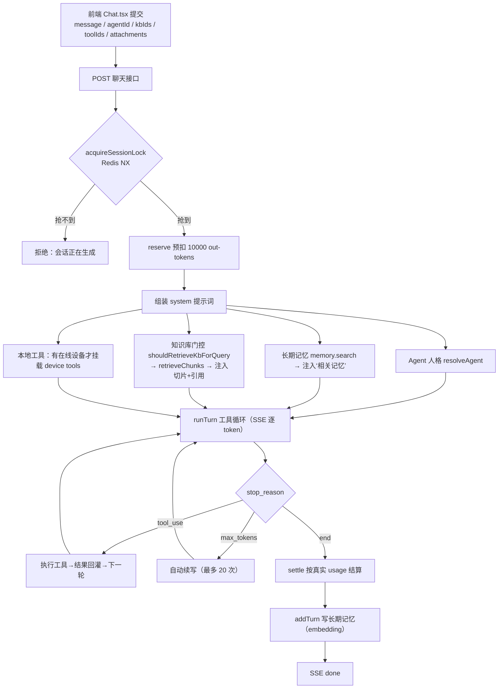

# 对话助手（深读）

> 这是一篇「自包含」的学习文档：读完这一篇就能理解对话助手的设计取舍、完整链路、关键参数和踩过的坑，不需要来回跳别的文件。文中只写环境变量名与占位符，不含任何真实密钥。

## 一、这个模块是什么

对话助手是整个平台的入口能力：一个**流式（SSE）多轮对话**，同时具备四种增强——

1. **Agent 人格**：每条对话归属一个 Agent（系统提示词、头像、可用工具集不同）。
2. **长期记忆**：把跨会话记住的事实注入本轮上下文。
3. **知识库检索（RAG）**：命中用户选择的知识库时，把相关切片和引用注入上下文。
4. **本地设备工具**：用户开着桌面端时，模型可以经连接器读写用户本机文件、执行终端命令。

它是「模型网关 + Agent 工具循环 + 记忆/知识库 + 计费」的集大成者，后面所有工作流复用的基础设施（模型路由、计费包裹、流式）都在这里第一次成型。

后端入口 `apps/api/src/chat/`，模型层 `packages/llm/`，Agent 循环 `apps/api/src/agent/`，前端 `apps/web/src/pages/Chat.tsx` + `chatState.ts`。

## 二、设计思路（为什么这么做）

### 2.1 一切对话统一走 Anthropic Messages 协议

这是整个项目最核心的一条决策。业务上层（消息块、工具调用、流式事件）全部只认识 Anthropic SDK 的形状（`@anthropic-ai/sdk`）。`packages/llm/src/client.ts` 用一个 `LlmProvider`（`bailian` / `anthropic`）决定主路由：

- `bailian`（默认）：自动把 `BAILIAN_WORKSPACE_ID` + `BAILIAN_REGION` 拼成 `https://{WorkspaceId}.{region}.maas.aliyuncs.com/apps/anthropic`，Anthropic SDK 直接向其 `/v1/messages` 发请求。
- `anthropic`：旧 NewAPI 兼容网关，仅作回退。
- **AI Pixel 的 GPT 系列**用「按模型名多网关路由」叠加：`withModelRoutes` 把白名单 `CHATGPT_MODELS`（`gpt-5.4`/`gpt-5.5`/`gpt-5.6-*` 等）中的模型，各自挂到一个独立的、指向 AI Pixel 的 Anthropic client 上（`applyModelRoutes` 里 `routeClients` 按 `body.model` 分发）。

好处：换网关、换模型只动环境变量，业务代码零改动；白名单顺带把上游杂乱的音频/Realtime/图片模型挡在对话选项之外。这条路不是一开始就走对的，见踩坑 6.2。

### 2.2 为什么用 SSE 而不是 WebSocket

对话是「一问一答、服务端单向持续推送 token」的形态，SSE（`content-type: text/event-stream`）刚好够用，比 WebSocket 少一套连接管理。真正需要双向长连接的是桌面设备（那才用 WebSocket）。SSE 还带一个 15 秒心跳（`SSE_HEARTBEAT_MS = 15_000`）防止中间代理断流。

### 2.3 会话串行锁：同一会话不允许并发生成

用户快速连发、或多标签页同一会话同时提交，会造成消息错乱、记忆重复写、计费并发。解决办法是 Redis 单飞锁（`apps/api/src/chat/lock.ts`）：

```ts
const key = `ai-assistant:lock:session:${sessionId}`;
const ok = await redis.set(key, token, "PX", ttlMs, "NX"); // ttlMs 默认 120000
```

`NX` 保证只有第一个抢到，`PX` 到期自动释放（防止进程崩溃后死锁），释放时校验 token 只删自己的锁。拿不到锁就直接拒绝本次并发请求。

### 2.4 计费包裹：先预扣、后按实结算、故障降级放行

所有付费操作的统一骨架在这里定型：**reserve（预扣）→ 生成 → settle（结算）**。对话按固定 `CHAT_RESERVE_OUTPUT_TOKENS = 10_000` 的输出上限预扣（Go 侧按模型输出单价折算算力点），生成结束用真实 `usage` 结算，多退少补。一个刻意的取舍是**计费故障降级放行**：billing 服务不可用时不阻断对话（源码注释原文：「billing 故障降级放行；reserve 计价仍是安全网」），把可用性放在严格计费之上，靠 reserve 兜底。

## 三、端到端流程



## 四、代码地图

| 文件 | 职责 |
| --- | --- |
| `apps/api/src/chat/routes.ts` | HTTP/SSE 边界：入参 zod 校验、会话锁、计费、system 组装、KB/记忆/工具编排、错误文案 |
| `apps/api/src/chat/attachments.ts` | 附件处理：图片走多模态、文件走 `kb/parse` 解析为文本块；`resolveChatModel` 决定是否切多模态模型 |
| `apps/api/src/chat/lock.ts` | 会话串行锁（Redis NX + token 释放） |
| `apps/api/src/chat/sessions.ts` | 会话/消息读写 |
| `apps/api/src/agent/run.ts` | **Agent 工具循环 `runTurn`**：迭代上限、续写、工具调用、流式重试、超时/空响应 |
| `apps/api/src/agent/tools.ts` | 默认（服务端）工具实现 |
| `packages/llm/src/client.ts` | 模型层：provider 归一化、百炼 baseURL 拼装、按模型名多网关路由、百炼 thinking 默认 |
| `apps/api/src/memory/memory-service.ts` | 长期记忆 `search` / `addTurn`（1024 维向量） |
| `apps/api/src/kb/retrieve.ts` | 知识库检索：`shouldRetrieveKbForQuery` 门控、`retrieveChunks`、`filterRelevantChunks`、`dedupeKbCitations` |
| `apps/api/src/connector/{hub,local-tools,select-device}.ts` | 本地设备工具派发（`getDispatcher` / `makeLocalExecTool` / `pickActiveDevice`） |
| `apps/web/src/pages/Chat.tsx` · `chatState.ts` · `chatAttachments.ts` | 前端视图 / 纯逻辑状态 / 附件处理 |

## 五、关键机制与参数

- **Agent 工具循环**（`agent/run.ts`）：单次请求 `max_tokens = 4096`（`DEFAULT_MAX_OUTPUT_TOKENS`）；工具循环最多 `256` 迭代（`DEFAULT_MAX_ITERATIONS`）；输出被 `max_tokens` 截断时**自动续写**，最多 `20` 次（`DEFAULT_MAX_CONTINUATIONS`，可用 `CHAT_MAX_CONTINUATIONS` 覆盖）；流式失败重试 `1` 次（`DEFAULT_STREAM_MAX_RETRIES`）。一个易忽视的细节：`stop_reason === "tool_use"` 那一轮流式出的文本只是「工具调用前的说明」，不计入最终答案（`onResetText` 清掉），避免把中间碎话拼进结果。
- **KB 智能召回**：不是每句话都查库。`shouldRetrieveKbForQuery` 先做门控；命中后 `DEFAULT_KB_TOPK=8` 召回、`DEFAULT_KB_MIN_SCORE=0.35` 过滤、每次最多注入 `DEFAULT_KB_MAX_CONTEXT_CHUNKS=4` 个切片、同一文档最多 `DEFAULT_KB_MAX_CHUNKS_PER_DOCUMENT=2` 个，最后 `dedupeKbCitations` 去重引用。
- **百炼 thinking 默认关闭（带工具时）**：`withBailianMessageDefaults` 在客户端层统一处理——**只要请求带 `tools` 且调用方没显式设 `thinking`，就注入 `thinking: { type: "disabled" }`**。这是踩坑 6.3 的收敛点，不让每个业务调用点各自打补丁。
- **多模态回退**：`attachments.ts` 的 `resolveChatModel` 在检测到图片附件时切到 `CHAT_MULTIMODAL_MODEL`（缺省 `qwen3.7-plus`）。文件附件（非图片）经 `kb/parse` 的 `parseDocument` 抽成文本块塞进上下文。附件入参上限：单请求 ≤8 个、单个 ≤10MB、base64 ≤14MB。
- **模型名别名**：`BAILIAN_MODEL_ALIASES` 把历史 `GLM-5.2` 映射为百炼实际 id `glm-5.2`（`providerModelId`）。
- **本地工具的暴露条件**：只有当用户有在线设备（`pickActiveDevice`）时，才向模型暴露本地工具集，并通过 SSE 的 `device` 事件把工具名回给前端；没有设备就完全不挂。
- **友好错误文案**：`chatModelErrorMessage` 把上游错误按 provider（百炼 / AI Pixel / 模型服务）翻译成中文——`401`/`invalid api key`→「API Key 无效」、`Model.AccessDenied`→「业务空间未授权该模型」、`404`→「不存在该模型或地域不可用」、`ECONNREFUSED/ENOTFOUND`→「无法连接，请检查接入地址与网络」。这些文案本身就是踩坑清单的浓缩。

## 六、踩坑记录（现象 / 根因 / 修法 / 预防）

> 主要来自 2026-07-13 的「修复对话助手接入」会话（迁移后逐项恢复百炼链路）。

### 6.1 迁移后所有对话「生成失败」——死网关 `127.0.0.1:9999`
- **现象**：项目迁移后，页面只报统一的「生成失败」。
- **根因**：`.env` 的 `LLM_BASE_URL` 仍指向已不存在的旧网关 `127.0.0.1:9999`。
- **修法**：切到北京地域百炼 Anthropic 兼容地址 `/apps/anthropic`。
- **预防**：迁移检查清单第一条就是「所有上游 base URL 指向真实可达地址」；错误文案专门识别 `ECONNREFUSED` 提示接入地址问题。

### 6.2 多写了一层 OpenAI→Anthropic 转换（弯路后纠正）
- **现象**：第一版为接百炼，新增了 `openai-compatible.ts` 转换层 + `openai` 依赖，把地址拼成 `.../compatible-mode/v1`。
- **根因**：误以为百炼主接入是 OpenAI 协议；实际上项目上层全是 Anthropic 形状，而百炼**原生支持** Anthropic 端点 `/apps/anthropic`。转换层白白增加了流式增量、工具调用、图片、token 用量四处的维护面。
- **修法**：删掉转换层与 `openai` 依赖，`buildBailianBaseURL` 直接生成 `/apps/anthropic`，无论百炼还是旧网关都 `new Anthropic({ baseURL, apiKey })`。
- **预防**：**贴合既有抽象**。接新上游前先确认它是否直接兼容项目已依赖的协议，能少一层就少一层。

### 6.3 带工具时模型「不调用工具」——百炼 thinking 模式
- **现象**：工具定义已被接口接受，但 `qwen3.7-plus` 在自动模式下不主动调用工具；强制 `tool_choice` 又被拒。
- **根因**：`qwen3.7-plus` 默认进入 thinking 模式，该模式下 Anthropic 工具自动选择行为异常，且拒绝 `tool_choice`。
- **修法**：在**模型层**统一处理——带 tools 且未显式设 thinking 时自动 `thinking: { type: "disabled" }`（`withBailianMessageDefaults`）。
- **预防**：兼容性差异收敛到客户端一处，不散落到各业务调用点。

### 6.4 老会话一打开就失败——模型名大小写
- **现象**：迁移前用户浏览器里记住了 `GLM-5.2`，打开老会话直接失败。
- **根因**：百炼正式模型 id 是小写 `glm-5.2`。
- **修法**：`BAILIAN_MODEL_ALIASES` 精确别名映射，保留用户选择与计费目录不变，只在真正请求时转换。
- **预防**：迁移要保证「历史用户选择」继续可用，别让存量数据变成故障源。

### 6.5 开启记忆的用户每次聊天都白打一次旧向量网关
- **现象**：迁移后开「长期记忆」的用户每轮聊天会访问已失效的 4096 维旧向量网关，虽被降级捕获、不致对话失败，但白白产生一次无效预扣与请求。
- **根因**：记忆/知识库向量链路尚未随对话一起迁移，旧回退还在。
- **修法**：先切断旧回退；等知识库/记忆迁移时按百炼 `text-embedding-v4` 的 **1024 维**重建索引。
- **预防**：分模块迁移时，注意「顺带被调用」的隐性链路，别让它继续打死端点。

### 6.6 用浏览器点页面做功能验收（被用户纠正）
- **现象**：早期用浏览器点页面验证对话/工具/图片是否正常。
- **根因**：项目本身有一套测试（单测 + POC），页面操作不稳定也慢。
- **修法**：网页只用于查官方文档；功能验收改用仓库 POC——`set -a; source .env; set +a; RUN_TOOLUSE_POC=1 ...` 跑 `tooluse.poc.test.ts` 真实验证工具调用/流式/图片块。
- **预防**：有测试就用测试；真实链路用带环境开关的 POC，别把配额消耗混进日常测试。

### 6.7 把模型的不确定性误判成协议故障
- **现象**：POC 里模型「没调用工具」、1×1 测试图被拒。
- **根因**：自动工具选择本身有随机性（应显式 `tool_choice`）；测试夹具 1×1 图不合法（宽高需 >10）。
- **修法**：修 POC 夹具，不动协议。
- **预防**：链路测试要消除模型决策随机性和夹具边界，避免把它们当成接入 bug。

## 七、演进史（git × codex 会话）

- **yun-claude 底座期（导入前）**：对话能力在此成型——`2026-07-04` 后端改为逐 token 实时流式、前端加闪烁光标、自动续写默认 20 轮、接入模型广场与 VIP 计费、模型可配最大输出 token 并固定预扣；`2026-07-09` 新增 Agent 栏、对话按 Agent 归类。
- `2026-07-10` `491de0f` 底座整仓导入。
- `2026-07-13`（会话「替换云豆为 AI 助手」`019f5a45` + 「修复对话助手接入」`019f5b4d`）：品牌改名；迁移后逐项修复对话链路、真实接通百炼（见第六节全部踩坑）。
- `2026-07-14` `67ccae3` `feat: migrate project and integrate Bailian models` 落地。
- `2026-07-16` `33179d1` 新增接入 gpt 模型：通过 `CHATGPT_MODELS` 白名单把 gpt-5.x 经 AI Pixel 的 Anthropic 兼容端点接入对话（多网关路由）。

## 八、自己动手学习入口

1. 读 `packages/llm/src/client.ts` 全文（很短）：一次性理解 provider 归一化、百炼 baseURL、`withBailianMessageDefaults`、`withModelRoutes`/`applyModelRoutes` 四件事。
2. 读 `apps/api/src/agent/run.ts` 的 `runTurn`：抓住「迭代上限 / max_tokens 续写 / tool_use 文本不计入最终答案」三条主线。
3. 读 `apps/api/src/chat/routes.ts`：从会话锁 → reserve → system 组装（记忆/KB/工具）→ runTurn → settle → addTurn 顺着走一遍。
4. 真实验证工具调用：`set -a; source .env; set +a; RUN_TOOLUSE_POC=1 pnpm --filter @ai-assistant/api exec vitest run src/agent/__tests__/tooluse.poc.test.ts`（以仓库实际 POC 路径为准）。
