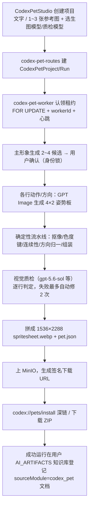

# Codex 桌宠工作流（深读）

> 自包含学习文档：设计取舍、精灵规格、完整链路、关键机制、踩坑与演进史都在这一篇里。这是最新、也最「现代」的一条业务线——模型合同、租约 Worker、确定性图像流水线、签名交付、事件溯源、软删除一应俱全，很适合作为「一条成熟业务线该长什么样」的样本。

## 一、这个模块要做什么

用户上传参考图或输入文字，生成一只**可以直接导入 Codex 当桌宠**的像素动画角色。终产物不是「几张会动的图」，而是严格符合 **Codex v2 规格**的资源包，可通过深链一键安装。

后端在 `apps/api/src/workflow/codex-pet-*.ts` + `apps/api/src/workers/codex-pet-worker.ts`，确定性图像流水线在 `packages/codex-pet-pipeline/`，前端在 `apps/web/src/components/workflow/CodexPetStudio.tsx` 三件套。

## 二、先理解产物规格（决定了整条流水线）

Codex v2 桌宠是一张精灵图集（`packages/codex-pet-pipeline/src/constants.ts` 是唯一真源）：

- **单元格** `192 × 208`，**8 列 × 11 行**，最终图集 `1536 × 2288`，清单 `spriteVersionNumber: 2`，图集文件名固定 `spritesheet.webp`。
- **前 9 行是标准状态**：`idle`、`running-right`、`running-left`、`waving`、`jumping`、`failed`、`waiting`、`running`、`review`，每行有各自的帧数与逐帧时长。
- **后 2 行是 16 个观察方向**（`look-a`/`look-b`），从 `000` 起每 `22.5°` 顺时针一格。
- **交付两种方式**：`codex://pets/install?...&spriteVersionNumber=2` 深链一键安装；或下载 ZIP（`pet.json` + `spritesheet.webp`）。

**这个规格直接催生了整条流水线的核心难点**：GPT Image 的输出长宽比不能超过 `3:1`，而单行 8 帧约 `7.4:1`——模型没法直接吐出最终横条。解决办法是让模型生成 `4×2` 的姿势板，再由**程序确定性裁切、归一化、拼装**成 Codex 行（见踩坑 6.1、6.2）。

## 三、端到端流程



每一步都追加写 `CodexPetEvent`，前端 Studio 靠 SSE + 2.5 秒轮询兜底渲染进度、事件日志、失败原因、重试次数与计费状态；刷新/换设备/断线后从持久化事件游标恢复。

## 四、关键设计

### 4.1 确定性图像流水线（`packages/codex-pet-pipeline`）
模型只负责「画出角色的各个姿势」，**几何正确性由程序保证**，不指望模型直接产出规格图：

- `extraction`（抠像）、`chroma`（色度键，候选背景色 `#ff00ff` / `#00ff00` 等）、`continuity`（帧间连续性）、`direction-registration`（方向注册）、`jumping`（跳跃）、`normalized-pose-board`（姿势板归一）、`assembly`（拼装）、`package`（打包 + 清单校验：`n===2 && spritesheetPath==="spritesheet.webp"`）。
- **蛇形取帧**：方向板按 `4×2` 蛇形生成（`LOOK_BOARD_CHRONOLOGICAL_TO_SOURCE_SLOT = [0,1,2,3,7,6,5,4]`），让第 4→5 帧在右边缘物理相邻，避免从右上跳到左下；提取时再确定性还原成正常顺时针顺序。这是「迁就模型的画法、用程序纠正几何」的典型。

### 4.2 模型合同（`codex-pet-model-contract.ts`）
把「哪个环节必须用哪个模型」写成代码硬合同，合同版本 `selectable-visual-v2`：

- **生图**走 `gpt-image-2`（Pixel，relay 会把模型名改写成 `gpt-image-2-codex`，合同允许这个别名）。
- **视觉理解/质检**可选 `gpt-5.6-sol`（Pixel 路由）或 `qwen3.6-flash`（百炼路由），来自模型广场；**显式排除 `qwen3.7*`**（本地配额已耗尽，防旧配置误选）。
- **拒绝前缀匹配，用显式允许名单**——注释点明 `gpt-image-2-qwen-fallback` 这类别名会骗过前缀匹配、污染落库溯源。
- 违约抛**不可重试**的 `CodexPetModelContractError`，避免对错误网关反复烧配额。
- 模型选择在项目级持久化，**启动 run 时冻结进 snapshot**，Worker 只用 snapshot、禁止中途切换；最终交付会核验上游实际返回模型与所选严格一致。

### 4.3 租约 Worker（`codex-pet-worker.ts` + `codex-pet-runner.ts`）
队列是「至少一次」，所以必须防止过期投递在别的 Worker 已接管后还继续写：

- 认领用 `SELECT "id" FROM "CodexPetRun" WHERE "id"=$1 FOR UPDATE` + `workerId` + `heartbeatAt`；只有心跳超过 stale 阈值，另一个 Worker 才能接管。
- 失去租约时抛 `CodexPetRunLeaseLostError`——不报错崩溃，而是安静让当前租约持有者继续。
- 健康端口 `CODEX_PET_WORKER_HEALTH_PORT`（默认 8092），提供 `/health` 与 `/metrics`。

### 4.4 交付安全与软删除
- 产物下载走**签名 URL**（`CODEX_PET_ARTIFACT_SIGNING_SECRET`，缺省复用 ≥32 字节的 `SESSION_SECRET`）；生产强制要求 HTTPS 的 `CODEX_PET_PUBLIC_BASE_URL`，本地开发才允许 HTTP。
- **软删除（假删）**：DELETE 写 `deletedAt`，列表/详情默认排除，项目/运行/知识库文档/产物全部保留；仍在运行的项目删除时先取消并按原规则退款；旧的「`deleting` 且无 `deletedAt`」tombstone 仍走硬清理队列，新软删除不进硬清理。

### 4.5 计费
`codex-pet-billing.ts` 按运行计次（设计期定为固定套餐 `codex_pet_v2_package`，默认 200 点，可后台调）；套餐内的自动修复成本由系统承担；尚无任何成功图片时主动取消全额退款，已有图片后主动取消不退，系统最终无法交付全额退款——遵循平台 finalize 幂等退款范式。

**按次计费模式 `per_image_call_v1`（现行）**：运行级先 `reserveResource` 预留 N 次，结束时 `settleResource` 按实发次数结清；计划外调用另走独立的 `chargeResource`。两条不变量必须记住：

1. **结清即终态。** 一旦 `billingSettlementStatus` 变成 `settled`，该运行**再也无法续跑**——worker 领活资格（[`codex-pet-worker.ts:715`](../apps/api/src/workers/codex-pet-worker.ts)）、额外调用授权（[`codex-pet-routes.ts:2351`](../apps/api/src/workflow/codex-pet-routes.ts)）与失败续跑准入（[`codex-pet-failed-continuation.ts`](../apps/api/src/workflow/codex-pet-failed-continuation.ts)）都硬性要求 `reserved`。因此**失败不再结清**：失败运行保留预留、进入可续跑窗口期（默认 24h，`CODEX_PET_FAILED_SETTLEMENT_GRACE_MS`），由 worker 维护轮次的 `reconcilePerImageBillingSettlements` 在窗口到期后兜底关账；只有 `ready` / `cancelled` 这两个真终态即时结清。唯一例外是**零次已发调用的失败**——无可续跑之物且未花钱，立即结清释放预留。历史背景见 6.11.3。
   - 宽限期必须做在清算任务里：维护轮次默认每 60s 扫一遍终态运行，只摘掉失败路径里的内联结清只能推迟 60 秒。
   - 延后结清**更准**：结清单位是结清那一刻从 `CodexPetImageCall` 重新点的已发计划内调用数，续跑后按真实最终次数结。
   - 代价：窗口期内预留仍占用户额度，此时新建运行需要同时覆盖两笔预留。
2. **结清之后只能补扣，不能重开。** 要追加金额得走另一个确定性 operation（`…:settlement-correction:<targetPoints>`，见 [`codex-pet-per-image-billing-correction.ts`](../apps/api/src/workflow/codex-pet-per-image-billing-correction.ts)），绝不回头对已结清的 operation 再 `settleResource`。该修正路径**只补扣、无退款**。
3. **失败的调用不算钱。** 计划内调用失败 → 不进结清单位（`status: { not: "failed" }`）；额外调用失败 → 立即按 `operationId` 退款。这条规则在**四处**必须字面一致：runner 的 `settlePerImageRunBilling`、worker 清算的 `reconcilePerImageBillingSettlements`、取消退款的 `settleCancellationRefund`，以及额外调用的 `refundCodexPetFailedExtraCall`。改一处不改其余，取消路径就会继续对失败调用收费。历史背景见 6.11.6。
   - 注意与另一处计数区分：`settlePerImageBillingOnFailure` / `finalizeClaimedSetupFailure` 里的 `sentPlannedCalls` 回答的是「这次失败到底有没有动过钱/有没有可续跑之物」，**那里失败调用仍然要计数**，否则会把有素材可救的失败当成零成本失败立即结清。
4. **额外调用有上限。** 每个动作 4 次、每次运行 12 次（`CODEX_PET_EXTRA_IMAGE_CALLS_PER_JOB_LIMIT` / `…_PER_RUN_LIMIT`，见 [`codex-pet-call-ledger.ts`](../apps/api/src/workflow/codex-pet-call-ledger.ts)）。上限**在扣费之前**判，超限返回 409 并在 `data.extraCallBudget` 里回当前用量。计数只认「钱已经花出去」的流水状态（`dispatching` / `sent` / `succeeded`），因此被退款的传输失败不占用户的修复预算。

## 五、文件地图

- 后端：`workflow/codex-pet-{routes,runner,queue,events,storage,visual,prompts,billing,packaging,archive,cleanup,delivery-validation,model-contract}.ts` + `workers/codex-pet-worker.ts`。
- 流水线包：`packages/codex-pet-pipeline/src/{constants,extraction,chroma,continuity,direction-registration,jumping,normalized-pose-board,assembly,package}.ts`。
- 前端：`components/workflow/CodexPetStudio.tsx` + `codexPetStudioModel.ts` + `codexPetApi.ts`。
- POC（真实链路、环境开关触发）：`codex-pet-action.poc.test.ts`、`codex-pet-look.poc.test.ts`、`gpt-image-edit.poc.test.ts`。
- 运维手册：原 `docs/reference/codex-pet-ops.md` 已归并入本文档（见「运维与告警」章节）。

## 六、踩坑记录（现象 / 根因 / 修法 / 预防）

> 主要来自会话 `019f6f66`（设计与真实 POC 探测）与 `019f7ab5`（全流程重建 + 模型选择，「哪里报错修哪里」）。

### 6.1 GPT Image 不能吃参考图？——用错了端点
- **现象**：想「按参考图 + 文字生成」，但现有 GPT Image 只接了 `/v1/images/generations`，只能文生图，锁不住角色的脸/花纹/配件。
- **根因**：`generations` 只收文字；带图输入（图片编辑）要走 `/v1/images/edits`。
- **修法**：在生图模块补齐 GPT Image 的 multipart `edits` 端点 + 多参考图，桌宠复用它而非另造客户端。
- **预防**：「参考图 + 文字生图」本质是图片编辑能力，先确认端点能力再设计链路。

### 6.2 模型画不出 `7.4:1` 的横条——改成姿势板 + 程序拼装
- **现象**：想让模型直接产出单行 8 帧的横向精灵条。
- **根因**：GPT Image 输出长宽比 ≤ `3:1`，而单行 8 帧约 `7.4:1`。
- **修法**：让模型生成 `4×2` 姿势板（`1536×1024` 实测可用，能画出 8 个分离完整的姿势），再由流水线确定性裁切/归一/拼装成 Codex 行。
- **预防**：把「模型擅长的事」和「必须确定性保证的事」分开——几何、拼接、版本清单交给程序。

### 6.3 网关不透传参数——以响应实际值为准记账
- **现象**：请求 `1024×1024 + quality=low`，响应回来是 `1254×1254 + auto`，模型名被改写成 `gpt-image-2-codex`。
- **根因**：中转网关没严格透传尺寸/质量，还会改写模型标识。
- **修法**：不假设质量/尺寸档一定生效，一律按响应回传的实际 `quality/size/model/usage` 记账与展示；合同把 `gpt-image-2-codex` 作为允许的 relay 别名。
- **预防**：对第三方网关，请求参数是「期望」，响应字段才是「事实」。

### 6.4 跳跃动作总是不对——`3×2` 换行造出「第二个波峰」
- **现象**：跳跃行用 `3×2` 布局时，换行后第一格被误判成第二个波峰。
- **根因**：`3×2` 换行破坏了「起跳→上升→顶点→下降→落地」的时间连续性。
- **修法**：跳跃行改成 `5×1` 单行左到右（`constants.ts` 里有注释说明这是刻意的），可靠产出完整弧线。
- **预防**：动作时序对布局敏感，反复 POC 找到稳定布局后固化到常量。

### 6.5 只加下拉框没用——第一版写死了 GPT-only
- **现象**：想让用户选模型，但只在页面加下拉框不生效。
- **根因**：第一版把整条工作流从前端、后端、run snapshot、worker 到交付校验全部写死成 GPT-only。
- **修法**：模型选择做成项目级持久化配置 → 启动冻结进 snapshot → worker 按所选路由执行 → 交付按对应合同核验；历史 `gpt-only-v1` 项目保留只读交付兼容。
- **预防**：「可配置」要贯穿数据模型到执行快照的每一层，不能只改 UI。

### 6.6 `P2022`：`deletedAt` 列不存在——迁移没应用
- **现象**：加了软删除后接口报 `P2022 The column CodexPetProject.deletedAt does not exist`。
- **根因**：Prisma Client 已认识新字段，但数据库还没执行迁移。
- **修法**：`pnpm --filter @ai-assistant/db exec prisma migrate deploy` 应用 `20260719100000_codex_pet_project_soft_delete`。
- **预防**：改 schema 必须同步应用迁移；这也是「本地能编译、运行才报错」的典型。

### 6.7 质检投票合并错误——通过的复审没顶掉初审失败票
- **现象**：跳跃动作独立尺度复审已通过，却仍把初审失败票计入最终多数票，形成 1:1 后错误重试。
- **根因**：确定性状态合并逻辑把「已被复审推翻的初审票」继续计入。
- **修法**：通过的独立复审取代该项初审硬门禁，同时把初审证据仍留在 QA 报告里。
- **预防**：多轮判定要明确「后一轮结论覆盖前一轮」，别让被推翻的证据继续投票。

### 6.8 恢复运行不继承过程产物——工作台九格动画全空
- **现象**：`像素小助手 GPT 全流程 R7`（`cmrteijsv0002c3opa4jyt04z`）交付面板显示「桌宠已生成，可安装」、最终 Contact Sheet 正常，但「9 组标准动画」九格全是「XX 预览处理中」，主形象候选整块消失。
- **根因**：该项目 `latestRunId` 指向 `cpr_recovery_*` —— 由已失败且已退款的源运行 `cpr_3a7a7ee3…` 人工发起的零扣费打包运行。恢复路径只重建 spritesheet / preview / package（该 run 下只有一个 `final-package` job），不产出 `animation_preview` / `base_candidate` / `pose_board`。而工作台刻意把所有可视产物限定在 `latestRun.id`（[`CodexPetStudio.tsx:411`](../apps/web/src/components/workflow/CodexPetStudio.tsx)，防止失败运行的候选图看起来可交付），于是九个动画虽然 `ready`、`expiresAt=null`、字节健在，却全被过滤掉。
- **排查要点**：先按 `runId` 分组统计产物再下结论。九个动画都在源运行下，`metadata.jobKey` 为 `row-<state>`，与九个标准状态严格一一对应；既不是没生成，也不是过期清理或签名失效。API 侧 `take: 300` 也未截断（该项目共 133 个产物）。
- **修法**：一次性补数据脚本 [`.cc-tmp/backfill-r7-recovery-artifacts.ts`](../.cc-tmp/backfill-r7-recovery-artifacts.ts) 把 9 个动画 + 2 个主形象候选 + 1 张最新姿势板从源运行复制到恢复运行，源行不动。**必须走 `putCodexPetArtifact` 重新上传，不能只 `UPDATE runId`**：`objectKey` 里嵌了 runId，而 `hasOwnedArtifactObjectKey` → `isCodexPetArtifactObjectKeyFor` 会校验前缀与行上 runId 一致，改列会让所有预览 URL 变成 null。副本 `jobId` 置 null（源 job 属于失败运行且该列有外键），`expiresAt` 置 null（源姿势板和候选 1 带 7 天中间产物 TTL，本会过期），并把恢复运行的 `selectedBaseArtifactId` 指到候选 2 的副本（该列无外键，否则 UI 兜底会高亮成候选 1）。脚本按 `metadata.backfilledFromArtifactId` 幂等。
- **预防**：恢复/补救类运行如果继承上游像素成果，就必须同时把用户可见产物落到新 runId 下，否则前端的按运行隔离会把它们全部隐藏。恢复路径目前没有生产调用方（全库仅此一条恢复运行），productize 时应在打包阶段一并重建九个行动画。

### 6.9 工作台可视产物挑错了对象——「筛选口径比语义宽 + 取最新」的两处同形 bug（已修）

同一个形状犯了两次：**筛选口径比标题语义宽 → 按 `createdAt` 倒序取 `[0]` → 流水线阶段顺序让误捞项稳定胜出**。故障表现都不是空白，而是「显示了错的图」，所以一直没人发现。

#### 6.9.1 「当前桌宠姿势板」显示方向盲测图
- **现象**：所有跑完方向校验的项目，「当前桌宠姿势板」那格显示的不是姿势板，而是一张 `408×3668` 的方向盲测图，被 `aspect-[3/2]` 框 `object-contain` 压成中间一条细竖条。
- **直接根因**：原筛选是 `kind.includes("pose") || kind.includes("board") || kind.includes("direction")`，把 `direction_blind_qa` / `direction_qa` / `registered_direction_row` 一起捞了进来，再按 `createdAt` 倒序取 `[0]`。方向质检图产在流水线最后的校验阶段，永远比姿势板新，所以只要方向校验跑完，真正的 `pose_board` 就永远抢不到这格。
- **实测**：`GPT Image 2 验收 QA-off R1`（run `cpr_f8be7f05…`）里方向盲测图 `02:14:38.291`、姿势板 `02:14:22.655`，差 16 秒。
- **更深一层的根因**：筛选之所以写这么宽，是因为那格必须「总能填上点什么」——而姿势板带 7 天 `INTERMEDIATE_TTL_MS`，本来就会过期。把一个注定过期的中间产物放在面向用户的工作台上，就一定会遇到「显示错图」或「显示空白」二选一。
- **修法（已实施）**：不是把筛选收紧后继续留在原位，而是把这类产物整体下沉到内部诊断区。
  - [`codexPetStudioModel.ts`](../apps/web/src/components/workflow/codexPetStudioModel.ts) 新增 `isCodexPetPoseBoard`（严格 `kind === "pose_board" | "pose_board_scaffold"`）、`isCodexPetProcessArtifact`（姿势板 + 方向类）、`codexPetProcessArtifactLabel`（按 kind 给中文名，盲测图就叫「方向盲测图」，不再冒充姿势板）。
  - [`CodexPetStudio.tsx`](../apps/web/src/components/workflow/CodexPetStudio.tsx) 删掉 `currentPoseBoard` 与「当前姿势板」槽位（原本与「状态动画预览」并排两列，那一格随后在 6.9.2 一并删除）；工作台底部新增默认折叠的 `<details data-testid="codex-pet-process-artifacts">`「过程产物（内部诊断 · N 项）」，列出本次运行仍在保留期内的姿势板与方向质检图，并明写「仅保留 7 天，用于排查与定向续跑，不是交付内容。过期后此处为空属正常」。空列表走独立文案，不再是可疑的占位图。
  - 空态引导文案同步去掉「当前姿势板」。
- **为什么不能干脆不存姿势板**：它存的是 `generated.buffer`，即那次付费出图的原始字节，有四个下游消费者——worker 的 provider 指标遍历 `base_candidate` + `pose_board` 的 metadata 累加出图次数与 token（[`codex-pet-worker.ts:269`](../apps/api/src/workers/codex-pet-worker.ts)）；定向续跑按 id 锁定「已付费的失败板」并据此卡真实调用次数上限（[`codex-pet-failed-continuation.ts:105`](../apps/api/src/workflow/codex-pet-failed-continuation.ts)）；已出图恢复直接从旧板重切帧（[`codex-pet-generated-board-recovery.ts:164`](../apps/api/src/workflow/codex-pet-generated-board-recovery.ts)）；续跑还会读回上一张板做脚手架来源（[`codex-pet-runner.ts:2531`](../apps/api/src/workflow/codex-pet-runner.ts)）。R7 在 07-22 能救回 26 次付费出图，正是因为 07-20 那次失败运行的板子还在 7 天窗口内。7 天 TTL 是存储成本与救援窗口的折中，不是「它不重要」。
- **回归**：[`CodexPetStudio.test.tsx`](../apps/web/src/components/workflow/CodexPetStudio.test.tsx) 增两条——盲测图 + 姿势板同时存在时，`img[alt="当前桌宠姿势板"]` 必须不存在、两者按 kind 各自标注出现在诊断区；没有中间产物时诊断区显示 `0 项` 与正常空态文案。
- **预防**：用 `includes` 做 kind 归类容易误捞同前缀/同词根的产物；配合「取最新一个」时，流水线阶段顺序会让误捞项稳定胜出，故障表现是「显示了错的图」而非「空白」，比空白更难发现。更根本的一条：带 TTL 的中间产物不要放进面向用户的交付区，否则「过期」会被当成「故障」。

#### 6.9.2 「状态动画预览」显示的是方向行，不是九态之一
- **现象**：工作台单独一格「状态动画预览」，看起来是个正常的桌宠动画，但它既不属于九个标准状态中的任何一个，界面上也没有任何标注说明它是什么。
- **根因**：`animation_preview` 这个 kind 不止九个标准行——`look-a` / `look-b` 两个方向行也产 `animation_preview`，`expiresAt: null`，jobKey 为 `look-a` / `look-b`（[`codex-pet-runner.ts:4221`](../apps/api/src/workflow/codex-pet-runner.ts)、[`:4326`](../apps/api/src/workflow/codex-pet-runner.ts)）。一次成功运行下共 11 个 ready 预览，不是 9 个（集成测试断言 `status='ready'` 为 11、总数 12，多出的一条是被 QA 顶掉的镜像预览）。而那一格取 `animationPreviews[0]`，方向行产在标准行之后，稳定胜出。
- **实测**：全库 324 个有 ready 预览的运行里，最新一条的 jobKey 是 `look-*` 的有 **294** 个，是九态之一的只有 30 个。即 91% 的运行显示的是一个无标注方向行动画；剩下 9% 显示的是最后完成的标准行（多为 `row-review`，或修复后的 `row-idle`），那属于与下方九格重复。
- **为什么不能直接删这一格**：下方「9 组标准动画」原先整块嵌在 `latestRun && deliveryReady` 里，要 `spritesheetArtifactId` 和 `packageArtifactId` 都就位才渲染，也就是说跑的十几分钟里九格根本不存在，这一格是唯一的动画反馈。
- **修法（已实施）**：把九格从交付面板里挪出来，改成只要有 `latestRun` 就渲染，然后删掉单格。
  - 九格本身已经是渐进的——`standardAnimationPreviews` 按 `CODEX_PET_STANDARD_STATES` 映射，缺的格子走 `{state.label}预览处理中`，所以挪出来后运行中期就是九个带标签的占位逐个亮起，信息量比一格无标注动画大，且不可能再显示九态之外的东西。
  - 标题旁加「已完成 N/9」（`data-testid="codex-pet-animation-progress"`），避免运行中期一片占位被误读成 6.8 那种全空故障。
  - 交付面板里只留 Contact Sheet、16 方向、质量报告和操作按钮；空态引导文案改为「2 个主形象候选、9 组标准动画和最终 v2 精灵图」。
- **顺带发现（未处理）**：`look-a` / `look-b` 那两个方向动画是 `expiresAt: null` 永久保留的，但 web 侧全站零引用，从未展示。「16 个观察方向」那块目前只有 16 个角度数字标签、没有图。要展示可以接在那块下面，或归入 6.9.1 的过程产物诊断区。
- **回归**：[`CodexPetStudio.test.tsx`](../apps/web/src/components/workflow/CodexPetStudio.test.tsx) 新增运行中期用例——只有 `row-idle` / `row-waving` 两个预览外加一个 `look-b`，断言九格存在、两格有图、`row-jumping` 显示「跳跃预览处理中」、计数为 `已完成 2/9`、且 `look-b` 的 URL 不出现在任何 `img` 上；九格用例补断言 `已完成 9/9` 与 `img[alt="桌宠状态动画预览"]` 数量为 0。两条断言都验证过对旧代码会失败。

### 6.10 工具链与验收方式的小坑
- 桌面内置 pnpm 11 发现仓库由 pnpm 10 安装，试图清空 `node_modules` 被非交互环境阻止——改用仓库已装好的二进制，不重装依赖、不扰动工作区。
- 用户纠正过两次验收方式：不要为测试去注册新账号，直接用已打开的登录态；真实链路优先用仓库 POC 而非浏览器点页面。

### 6.11 「真实扣费扣出去了，却一直失败不给图」——两层校验判死刑 + 失败即结清

以 `老鼠猫`（run `cpr_13c964c03d2965b49b5e33cc1c9a9c1b`，07-28 起跑）为样本。表征是同一个动作重试 11 次、共 23 次真实付费调用（4600 积分），中间产物人眼看全是好的，运行却始终失败、一张图都交付不出来。

拆开是**四个独立问题串在一条链上**：任一次瑕疵 → 整板作废 → 重试烧钱 → 侥幸全过后图集层再判一次 → 失败瞬间结清计费 → 所有恢复路径永久关闭。前两个是像素判定过严，第三个是状态机设计缺陷，第四个是账目不一致。

#### 6.11.1 逐帧像素规则零容忍——一格瑕疵废掉整块付费板
- **现象**：一次付费调用在一张 `4×2` 板上出 8 个姿势，但 `extractPoseBoard` 返回 `ok: errors.length === 0`，任意一格触发任意一条硬规则，**整块板连同另外 7 个好姿势一起作废**，然后重试、再扣一次费。
- **根因**：三条按格判定的像素规则按「零容忍」写死。而槽位边界是对源板做的**纯算术等分，没有印刷装订线**，相邻姿势天然会在共享边界上留下浅浅一条。也就是说这三条规则惩罚的是排版方式本身，不是画得不对。
- **修法**：引入 `FRAME_TOLERANCE` 容差（[`extraction.ts`](../packages/codex-pet-pipeline/src/extraction.ts)）：`maxBorderRunFraction: 0.3`、`maxBorderContactFraction: 0.006`、`maxBleedComponentFraction: 0.03`、`maxBleedComponentDepthFraction: 0.08`、`maxTotalEnclosedFraction: 0.08`；`measureBorderContactRuns` 改为**按主体 label 分别度量**（原先跨 label 合并，两个不相邻的接触会被算成一条长边界run）；孔洞规则只看总面积占比，不再按单个孔洞卡。
- **保留退路**：新增 `FrameStrictness`（`"strict" | "tolerant"`，默认 `tolerant`）。`strict` 逐字复现原先的零容忍行为，用于回归对照——测试里对同一张板同时断言两种模式，确保放宽是**有意的**而不是把判定改坏了。
- **预防**：判定阈值要对着「产物是怎么排版的」去定，而不是对着「理想像素」去定。以及**任何 `ok: errors.length === 0` 形式的合取门禁，都要先问一句：一条失败该废掉多大范围的付费成果**。

#### 6.11.2 邻格渗漏「只降级不擦除」——同一批像素在图集层再判一次
- **现象**：6.11.1 放宽后，9 组标准动作**每一组都第一次调用就通过**（9 行 × 1 次）。但运行随即死在下一层：`标准 8×9 图集结构检查失败：running-left[4]:multiple-foreground-components；failed[1]:…；failed[5]:…`。
- **根因（这条最值得记）**：`looksLikeNeighbourBleed` 命中后只是把 finding **从 error 降级成 warning，并没有把那条渗漏像素擦掉**。于是这条浅边缘：① 被算进 `bounds`，把裁剪框撑宽；② 参与该行的共享缩放；③ 存活进归一化后的 `192×208` 图集格。而进了图集格之后它**不再贴着任何边界**——渗漏特征消失，于是在 `validateStandardPetAtlas` → `inspectFrame` 里以硬错误身份复活，废掉整张已全部付费的 8×9 图集。
- **两层校验是真独立的**：Level 1 `extractPoseBoard` 判**原始板槽位**（错误码前缀 `frame-N:`，边界码 `source-touches-slot-edge`）；Level 2 [`validateStandardPetAtlas`](../packages/codex-pet-pipeline/src/assembly.ts) 判**归一化后的图集格**（错误码 `${spec.state}[${column}]:`，边界码 `touches-cell-edge`）。两者都是合取门禁，**过了第一层完全不代表能过第二层**。
- **修法**：`analyzeAlpha` 改成 options 入参，新增 `dropNeighbourBleed`——命中渗漏的连通域直接从保留集里剔除，由已有的 `removedComponentPixels` 通路把像素清零并据存活集重建 `bounds` / `opaquePixels` / `cleanedImage`。只在 `extractPoseBoard` 的**槽位**调用处开启（`strictness !== "strict"`）；`inspectFrame` 处**刻意不开**——归一化格四周都有内边距，贴边就是真溢出，该由安全边距规则管。
- **擦除了也要照报**：新增 `removedBleedComponentCount` 字段，`classifyFrameFindings` 据它补一条 `multiple-foreground-components` warning。**悄悄丢像素正是让这条流水线难以排查的那个失败模式本身**，所以擦除必须留痕。
- **顺带修掉一句假注释**：`looksLikeNeighbourBleed` 原注释声称这条浅边缘「会在归一化时被丢弃、永远到不了图集」——从来没有。注释按代码实际行为重写，并写明「擦除 vs 降级」为什么是承重的。
- **预防**：**一个被降级的判定，如果没有同时消除它所依据的像素，就等于把状态泄漏给了下游**。降级只改变「这次要不要报错」，不改变「这堆像素还在不在」；下一层用不同坐标系、不同特征重新看同一堆像素时，结论可以完全反转。多层校验的流水线里，「降级」和「擦除」必须显式二选一。

#### 6.11.3 失败瞬间结清按次计费——三条恢复路径同时永久关闭（最致命）
- **现象**：把 9 行按修正规则零成本重导、图集本地验证 `ok=true 0 错 0 警` 之后，按工作流状态机把运行解冻回 `standard_generating`，worker **确实来领了活，然后立刻返回 `{"status":"billing_pending"}` 走掉**，运行再也不动。
- **根因**：06:04 那次失败**顺手把按次计费结清了**（`billingSettledAt = 2026-07-30T06:04:13.576Z`，与失败时刻同一毫秒级）。而代码里**每一条**恢复路径都要求 `billingSettlementStatus === "reserved"`：worker 领活资格检查（[`codex-pet-worker.ts:715`](../apps/api/src/workers/codex-pet-worker.ts)）、额外调用授权（[`codex-pet-routes.ts:2351`](../apps/api/src/workflow/codex-pet-routes.ts)）。于是**按次计费一旦结清，该运行即为终态，工作流状态怎么改都救不回来**。
- **为什么不把那个字段改回 `reserved`**：`resource/settle` 是外部 HTTP 接口（[`packages/billing/src/index.ts:433`](../packages/billing/src/index.ts)），对一个已结清的 operation 再结清一次会发生什么，在本仓库内无法验证，猜错就是重复扣费。而 [`codex-pet-per-image-billing-correction.ts`](../apps/api/src/workflow/codex-pet-per-image-billing-correction.ts) 恰好反证了设计意图：结清之后要补钱，走的是**另一个确定性的 `chargeResource` operation**（`…:settlement-correction:<targetPoints>`），从不回头重开原 operation。
- **解冻的副作用**：`standard_generating` 在 `ACTIVE_RUN_STATUSES`（[`codex-pet-routes.ts:70`](../apps/api/src/workflow/codex-pet-routes.ts)）里，而 [`:1602`](../apps/api/src/workflow/codex-pet-routes.ts) 用它拦「已有活跃运行」，**解冻等于把用户锁在新建运行之外**。确认无法续跑后已把运行改回 `failed`，并在 `error` 里写明图集已交付、以及为什么不能在同一运行内续跑。
- **交付方式**：既然续跑不可能，就把已付费成果直接交付。[`.cc-tmp/deliver-laoshumao-standard-atlas.mts`](../.cc-tmp/deliver-laoshumao-standard-atlas.mts) 从 9 行已存帧纯确定性拼装出 `1536×1872` 标准 8×9 图集 + Contact Sheet + 结构验证报告，`validateStandardPetAtlas` 先过再写库（`ok=true`，0 错 0 警）。**零生图调用、零计费写入、姿势板只读**。`expiresAt` 置 `null` 而非 7 天中间产物 TTL——这是该运行唯一的交付物，7 天后删掉就等于又回到「扣了费不给图」。
- **根因修法（已修）**：失败路径不再结清。`finalizeFailure` 与 `finalizeClaimedSetupFailure` 改走 `settlePerImageBillingOnFailure`——只有**零次已发计划内调用**的失败才即时结清（没花钱也没得续跑，白冻额度没意义），其余保留 `reserved` 并发 `billing.settlement_deferred` 事件；由 worker 维护轮次的 `reconcilePerImageBillingSettlements` 在宽限期（`CODEX_PET_FAILED_SETTLEMENT_GRACE_MS`，默认 24h，按 `completedAt` 计）到期后兜底关账。`completedAt` 为空的失败运行按已过期处理，避免预留被永久占住。
- **为什么不是「只在 `ready`/`cancelled` 才结清」**：预留会**占住**用户余额（本例预留 2800、实用 2200）。永不结清失败运行，等于把「无界的判死刑」换成「无界的冻结」——每个没人回头看的失败运行都永久占额度。窗口把两头都收住。
- **落地时才发现的两件事**：① 清算任务**本来就**在扫 `ready/failed/cancelled`，且维护轮次默认 60s 一轮——只删内联结清只买到 60 秒，宽限期必须做进清算任务本身。② 不可逆外部调用前要**重读一次准入**（`findFirst`），否则窗口期内刚被续跑的运行会被扫描与结清之间的竞态结掉；反过来，外部结清一旦成功，落库**不再要求运行仍是终态**——丢掉回执会导致重复结清且不可恢复，而错判死刑的运行人工可救。
- **窗口还得配一条真能走通的续跑路径（同根因的第二张面孔）**：改完时序才发现 [`codex-pet-failed-continuation.ts`](../apps/api/src/workflow/codex-pet-failed-continuation.ts) 的准入条件写的是**老套餐计费的列**——要求 `billingChargeStatus === "charged" && billingRefundStatus === "refunded"`。而按次计费运行的这两列永远是 `reserved` / `none`，于是**失败续跑与定向动作续跑对每一个按次计费运行都是不可达的**，窗口开了也无处可去。已抽出 `continuationBillingBlocked` 按计费模式分别给出「钱这边可以复用」的证明：老模式看「已退款」，按次计费看「预留仍未结清」。
- **预防**：**结清/退款这类不可逆的账务动作，不要挂在「失败」这个事件上**。失败是可能被修复的中间态（本例就是纯代码 bug，素材完好），而结清是终态动作；把终态动作绑在可修复事件上，等于让每一次中途失败都对整个运行判死刑。更一般地：**任何在失败路径上执行的不可逆外部副作用，都会把「可重试的失败」变成「不可挽回的失败」**。以及**别用一种计费模式的列去判另一种模式的运行**——那种检查会静默地把整类运行排除在恢复路径之外。

#### 6.11.4 计费流水与运行列不一致（未处理，动手前必读）
- **现象**：运行列记 `billingSettledUnits: 11` / `billingSettledPoints: 0`——11 次计划内调用结清成 0 积分；而调用流水里这 11 次记的是 2200 积分（11 × 200）。两边不一致。
- **风险提示**：仓库里的修正脚本 [`correct-codex-pet-per-image-billing.ts`](../apps/api/src/scripts/correct-codex-pet-per-image-billing.ts) 对这个运行算出的缺口正好是 `2200 - 0 = 2200`，**跑一遍会再扣用户 2200 积分**。该脚本只会补扣、不会退款。这笔账该不该补取决于外部计费服务真实扣了多少，仓库内查不到，须到计费后台核对后再决定。
- **口径备忘**：本运行流水合计 23 次 / 4600 积分 = 计划内 11 次成功（2200）+ 额外 11 次成功（2200）+ 额外 1 次失败（200）。预留是 14 次 / 2800 积分，只用掉 11 次。
- 那笔「失败还扣了 200 积分的额外调用」已在 6.11.5 修掉根因；本条剩下的只是这一个存量运行的对账。

#### 6.11.5 两处漏钱：无上限的付费重试 + 失败调用照样收费（已修）
- **现象**：`老鼠猫` 那次 23 次调用里，`row-running-right` 一个动作独吞 10 次付费额外调用；另有 1 次 `status=failed`、`actualModel` 为 NULL、无任何产物的额外调用照样扣了 200 积分。更早那个**已完成**的运行更清楚：结清 12 单位里有 9 单位是 `status=failed` 的计划内调用——**为 9 张没生成出来的图收了 1800 积分**。
- **根因一（无界重试）**：`approve-next-image` 每次批准只把该 job 自己的 `maxAttempts` 加一，**没有任何总量口径**。用户面对一个「差一点就好了」的动作，可以一次又一次批准下去，每次都是真实扣费；而 6.11.1 那种过严判定正好制造这种「差一点」的错觉。
- **根因二（失败照收）**：结清单位数按 `callKind: "planned" && sentAt != null` 点，**没排除 `status: "failed"`**——只要请求发出去过就算一次。额外调用更直接：批准时就独立 `chargeResource` 扣掉了，之后provider 失败**没有任何退款路径**（运行级的 `billingRefundStatus` 对按次计费永远是 `none`）。
- **修法一**：`codexPetExtraCallBudget` 从流水点已花钱的额外调用数，每动作 4 次 / 每运行 12 次封顶，**在扣费之前**返回 409（`data.extraCallBudget` 带用量，前端可直接提示）。阈值不是猜的：翻两次完整运行的流水，单动作真实需要的**付费**额外调用最多 2 次（那个 6 次的 `look-cardinals` 是连续 6 次 socket 失败，按新规则不计数），病态那次是 9 次。超限的出路是失败续跑或复制为新工作，而不是继续在同一个动作上烧钱。
- **修法二**：`CodexPetImageCall` 加 `refundStatus` / `refundedAt` / `refundError` 三列（迁移 `20260730120000_codex_pet_failed_call_refund`）；`completeImageGenerationAttempt` 在失败落库后调 `refundCodexPetFailedExtraCall` 按调用自己的 `operationId` 退款，并发 `image.call.refunded` 事件。退款是 **best-effort**：回执写在流水行上，计费服务抖动时留下 `refundStatus: "pending"` + `refundError` 供重试，而不是让整条运行失败。同时四处结清口径统一加 `status: { not: "failed" }`。
- **为什么上限要从流水点、不从 `job.attempt` 点**：`attempt` 也会因为传输失败前进，而传输失败是要退款的。用 `attempt` 当预算，等于让 provider 的抖动消耗用户的修复次数——`look-cardinals` 那 6 次连续 socket 失败会直接吃掉 1.5 个动作的预算。
- **预防**：**任何「用户点一下就真实扣一次费」的入口都必须有总量上限，且上限要在扣费之前判**；以及**「请求发出去过」不等于「用户拿到了东西」**——计费口径要挂在交付结果上，不是挂在发出请求这个动作上。还有：同一条计费口径在仓库里出现几次，就要一次全改到位，漏掉的那条路径（本例是取消退款）会安静地继续按老规则收钱。

#### 6.11.6 修复验证与排查备忘
- **漏钱修复（6.11.5）的验证记录**：`apps/api` `tsc --noEmit` 干净；接真库跑 `codex-pet-runner.integration.test.ts` **39 passed / 1 skipped**（约 314s）；`codex-pet-routes.test.ts` 41 passed、`codex-pet-call-ledger.test.ts` 19 passed、`codex-pet-worker.test.ts` 20 passed、其余 codex-pet 单测 95 passed / 2 skipped。新增用例：单动作上限触顶、「第 10 次修复会被拒」、缺陷跨动作走时的运行级上限、失败的额外调用不消耗预算、`dispatching` 在途也计数（挡住双击批准）、退款幂等、退款抛错落 `pending` + `refundError`、`{success:false}` 视为未完成、失败的**计划内**调用不走额外退款（否则与结清路径重复退款），以及路由层「超限先拒再不扣费」与「用光的都是已退款传输失败时仍然放行」。
- **写路由层用例时踩到的一点**：`logicalAttempt = job.attempt + 1`，而 `job.attempt` 会随每次传输失败前进。用例里只塞失败流水却不动 `attempt`，`prepareCodexPetExtraImageCall` 会撞上同 `logicalAttempt` 的既有行，走幂等重放分支返回 202 而**不扣费**——断言 `chargeResource` 被调用就会失败。夹具要把 `attempt` 一起推进才是真实状态。
- **计费时序修复的验证记录**：`apps/api` `tsc --noEmit` 干净；`codex-pet-*` 全量单测 187 passed / 50 skipped；接真库跑 `codex-pet-runner.integration.test.ts` **38 passed**（约 318s，这批才真正走失败与结清路径），另加 `failed-continuation` / `generated-board-recovery` / `routes.integration` 3 passed。新增用例：清算宽限期的候选条件、扫描与结清之间被续跑时跳过结清、外部结清成功后即使运行已离开终态也必须落库回执，以及 `continuationBillingBlocked` 的按模式准入（含「`reserved` + 未退款是健康态而非淘汰条件」这条回归）。
- **验证记录**：`tsc --noEmit` 对 `packages/codex-pet-pipeline` 与 `apps/api` 干净；流水线测试 44/44 通过（含新增不变量用例与 `strict` 反向断言）；对两块**真实失败板**重新抽帧，`running-left` 与 `failed` 均 `ok=true`，且**全部 16 个归一化格 `errors=[] componentCount=1`**——原先废掉图集的 `running-left[4]` / `failed[1]` / `failed[5]` 三格已干净；9 行全量重导后 `validateStandardPetAtlas` 返回 `ok=true 0 错 0 警`。
- **新增测试盯的是不变量而非严重级别**：断言渗漏格的 `sourceBounds` 恰好等于主体外框、`componentCount === 1`、`inspectFrame` 返回 `errors: []`，同时断言 warning 仍在。只断言「降级成 warning」会让 6.11.2 这个 bug 继续躲过测试。
- **行帧数不是统一的 8**：`idle 6 / running-right 8 / running-left 8 / waving 4 / jumping 5 / failed 8 / waiting 6 / running 6 / review 6`。写救援脚本时按 `spec.frameCount` 取，硬编码 8 会在 `row-idle` 上误报「只有 6 帧」。
- **零成本重导要点**（[`.cc-tmp/reextract-laoshumao-standard-rows.ts`](../.cc-tmp/reextract-laoshumao-standard-rows.ts)）：恢复路径读的是**已存帧产物**（`completedBoardJob` → `loadArtifactsInOrder`），所以只修抽帧器救不了老运行，必须重写帧；每行按 `output.reextract` 标记幂等（首次部分失败后补的，否则重跑会写第二份全量）；逐行的抽帧参数必须与 runner 一致（`row-jumping` 的 `allowVerticalTravel` / `requireJumpingArc`，`row-jumping` 与 `row-failed` 的 `maxHeightRatio: 1.8`）。
- **`CodexPetEvent` 必须显式给 `sequence`**：在同一事务里用 `lastEventSequence: { increment: 1 }` 更新运行、再把返回值写进事件的 `sequence`；进度列叫 `progress`，不是 `progressPercent`。漏了会以 `Argument \`sequence\` is missing` 在事务末尾炸掉，而前面的写入已经提交。
- **确认 worker 跑的是新代码**：`tsx watch` 重载后子进程 PID 会变。当子进程启动秒数与最后一次改动同秒时不要想当然——`touch` 一下源文件，确认出现一个启动时间明确晚于所有改动的新 PID。
- **小环境坑**：`.cc-tmp/` 没有自己的 `package.json`，`.ts` 会按 CJS 编译从而不支持顶层 `await`，改用 `.mts`；`packages/db/src/index.ts` 只导出 `getPrisma` 与 `PrismaClient` 类型，没有 `PrismaClient` 值导出；产物写入走 `putCodexPetArtifact`、读取走 `getObject(s3, objectKey)`；`CodexPetArtifact` 没有 `bytes` 列；macOS 无 `timeout` 命令；zsh 下 `--include='*.ts'` 必须加引号。

### 6.12 新建项目前的只读复查（2026-07-30 记录，**2026-08-03 全部修完**）

在「用新项目跑一次真实验证」之前做的一遍只读代码审查，目标是回答一个问题：**「调用了很多次还是不成功」这件事，现在还会不会重演。** 当时结论是**会**，而且最大的一条与 6.11.1 / 6.11.2 那两个已修的判定 bug 无关——那两条修的是「判得太严」，这一条是「判失败之后怎么处理」。以下按「离用户抱怨有多近」排序。

**2026-08-03 状态**：6.12.1–6.12.5、6.12.7–6.12.11 全部落地（提交 `fe35f44`），每条的实际修法与遗留边界写在该条的 `已修` 行里。6.12.6 与 6.12.12 是口径备忘、6.12.13 是环境建议，本来就不是 bug。验证记录见 6.12.14。**单测全绿不等于真流程能出图**——这一条只能靠真跑验。

#### 6.12.1 一格坏帧，整块已付费姿势板连同 7 张好帧一起丢掉（最贴近用户抱怨）
- **现象**：一个动作只要有一格没过检，整块板判失败，下一次批准是**从头重画整块板**，重画出来的板可能在另一格上翻车。用户看到的就是「一次又一次批准，一次又一次扣费，还是不成功」。
- **根因**：[`extraction.ts:975-988`](../packages/codex-pet-pipeline/src/extraction.ts) 里 `extractPoseBoard` **无论成败都把全部帧和逐帧诊断算完并返回**——`ok=false` 时 `frames` 和 `diagnostics` 都在手上。但 [`codex-pet-runner.ts:2170-2212`](../apps/api/src/workflow/codex-pet-runner.ts) 的失败分支只落两样东西：原始板图 + 一份**不含帧**的 `qa_report`；写帧产物的代码在 [`:2220-2234`](../apps/api/src/workflow/codex-pet-runner.ts)，只在成功分支里。**已经付过钱、且结构上完全合格的那 7 格，在内存里存在过，然后被丢掉了。**
- **为什么这条最重要**：`老鼠猫` 那次的救援脚本恰好是反证——[`reextract-laoshumao-standard-rows.ts`](../.cc-tmp/reextract-laoshumao-standard-rows.ts) 零生图、零计费，纯靠**已存帧**就拼出了合格图集。也就是说「好帧可复用」不是设想，是已经在这个仓库里跑通过一次的事实；只是这条路当时得靠人写脚本，产品里没有。
- **修法建议**：失败分支也把 `extracted.frames` 与逐帧 `diagnostics` 落成产物（可加 `output.partial = true` 之类的标记区分），让下一次批准只重画**坏掉的那几格**、或至少让重画后的板与旧板逐格取优。这会把「单格缺陷 → 8 格重画」的放大系数从 8 压到 1。
- **已修**：走的是「拼源槽位」而不是「合并已抽帧」。失败分支用 `poseBoardSlotHealth`（[`codex-pet-runner.ts:384`](../apps/api/src/workflow/codex-pet-runner.ts)）算出哪些**物理源槽位**干净，把槽位表写进那块板 artifact 的 `metadata.salvage`（`poseBoardSalvageMetadata`，schema `codex-pet-pose-board-salvage-v1`）；下一次（需授权付费的）重画开头用 `loadPoseBoardSalvage` 把捐赠板取回来，`spliceSourcePoseBoardSlots`（[`extraction.ts:1195`](../packages/codex-pet-pipeline/src/extraction.ts)）只替换**新板本来也会判废的**那几个槽位，然后**重新走一遍 `extractPoseBoard`**。
  - 为什么必须拼源槽位：`extractPoseBoard` 每块板自己推一个 `sharedScale` 和一条基线，跨板合并已抽帧会带进两套尺度，正是 `extractFullPoseBoardsWithSharedRegistration` 要防的尺寸/基线跳变。拼在源槽位上，后面那一遍抽帧仍是全部帧尺度与配准的唯一归属者。
  - 只接受严格改善：拼完 `respliced.errors.length < extracted.errors.length` 才采用（[`codex-pet-runner.ts:2308`](../apps/api/src/workflow/codex-pet-runner.ts)），因为合并后的轮廓会重算共享尺度，理论上能把原本合格的一格挤出安全边距。
  - 捐赠板按 `inputRevision` 归属：依赖变了就连同旧的尝试预算一起作废；槽位索引越界、schema 不符、对象已被 TTL 扫掉都会安静跳过（不是报错）。
  - **遗留边界（有意不改）**：`metadata.salvage` 只在**失败分支**写。所以「抽帧和质检都过了、但被终局图集闸门指认」的那块板没有捐赠记录，而且它的产物已被 `resetGateScopedJobs` 置成 `superseded`、`loadPoseBoardSalvage` 只收 `status: "ready"` ⇒ 这种重画仍然是从零开始。要覆盖它得同时在成功路径写捐赠记录并放宽 `ready` 过滤，那是设计变更，不在本轮复查结论里。
- **预防**：**校验失败时不要连同「已经算出来的合格部分」一起扔**。付费产物的失败分支，落盘的信息量应当**不少于**成功分支——成功时只需要结果，失败时才最需要中间态。判定层返回了逐项诊断，就说明作者本来打算让调用方按项处置；调用方只取一个 `ok` 布尔值，等于把这份信息量白白丢掉。

#### 6.12.2 四道硬性图集闸门都在 14 次调用**全部花完之后**，且没有行级补救
- **现象**：9 行全部通过、每行都有产物，最后在「拼图集」这一步整条运行 `failed`。这正是 `老鼠猫` 那次用户截图里问的「九组标准动画不是已经出来了吗，为什么还是判失败」。
- **根因**：四处 `throw`，全部位于所有付费调用之后，且都是**整条运行判死刑**、没有任何「只重做某一行」的分支：
  - `storeStandardAtlas` 的结构检查 [`codex-pet-runner.ts:2669-2676`](../apps/api/src/workflow/codex-pet-runner.ts)
  - `validatePetAtlas` [`:4631-4632`](../apps/api/src/workflow/codex-pet-runner.ts)
  - `measureDirectionContinuity` [`:4633-4634`](../apps/api/src/workflow/codex-pet-runner.ts)
  - 打包时又一次 `validatePetAtlas` [`:4771`](../apps/api/src/workflow/codex-pet-runner.ts)
- **额外的坑**：`:4632` / `:4633` 这两道**跑在 `qualityInspectionEnabled` 那个绕过开关（[`:4638`](../apps/api/src/workflow/codex-pet-runner.ts)）之前**——也就是说**把质检关掉也挡不住它们**。而唯一存在的有界修复循环（`directionMaxAttempts = 3`，[`:4581-4582`](../apps/api/src/workflow/codex-pet-runner.ts)）只对**质检结论**做反应，对这四处结构性 `throw` 一概不接。
- **修法建议**：结构闸门失败时定位到具体行/格，走与质检同一套有界重画循环；至少让 `:4632`/`:4633` 跟随 `qualityInspectionEnabled`，避免「关了质检还是过不去、且看不出为什么」。
- **已修**：闸门失败现在带着**行级归因**出来，落到运行上供失败续跑消费（配合 6.12.4）。
  - 归因来源一：`validatePetAtlas` 把色键残留摊到**具体单元格**（[`assembly.ts:460`](../packages/codex-pet-pipeline/src/assembly.ts)），报成 `<state>[<column>]:opaque-chroma-pixels:<n>`；图集级那一条只留给「格子之外的残留」（`opaqueChromaPixels > attributedChromaPixels`）。8×11 网格正好铺满画布，所以合法尺寸下每个色键像素都落在某个格子里 ⇒ 图集级残差实际不会触发，任何一条无格位前缀的错误都意味着尺寸本身不对。
  - 归因来源二：`repairRowsFromAtlasValidation` / `repairRowsFromDirectionContinuity` 把逐格错误和方向连续性错误映回动作组；`atlasValidationErrorsWithoutCellScope` 挑出**无法归因**的那些（`width:`、`atlas-missing-alpha-channel`、无前缀的色键残留），这类才继续判整条死刑。
  - 方向连续性按 157.5/180 切分 look-a / look-b，差一位就会重画错的那块付费板，所以这条有单独的测试。
  - 行→任务键映射唯一来源是 `codex-pet-gate-failure.ts` 的 `CODEX_PET_GATE_REPAIR_ROWS` + `codexPetGateRowJobKey`（look-a/look-b 自成任务键，其余是 `row-<state>`），runner 的修复范围与续跑的可重置集合共用它，防止两边漂移。
- **预防**：**把「整体校验」放在所有付费步骤之后，且不给局部补救路径，等于把整条流水线的成败押在最后一次拼装上**。整体校验的失败信息要能反向映射到某一个可单独重做的单元，否则它只能表达「重来」。

#### 6.12.3 从 409（额外调用超限）出来之后，界面上没有一条通路
- **现象**：额外调用触顶后返回 409，文案说「请改用失败续跑或复制为新工作」，但这两条在当时的状态下**都点不到**。
- **根因**：触顶时运行停在 `awaiting_regeneration_approval`。① 「复制为新项目」按钮的显示条件是 `runIsTerminal`（[`CodexPetStudio.tsx:1614`](../apps/web/src/components/workflow/CodexPetStudio.tsx) / [`:1630`](../apps/web/src/components/workflow/CodexPetStudio.tsx)），停摆态不是终态 ⇒ **按钮不出现**。② 「失败续跑」要求 `status === "failed"`（[`:502-507`](../apps/web/src/components/workflow/CodexPetStudio.tsx)，后端 [`codex-pet-failed-continuation.ts:372-376`](../apps/api/src/workflow/codex-pet-failed-continuation.ts) 同样要求）⇒ **也不可用**。实际唯一能走的是**先「取消运行」**（[`codex-pet-routes.ts:882-1024`](../apps/api/src/workflow/codex-pet-routes.ts)，`:895` 只拦 `ready`/`failed`/老模式，停摆态可取消，且结清口径正确），**取消完变成终态之后**才能复制为新项目——而这一步文案里一个字都没提。
- **修法建议**：409 文案改成「先取消本次运行，再复制为新项目」；或者让「复制为新项目」在 `awaiting_regeneration_approval` 也可见。
- **已修**：409 文案改成先取消再复制的真实次序，且 `ApiError` 现在带 `data`（`readErrorBody`，[`apiError.ts`](../apps/web/src/apiError.ts)）把后端的 `extraCallBudget` 透上来，前端能说清超了多少而不是只说「到顶了」。
- **预防**：**报错文案里给出的出路，必须在当时那个状态下真的点得到**。写文案时按的是「概念上存在这条路」，用户按的是「这个按钮现在在不在」。

#### 6.12.4 「失败续跑」对图集闸门造成的失败不可达
- **根因**：[`codex-pet-failed-continuation.ts:413-420`](../apps/api/src/workflow/codex-pet-failed-continuation.ts) 要求存在 `promptVersion` **落后于** `CODEX_PET_BOARD_PROMPT_VERSION` 的行任务，且 [`:404-411`](../apps/api/src/workflow/codex-pet-failed-continuation.ts) 明确拒绝重做**已完成**的板。图集闸门失败时，9 行都是 `completed` 且都是当前版本 ⇒ 抛「失败续跑没有可由 … 修复的旧动作任务」。
- **后果**：6.11.3 好不容易开出来的那 24h `reserved` 宽限窗口，**对这种失败形态没有消费者**——窗口开着，但没有任何一条路能走进去。
- **修法建议**：把「行全过、图集不过」识别为一种可续跑形态（重做被闸门指认的那几行），而不是只按 `promptVersion` 是否过期来判定可修性。
- **已修**：`finalizeFailure` 把闸门的行范围写进 `inputSnapshot.gateFailure`（`codexPetGateFailureSnapshotValue`，schema `codex-pet-gate-failure-v1`，[`codex-pet-runner.ts:3947`](../apps/api/src/workflow/codex-pet-runner.ts)）；续跑准入除了「promptVersion 落后」之外，多认这一种形态，`resetGateScopedJobs` 只重置**被指认的那几行**外加派生的 `standard-atlas`，没被指认的行保留它们已付费的产物。
  - 快照是**一次性**的：读到就消费掉（写回 `gateFailure: null`），并把范围记进 `failedContinuation.gateFailure` 留痕，避免同一份范围被反复重置。
  - `readCodexPetGateFailureSnapshot` 在 schema 不符或行集为空时返回 `null`——空记录绝不能被当成「什么都可以重置」。
  - 指认了一个当前运行里不存在的行（例如 `look-b` 没有对应任务）会明确拒绝并点名那一行，运行留在 `failed`，不会静默半重置。
  - 按次计费下 `maxAttempts` 取 `max(job.attempt + 1, 1)`：给出一次新的逻辑尝试，让 ledger 看到新的计费单位、由用户授权并付费重做，**绝不下调已被授权抬高过的上限**。
- **预防**：**续跑的准入条件不要用「代码版本变了没」当唯一代理指标**。它只覆盖「因为老 prompt 而失败」，不覆盖「因为拼装/连续性而失败」。

#### 6.12.5 按次计费下传输层零重试：不漏钱了，但会「点很多次」
- **根因**：[`codex-pet-runner.ts:1992`](../apps/api/src/workflow/codex-pet-runner.ts) 与 [`:4998`](../apps/api/src/workflow/codex-pet-runner.ts) 在 `perImageBilling` 下把 `maxAttempts` / `maxBoardAttempts` 钉成 1。一次 socket 抖动就把运行停到 `awaiting_regeneration_approval`，等用户手点批准，而每次批准都是一次**独立扣费**的额外调用。
- **平衡点在哪**：6.11.5 之后失败的额外调用会退款、且**不消耗**额外调用预算（[`codex-pet-call-ledger.ts:46`](../apps/api/src/workflow/codex-pet-call-ledger.ts) 只点 `dispatching`/`sent`/`succeeded`），所以**钱不会白花、预算不会被抖动吃掉**。代价是体感：运行可以在「抖动 → 停摆 → 用户批准 → 抖动」之间无限来回，看起来就是「点了很多次还没成功」。`look-cardinals` 那 6 次连续 socket 失败就是这个形状。
- **修法建议**：区分「传输层失败」与「质量不合格」——前者在同一次已扣费的额度内自动重试（哪怕只 1 次），后者才停下来问用户。
- **已修**：两条轴彻底分开。
  - **传输轴**（同一次已付费单位内的重发）：`configuredTransportAttempts`（[`codex-pet-runner.ts:563`](../apps/api/src/workflow/codex-pet-runner.ts)）独立于板/质量轴，重发**回到同一条 ledger 行**（同一个 `logicalAttempt`），因此不额外计费、也不消耗额外调用预算；`CODEX_PET_IMAGE_MAX_ATTEMPTS=1` 仍可强制一次性，验收时用得上。
  - **质量轴**：`maxBoardAttempts` / `job.maxAttempts` 在按次计费下依然钉成 1 —— 每次重画都是单独计费、单独授权的单位。**这是设计，不是漏洞**（见 6.12.6）。
  - 修的过程中发现自己引入的一个真 bug 并已修掉：递增判定写成了 `call.sentAt !== null`，而新建的 ledger 行**不带** `sentAt` 列，`undefined !== null` 为真 ⇒ 每个调用的**第一次**发送会跳过计数递增和上限检查。改成 `!= null`。**如实说明**：真实 Prisma 对该列返回 `null`，所以这是 mock 才暴露的脆弱性，不是已确认的线上故障。
- **预防**：**「每次调用都要用户点一下」的设计，必须先把不需要用户判断的失败挡在用户面前之外**，否则用户会被迫替系统做重试。

#### 6.12.6 计划内 14 次预留零余量（口径备忘，不是 bug）
- `ctx.generate` 全仓只有两个调用点：[`codex-pet-runner.ts:1273`](../apps/api/src/workflow/codex-pet-runner.ts)（base 候选）与 [`:1974`](../apps/api/src/workflow/codex-pet-runner.ts)（板任务）。合计 = 2 base + 9 标准行 + `look-cardinals` + `look-a` + `look-b` = **正好 14**，与 `CODEX_PET_PLANNED_IMAGE_CALL_LIMIT = 14`（[`codex-pet-call-ledger.ts:5`](../apps/api/src/workflow/codex-pet-call-ledger.ts)）严丝合缝。
- **含义**：预留里**没有留任何重画余量**，因此「任何一次重画都必然是单独扣费的额外调用」是设计使然，不是漏配。看到「预留 2800、实扣更多」不必怀疑计费，那是额外调用。

#### 6.12.7 停摆运行既不会被回收、也不会被结清，还不挡新建运行
- **根因**：① [`codex-pet-worker.ts:461-498`](../apps/api/src/workers/codex-pet-worker.ts) 的 `recoverStaleRuns` 在 `:472` 把 `awaiting_regeneration_approval` 列进 `pausedStatuses`、又在 `:475` 把它过滤掉 ⇒ **等待批准没有任何超时**（这是有意的，人还没点不该抢）。② 结清清算（[`:521-...`](../apps/api/src/workers/codex-pet-worker.ts)）的候选集只有 `ready`/`cancelled`/超过宽限期的 `failed` ⇒ 停摆运行的 14 单位预留**被无限期占住**。③ 新建运行只查 `ACTIVE_RUN_STATUSES`（[`codex-pet-routes.ts:71-82`](../apps/api/src/workflow/codex-pet-routes.ts)，**不含**停摆态；而续跑那边 [`:1813`](../apps/api/src/workflow/codex-pet-routes.ts) 是含的 ⇒ 两处口径不对称），所以停摆运行**不挡**新建。
- **叠加起来的真实风险**：老的停摆运行一直占着额度躺着，用户去开了新项目；某天回头把老运行批准了，**两条运行同时打同一个 relay 配额** ⇒ 正是把 `老鼠猫` 打死的那种 429。
- **修法建议**：把 `awaiting_regeneration_approval` 纳入新建拦截（或给出「你有一个停摆运行」的显式提示），并给长期停摆运行一个「超期自动取消并结清」的兜底。
- **已修**：两头都堵上。
  - **拦截**：新增 `BLOCKING_RUN_STATUSES = [...ACTIVE_RUN_STATUSES, "awaiting_regeneration_approval"]`（[`codex-pet-routes.ts`](../apps/api/src/workflow/codex-pet-routes.ts)）。判据是「这个账号有没有一条**可能打到 relay** 的运行」——停摆运行虽然不在跑，但一批准就立刻派发付费调用，所以必须算进去。新建、续跑、恢复闸门失败三处call site 统一走它，报错文案点名出路（先授权继续或取消），不再是一句「已有正在制作的桌宠」让人无处下手。
  - **故意不改的一处**：PATCH 项目仍用裸 `ACTIVE_RUN_STATUSES`。它问的是项目级问题（这个项目的输入冻不冻结），且事务里二次断言 `status: "awaiting_base_review"`，停摆运行永远满足不了。
  - **兜底回收**：`expireParkedCodexPetRuns`（[`codex-pet-worker.ts:542`](../apps/api/src/workers/codex-pet-worker.ts)）扫 `{ status: "awaiting_regeneration_approval", workerId: null, updatedAt: { lte: parkedBefore } }`，转 `cancelled` 并结清预留、退掉已扣费未派发的额外调用，事件 `run.cancelled` 带 `payload: { reason: "approval_expired", expiryMs }`。用户在扫描与写入之间正好点了批准 ⇒ `updateMany` 命中 0 行 ⇒ 不发事件、不计数（竞态有单独测试）。单条运行处理失败不影响后续运行。
- **预防**：**「等人操作」的状态也要有过期策略**。没有超时的等待态会同时留下两笔债：占住的额度，和一个随时可能被唤醒去和现役运行抢配额的僵尸。

#### 6.12.8 已扣费但从未派发的额外调用没有退款路径（会漏 200 积分）
- **根因**：`refundCodexPetFailedExtraCall` 要求 `call.status === "failed"`（[`codex-pet-call-ledger.ts:348-379`](../apps/api/src/workflow/codex-pet-call-ledger.ts)）。批准流程是「先扣费（[`codex-pet-routes.ts:2405`](../apps/api/src/workflow/codex-pet-routes.ts)）→ 置 job 为 `queued`」，若在 worker 领活之前用户取消运行，这一行停在 `prepared`，**既不是 `failed`（拿不到额外退款）**，而 `settleCancellationRefund` 的按次计费分支（[`:1025-1076`](../apps/api/src/workflow/codex-pet-routes.ts)）**只结清计划内预留、从不退已扣费的 `extra` 行** ⇒ 200 积分留在系统里。
- **已经不漏的相邻路径**（别一起改）：扣费本身失败会把行置 `cancelled`（[`:2407-2412`](../apps/api/src/workflow/codex-pet-routes.ts)）；`enqueueRun` 失败靠 `recoverStaleRuns` 自愈。真正漏的只有「扣费成功 + worker 未领活 + 用户取消」这个窗口。
- **修法建议**：取消时把该运行下所有 `prepared`（已扣费、未派发）的额外调用一并退款；或让退款条件从「`status === failed`」放宽到「未产出交付物」。
- **已修**：`refundCodexPetUndispatchedExtraCalls` 按运行清扫 `callKind: "extra"` 且仍停在 `prepared` 的行。只碰 `prepared`：`sent`/`succeeded`/`failed` 各有自己的归宿，计划内调用一律不碰。幂等（重复调用不二次退款），退款接口失败记 `pending` 留给重试而不是静默吞掉。取消与超期回收两条路径都会调它。
- **预防**：**扣费点和退款条件要按同一个维度写**。扣费挂在「批准」这个动作上，退款却挂在「provider 失败」这个结果上，两者之间的状态差就是漏钱窗口。

#### 6.12.9 一处注释已经与代码相反（改动前必读）
- [`codex-pet-call-ledger.ts:242-246`](../apps/api/src/workflow/codex-pet-call-ledger.ts) 还写着「fetch 之后的 socket 错误照旧计费，因为请求可能已经到达 relay」。6.11.5 之后这句话**已经不成立**：额外调用**不看 `sentAt`** 一律退款，计划内调用**不看 `sentAt`** 一律从结清单位里排除（四处口径统一加了 `status: { not: "failed" }`）。
- **这是有意的政策变更**：已经打到上游、上游也真收了钱的那部分成本，现在由平台吸收，不再转给用户。方向对用户有利，但注释没跟上，照着它改代码会把漏钱补回去。
- **已修**：注释改写成当前政策，并写明为什么两条轴要分开（传输重发回到同一条 ledger 行 ⇒ 对用户免费）。

#### 6.12.10 前端计费展示的三处不准
- **409 里的用量被丢掉**：后端 409 带了 `data.extraCallBudget`（6.11.5 特意加的），但 [`codexPetApi.ts:283-306`](../apps/web/src/codexPetApi.ts) 的 `requestCodexPet` 只取 message + status 抛 `ApiError`，**结构化用量在这里被丢弃**，前端拿不到。
- **批准面板没有剩余次数**：[`CodexPetStudio.tsx:1483-1492`](../apps/web/src/components/workflow/CodexPetStudio.tsx) 不显示「本动作已用 3/4」，用户只能撞到 409 才知道到顶了——而这正是 6.11.1 那种「差一点就好了」错觉最容易骗人的地方。
- **取消对话框的退款文案对按次计费是错的**：[`:946-953`](../apps/web/src/components/workflow/CodexPetStudio.tsx) 写「已有成功图片不会退款 / 尚无成功图片将全额退款」，但按次计费是按**已发且未失败的单位数**结清，两种说法都不对。同理 [`:1762`](../apps/web/src/components/workflow/CodexPetStudio.tsx) 的「预计退回 `reserved - settled`」在结清前恒等于全额（2800），也会误导。[`:1370`](../apps/web/src/components/workflow/CodexPetStudio.tsx) 的 `预留 = rate * 14` 是写死的，与后端常量不联动。
- **已修**：三条都落地。409 用量透上来了（见 6.12.3）；批准面板显示本动作与本运行的额外调用余量；写死的 14 全部改成从后端常量派生 —— `plannedCallLimit = pricing?.plannedImageCallLimit ?? latestRun?.plannedImageCallLimit ?? 常量兜底`，预留报价 `rate * plannedCallLimit`。权威值是后端常量（定价接口的 `plannedImageCallLimit` 字段 + 运行行上冻结的那份），前端那个 `CODEX_PET_PLANNED_IMAGE_CALL_LIMIT` 只在两者都还没加载出来时兜底。这样后端改计划次数不会再让界面报一个后端根本不会扣的预留数。

#### 6.12.11 默认并发 3 让两个 base 候选必然抢跑（老 429 的源头）
- [`codex-pet-runner.ts:412-415`](../apps/api/src/workflow/codex-pet-runner.ts) 的 `configuredVisualConcurrency` 默认 **3**；[`:4131-4137`](../apps/api/src/workflow/codex-pet-runner.ts) 的两个 base 候选走 `mapWithConcurrency` ⇒ **默认就是并发两次真实生图**。9 个标准行反而是严格串行的（[`:4194-4222`](../apps/api/src/workflow/codex-pet-runner.ts)，注释写明「避免五个互不相关的付费调用同时在途」）。
- **已修**：默认从 3 改成 **1**（[`codex-pet-runner.ts:571-574`](../apps/api/src/workflow/codex-pet-runner.ts)），并在函数上方写清为什么——这个值的两个调用点（base 候选对、闸门修复对标准行的扇出）派发的都是**真实计费**调用，并发 > 1 就是让它们抢同一份上游 relay 配额，等于自己给自己造 429。上限仍是 3，想并发得显式开。`.env.example:52` 同步改成 `CODEX_PET_VISUAL_CONCURRENCY=1` 并加了中文说明。
- **注意**：`.env.example` 只是模板，**不会改到你本地已有的 `.env`**。真跑之前自己确认一下本地那份是 1（或者干脆删掉这行走默认）。
- **测试上的一处显式反转**：`codex-pet-runner.integration.test.ts` 里「保留原始 base 传输失败、只取消它的兄弟」那条契约现在**显式 pin `CODEX_PET_VISUAL_CONCURRENCY: "2"`**。原因写在测试注释里：兄弟任务只有在**正在跑**的时候才可能被取消，串行默认下候选 1 一 ECONNRESET，候选 2 根本没起过，这条契约在默认配置下不存在。这是我改默认值时先撞出来的回归，不是测试凑答案——生产默认保持串行。

#### 6.12.12 本轮复查确认**没有问题**的部分（避免重复排查）
- 6.11.1 / 6.11.2 的修法确实在默认路径上生效：`DEFAULT_FRAME_STRICTNESS = tolerant`，且四处 `validatePetAtlas` 调用点全部走默认 `inspectionOptions`（[`assembly.ts:421-460`](../packages/codex-pet-pipeline/src/assembly.ts)）⇒ 两层校验的容差口径一致；渗漏是**擦除**而非降级。
- 调用在抽帧**之前**就被标成 `succeeded`（[`codex-pet-runner.ts:2004`](../apps/api/src/workflow/codex-pet-runner.ts)，早于 `:2025` 的 `extractPoseBoard`），且 `completeCodexPetImageCall` 只改 `sent`/`dispatching` 行（[`codex-pet-call-ledger.ts:295-333`](../apps/api/src/workflow/codex-pet-call-ledger.ts)）⇒ 校验不过既不会重复退款、也不会把「已交付的图」改成不收钱。
- 额外调用预算从**流水**点、且在扣费**之前**判；退款过的传输失败不占预算。
- 停摆态可取消，且取消走的结清口径与其余三处**字面一致**（`callKind: "planned", sentAt: { not: null }, status: { not: "failed" }`）；`settlePerImageBillingOnFailure` 那两处**故意**仍然计入 `failed`，不要顺手统一。

#### 6.12.13 真实验证前的环境建议（照这个开跑）

> **2026-08-03 修正**：这份清单原来写的是把下面四项**全部设成 1**，那是 6.12.5 修好**之前**的建议，现在照着设会把修法关掉。正确做法是**四项全都不要设**，走代码默认值。

```bash
# 四项都不要显式设置。默认值就是对的：
#   CODEX_PET_VISUAL_CONCURRENCY   默认 1  ← 串行，不自伤 429
#   CODEX_PET_IMAGE_MAX_ATTEMPTS   默认 3  ← 传输轴，必须 > 1
#   CODEX_PET_MAX_BOARD_ATTEMPTS   默认 3  ← 按次计费下不生效，质量轴由授权逐次放行
#   CODEX_PET_VISUAL_MAX_ATTEMPTS  默认 3  ← 文本/LLM 调用，便宜
```

- **`CODEX_PET_IMAGE_MAX_ATTEMPTS` 千万不要设成 1。** `configuredTransportAttempts`（[`codex-pet-runner.ts:563`](../apps/api/src/workflow/codex-pet-runner.ts)）直接就是它，而这个值在按次计费下被写进 job 的 `maxAttempts`（[`:1509`](../apps/api/src/workflow/codex-pet-runner.ts)、[`:2233`](../apps/api/src/workflow/codex-pet-runner.ts)）—— 它管的是**传输轴**：同一次**已付费**调用因 socket 抖动的免费重发。设成 1 就退回到「一次抖动就停摆、还要你再授权付一次」，正是 6.12.5 要修的那个体感。**它不影响计费**，重发回到同一条流水行。
- `CODEX_PET_VISUAL_CONCURRENCY` 默认已是 1（6.12.11），不用设；只要确认本地 `.env` 里没有一条旧的 `=3` 盖住它 —— `.env.example` 的更新不会改你本地那份。
- `CODEX_PET_MAX_BOARD_ATTEMPTS` 在按次计费下**是个空转的旋钮**：`ensureJob` 对 per-image 运行走 `update: {}`（[`:1213`](../apps/api/src/workflow/codex-pet-runner.ts)），每次付费批准才把该 job 的 `maxAttempts` 抬一格。质量轴的闸门是**用户授权**，不是这个环境变量。
- 开跑之前先确认**没有遗留的 `awaiting_regeneration_approval` 运行**（见 6.12.7）：有就先取消掉，否则它既占着 2800 预留，又可能在验证途中被唤醒来抢 relay 配额。现在新建运行会主动拦这种情况并点名出路，不再是一句没头绪的「已有正在制作的桌宠」。
- **最坏情况的钱是有上限的**（这是 6.12.1/6.12.2 之外最实际的那道保险）：计划内 14 × 200 = **2800**，额外调用**每动作 ≤ 4、整条运行 ≤ 12**（[`codex-pet-call-ledger.ts:23,34`](../apps/api/src/workflow/codex-pet-call-ledger.ts)）⇒ 额外最多 12 × 200 = **2400**，合计**封顶 5200 积分**，到顶**在扣费之前**拒绝并告诉你出路。对照 `老鼠猫`：23 次调用 / 4600 积分、其中 `row-running-right` 一个动作独吞 10 次 —— 那个形状现在在第 5 次就被挡下。
- 开跑之前先确认**没有遗留的 `awaiting_regeneration_approval` 运行**（见 6.12.7）：有就先取消掉，否则它既占着 2800 预留，又可能在验证途中被唤醒来抢 relay 配额。现在新建运行会主动拦这种情况并点名出路，不再是一句没头绪的「已有正在制作的桌宠」。
- **对这次真跑该有的预期**（别错位）：修掉的是「同一次已付费调用被网络抖动打停摆、还要再授权付一次」「闸门否决只能整条重跑重付 14 次」「停摆运行无限期占额度还能被唤醒抢配额」「已授权未派发的额外调用不退分」这几类**白花钱**形状，加上把并发降到 1 不再自伤 429。但**计划内 14 次调用是零余量的**（6.12.6），**质量不过关的重画依然单独计费、单独授权——这是当前明确的设计，不是漏洞**。所以真跑出图质量不行，你还是会被逐次要求付费重画，区别只是每次都会先问你。

#### 6.12.14 本轮修完之后的验证记录（2026-08-03）
- **类型检查**：`tsc --noEmit` 三个包全部 exit 0（`apps/api`、`apps/web`、`packages/codex-pet-pipeline`），且是在**最后一次源码改动之后**重跑的——「刚改完还没编译过」那个窗口已经关掉。
- **codex-pet 单测**：`apps/api` 第一批 9 个文件 **156/156**（ledger 31、worker 25、routes 42、runner-contract 21、billing 13、续跑计费闸门 5、板版本 1、prompts 12、events 6）；第二批 11 个文件（含真库）**46/46**。
- **真库集成**：`codex-pet-runner.integration.test.ts` **39 passed / 1 skipped**（约 310s）。
- **流水线包**：`packages/codex-pet-pipeline` 4 个文件 **48/48**。
- **POC**：4 个文件 7 skipped——它们由环境变量闸住，本轮**没有发生任何付费调用**。
- **本轮新补的三组测试**：闸门行归因、好帧打捞（含耐久 donor 查询的 `where` 字面断言）、逐单元格色键归因，全部通过。
- 提交：`fe35f44 fix(codex-pet): 按次计费下不再花钱不出图`（已推 `origin/main`）。
- **必须写在这里免得以后误读**：**单测全绿不等于真流程能出图**。上面这些只证明改动编得过、契约没被写反、已知的白花钱形状被堵住了；出图质量与端到端能不能走完 23 个 job，只有真跑能证。

### 6.13 同一个动作连烧 5 次：阈值没判错，是切图网格和模型画的网格没对齐（2026-08-28）

> 只读诊断，来自四模块工作流复查的第 4 项。样本是 run `cpr_2defdce20f99dd1a8dd3477f774de2f8` 的 `row-failed`（动作名就叫 `failed`，8 帧），attempt 5/5，同运行另外 9 个 job 全部 `completed`。第 8~12 次调用全花在这一行，每次都要用户单独批准。**本条没有改动任何判定或 prompt，只落了一条回归测试。**

- **现象**：5 次 `validation.failed` 事件（sequence 38/45/53/59/68）的报错**逐字相同**：`frame-0:source-touches-slot-edge；frame-1:multiple-foreground-components`。同一条 prompt 连续 5 次在同样两个格位翻车。`modelProvenance.visualQa.enabled = false`——LLM 视觉质检是关着的，这一行完全由确定性闸门判死。
- **量出来的数（slot 384×512，run 阈值 = 512 × 0.3 = 153.6）**：
  - frame 0 的 `borderContactRuns.right` 五次分别是 **177 / 162 / 177 / 167 / 189**，全部超阈值；`longestHorizontalRun` 恒为 0；`edgePixels`(177) 对 `opaquePixels × 0.006`(≈525) → 总接触那一路**从没触发**。所以**只有竖直 run 这一路**把 frame 0 判成 error。
  - frame 1 每次都有第二个连通域贴在**左**边界（bounds `[0-39]` / `[0-28]` / `[0-53]`，3040~7661 px），它的 `edgePixels` **161/166/176/177/183** 与 frame 0 的接触 run **一一对应**（177↔177、162↔161、177↔176、167↔166、189↔183）。渗漏预算 `primary.pixels × 0.03` 是 2557/2392/2588/2385/2501，碎片每次超预算 **1.2~3.1 倍** → 不能按邻格渗漏擦掉 → 硬 error。
  - 把 `pose_board` 的第 0/1 格裁出来看：白色毛绒猫/狐狸的**尾巴压过格线**伸进第 1 格；碎片纵向范围 249→426（178 行）与那条 177 行接触 run、与尾巴的位置完全对上。
  - `salvage` 五次一致：`brokenSourceSlots [0,1]`、`reusableSourceSlots [2,3,4,5,6,7]`——坏的永远只有这两格。
- **结论一：`maxBorderRunFraction` 没判错，它抓到的是真溢出。** 177/512 = 34.6% 落在 `老鼠猫` 标定的「良性贴边 12.1%」与「真被切 50~61%」之间那条空带里，正是 30% 这个阈值被放在那儿要抓的东西。
- **结论二：放宽阈值不只是有风险，是根本不管用。** 把 `maxBorderRunFraction` 提到 189/512 = 36.9% 以上，只能把 frame 0 降成 warning；frame 1 的 `multiple-foreground-components` 来自**另一条独立**判定 `maxBleedComponentFraction`（3%），碎片每次都超预算。这一行照样失败、照样再付一块板。两条都放宽的话，交付出去的是 frame 0 一条被平切的尾巴 + frame 1 左边界上焊着一块 3~8k 像素的外来碎片。
- **结论三：prompt 里规则早就有了，但它约束的是模型看不见的东西。** [`codex-pet-prompts.ts:185/270/271/285`](../apps/api/src/workflow/codex-pet/codex-pet-prompts.ts) 已经写明 "Nothing may touch or cross a slot or outer canvas edge"、"keeps at least 15% clear background from every slot boundary"、"Do not split one character across neighboring slots"。同一条 prompt 连续 5 次在同样两个格位失败，是**排版配准错位**的签名，不是采样噪声——板上**没有印刷格线**，"slot boundary" 对模型根本不可观测。
- **根因（量化）**：把每行主连通域中心减去标称格心，10 行拟合出模型实际列节距是 **363~373 px**，对着 `extractPoseBoard` 假定的 `1536/4 = 384 px`，而且**永远向画布中心压缩**。于是最左那个姿势坐在标称格心**右侧 +19~+38 px**，而这个角色的尾巴朝右——切线正好从尾巴中间过去。切图代码是纯算术等分（[`extraction.ts:864-941`](../packages/codex-pet-pipeline/src/extraction.ts)），没有任何装订线探测；`:948-952` 的注释其实已经承认存在「行列装订线漂移」，但只在**摆位**时把它当噪声丢掉，从来没用来修正**切割**。
- **真正可动的两个杠杆（本条未实施，待确认后另做）**：① 切图网格按画出来的节距/装订线**配准**，而不是 `width/columns`；② 把排版约束改写成模型能观测的量（姿势之间的间隙、到画布边的距离），而不是不可见的网格。
- **诚实的边界**：按实测数，sprite 0 连尾巴的真实横向范围约 **329 px**，塞进一个正确居中的 384 px 窗口还剩十几像素余量，所以「只做配准就能同时清掉这两条 error」是**从测量推出来的预期，不是已验证的修复**——真要落地必须用一次真实生成验。
- **回归钉子（已落地）**：[`pipeline.test.ts`](../packages/codex-pet-pipeline/src/pipeline.test.ts) 新增用例，用 1536×1024 真实尺寸 + 365 px 节距造板，钉住「177 行跨格接触 + 超预算邻格碎片」必须是**硬失败**，并断言 frame 1 的 `borderContactRuns` 全为 0——因为边界 run 是**按连通域**度量的，外来碎片一条也不贡献，所以 run 阈值放得再宽都管不到它。以后想靠调 `maxBorderRunFraction` 修这一行的人，会先撞上这条测试。
- **预防**：确定性闸门报错时，先分开量两件事——**「阈值判得对不对」**和**「放宽了这一行能不能过」**。本例第二问的答案是不能，于是整个「阈值太严」的方向根本不存在，省掉一次改坏判定的机会。以及：**约束必须写成被约束方能观测的量**；在没有印刷格线的隐式网格上，「不要越过格线」对模型等于什么都没说。

## 七、演进史（git × codex 会话）

- `2026-07-17` 会话 `019f6f66`「设计 Codex 桌宠工作流」：从「上传参考图/文字生成、可导入 Codex」的想法出发，确认 Codex v2 规格、深链安装、`/v1/images/edits` 真实探测、`4×2` 姿势板方案与产品四阶段。会话 `019f7013` 顺带调研接口文档管理。
- `2026-07-19` `e07f178 新增 codex 桌宠工作流` → `bac38b9 修复 codex 桌宠生成链路`（会话 `019f7ab5`，「全流程跟到底、哪里报错修哪里、不要 mock、本地真实跑通」，并新增模型选择）。
- 同期会话 `019f78d0`（项目历史软删除、`P2022` 修复）、`019f7a8c`（部署上线清单与阿里云成本估算）。
- **进行中（工作区未提交）**：`20260719100000_codex_pet_project_soft_delete` 与 `20260719143000_codex_pet_model_selection` 两个迁移，以及一批 `codex-pet-*` 改动——软删除与模型可选的收尾。

## 八、自己动手学习入口

1. 先读 `packages/codex-pet-pipeline/src/constants.ts`：一张图看懂产物规格（单元格/行列/状态/方向/蛇形取帧）。
2. 读 `apps/api/src/workflow/codex-pet/codex-pet-model-contract.ts`：理解「显式允许名单 + 不可重试违约 + 快照冻结」的硬合同模式。
3. 读 `apps/api/src/workflow/codex-pet/codex-pet-runner.ts` 的租约认领（`FOR UPDATE` + 心跳 + `CodexPetRunLeaseLostError`）。
4. 真实图片链路验证：`set -a; source .env; set +a; RUN_GPT_IMAGE_EDIT_POC=1 pnpm --filter @ai-assistant/api exec vitest run src/workflow/_shared/gpt-image-edit.poc.test.ts`。
5. 上线前对照本文第九节的门槛清单。

## 九、运维与上线

> 本节为原 `docs/reference/codex-pet-ops.md`，已归并入此模块文档。

### 上线前置条件

`codex-pet` 菜单默认隐藏。只有下列生产门槛全部通过后，才应在客户端菜单配置中开启 `workflow.codex-pet`：

- PostgreSQL migrations 已应用；API、Redis、私有 S3 与 Billing 可用。
- `codex-pet-worker` 的 `/health` 返回 200，`/metrics` 可被监控系统采集。
- GPT Image edits 真实 POC 通过单参考图、多参考图和 `1536×1024` 任务。
- 文字、单参考图和不对称多参考图三类桌宠均通过 v2 验证。
- Codex 安装深链和 ZIP 手动导入均在目标 Codex 版本验证成功。
- 成功运行在用户的 `AI_ARTIFACTS` 知识库中只产生一个 `sourceModule=codex_pet` 文档。

### 必需配置

敏感值只放部署 Secret，不提交到仓库：

```text
GPT_IMAGE_API_KEY
GPT_IMAGE_EDIT_API_KEY        # 可选，留空复用 GPT_IMAGE_API_KEY
CODEX_PET_ARTIFACT_SIGNING_SECRET  # 可选，留空复用 >=32 字节的 SESSION_SECRET
```

非敏感配置及默认值见 `.env.example`。生产环境必须把 `CODEX_PET_PUBLIC_BASE_URL` 配置为可公开读取单个签名精灵图的 HTTPS API 域名。

**按次计费的三个护栏**（默认值即建议值，调之前先读 4.5）：

| 变量 | 默认 | 调大的后果 |
| --- | --- | --- |
| `CODEX_PET_EXTRA_IMAGE_CALLS_PER_JOB_LIMIT` | `4` | 单个动作可被反复付费重试，6.11.5 那种「一个动作烧 10 次」会再次可能 |
| `CODEX_PET_EXTRA_IMAGE_CALLS_PER_RUN_LIMIT` | `12` | 缺陷跨动作游走时总花费失控 |
| `CODEX_PET_FAILED_SETTLEMENT_GRACE_MS` | `86400000`（24h） | 失败运行的预留占用户额度更久；调小则续跑窗口更短 |

### 部署验证命令

```bash
pnpm --filter @ai-assistant/db generate
pnpm --filter @ai-assistant/db exec prisma migrate status
pnpm --filter @ai-assistant/api typecheck
pnpm --filter @ai-assistant/codex-pet-pipeline test
RUN_GPT_IMAGE_EDIT_POC=1 pnpm --filter @ai-assistant/api exec vitest run src/workflow/_shared/gpt-image-edit.poc.test.ts
```

POC 只在部署、图片网关切换或模型升级时运行，不进入普通 CI。

### 模型选择合同（运维视角）

新项目使用 `selectable-visual-v2` 合同。生图选项复用现有生图模块的模型目录；视觉理解与质检选项来自 Billing 的已启用模型广场，并排除 embedding、图片生成模型和所有 `qwen3.7*`。GPT 生图和 GPT 视觉模型继续通过 `https://api.ai-pixel.online` 路由，其他视觉模型通过百炼 Workspace 路由。

项目开始运行时，`imageModel` 与 `visualQaModel` 会写入运行快照。Worker 恢复或重试时只使用该快照，禁止中途静默切换模型；最终交付也会核验每次上游返回的实际模型与所选模型一致。历史 `gpt-only-v1` 项目仅保留只读交付兼容，不用于创建新项目。

本地首次验收优先选择 `gpt-image-2` 与 `gpt-5.6-sol`，并确认模型目录中不出现任何 `qwen3.7*`。阿里模型验收必须选择模型广场中的其他可用模型。

### 本地开发

仓库根目录执行 `pnpm dev` 会同时启动 API、Codex 桌宠 Worker、Web、Admin 和 Billing；桌宠 Worker 健康检查默认位于 `http://localhost:8092/health`。脚本会为未配置的 `CODEX_PET_PUBLIC_BASE_URL` 使用 `http://localhost:8090`，仅用于本地验证签名资源和界面流程。目标 Codex 的真实安装验收仍必须使用外网可达的 HTTPS 地址。

### 运行与健康检查

```bash
pnpm --filter @ai-assistant/api worker:codex-pet
curl -fsS http://127.0.0.1:8092/health
curl -fsS http://127.0.0.1:8092/metrics
```

Worker 会周期性恢复 stale run、确认不确定扣费、重试退款和清理到期中间产物。历史项目删除采用 `deletedAt` 软删除：项目、运行、知识库文档和产物保留，列表与项目详情默认隐藏；仍在运行的项目会先请求取消并按现有账单策略退款。只有迁移前遗留的 `status=deleting` 且没有 `deletedAt` 的旧 tombstone 才进入硬清理队列。知识库归档失败的上限由 `CODEX_PET_ARCHIVE_MAX_ATTEMPTS` 控制（默认 10，最大 100）；达到上限后运行失败并进入全额退款收敛。不要通过手工删除数据库行跳过这些收敛流程。

旧版本项目删除任务会先把所有待删私有对象的所有权信息持久化到 BullMQ job，再在同一数据库事务中删除对应的 AI 产物 Document/Chunk 与桌宠项目，最后异步删除对象存储内容。对象存储暂时失败时，重试继续使用 job 中的清单，不会重新创建知识库文档或项目。新软删除不触发这条硬清理路径。

### 生产发布与回滚顺序

1. 保持 `workflow.codex-pet` 隐藏，并先部署已包含新迁移的 migrate 镜像。
2. 固定名 `migrate` Job 重跑前先删除旧 Job，由发布编排只应用 Kustomize 渲染结果中的迁移 Job，并等待 `job/migrate` Complete；此阶段不要对整套 overlay 执行 `kubectl apply -k`，避免 API 或 Worker 提前滚动。
3. 迁移成功后再应用整套 overlay。更新 API 镜像时同步滚动 `deployment/api` 及所有复用该镜像的 Worker，并确认 Codex 桌宠 Worker `/health`、`/metrics` 和真实 GPT edits POC。
4. 完成三类桌宠、知识库归档、HTTPS 深链和 ZIP 验收后，才在客户端菜单后台开启入口。

**回滚**：旧 API 镜像前先隐藏入口、停止新运行并等待或取消存量运行，然后 scale/delete `codex-pet-worker`；旧应用镜像不包含该 Worker 入口文件，不能让新 Deployment 继续引用旧镜像。新增表和字段保持向后兼容，回滚应用时无需破坏性回退数据库迁移。

### 关键一致性告警

- `ready` 运行必须同时存在 `knowledgeDocumentId`、最终 spritesheet、ZIP 和通过的验证报告。
- 相同 `operationId=codex-pet:<runId>` 不得出现重复扣费。
- 相同 `sourceModule=codex_pet, sourceId=<runId>` 不得出现重复知识库文档。
- `archiving` 持续失败、stale run、退款重试、对象清理失败和上游模型/尺寸/质量偏差应告警。
- `CodexPetImageCall.refundStatus = 'pending'` 堆积必须告警：那是失败调用的退款没成功，钱还压在用户身上（索引 `refundStatus, createdAt` 就是给这条查询用的）。
- 结清单位数应恒等于该运行 `callKind='planned' AND sentAt IS NOT NULL AND status <> 'failed'` 的流水条数；不等说明四处结清口径又走散了（见 4.5 不变量 3）。
- `awaiting_regeneration_approval` 停留超过阈值（比如 24h）必须告警：该状态**没有任何超时回收**，其 14 单位预留会被无限期占住，且不挡新建运行——醒来后会和现役运行抢同一份 relay 配额（见 6.12.7）。
- `CodexPetImageCall` 里 `callKind='extra' AND status='prepared'` 且所属运行已终态的行必须告警：扣过费、从未派发、现有退款条件（要求 `status='failed'`）覆盖不到，每行漏 200 积分（见 6.12.8）。
- 日志和事件不得包含 API Key、base64、对象键、签名 URL、完整参考图或内部提示词。
