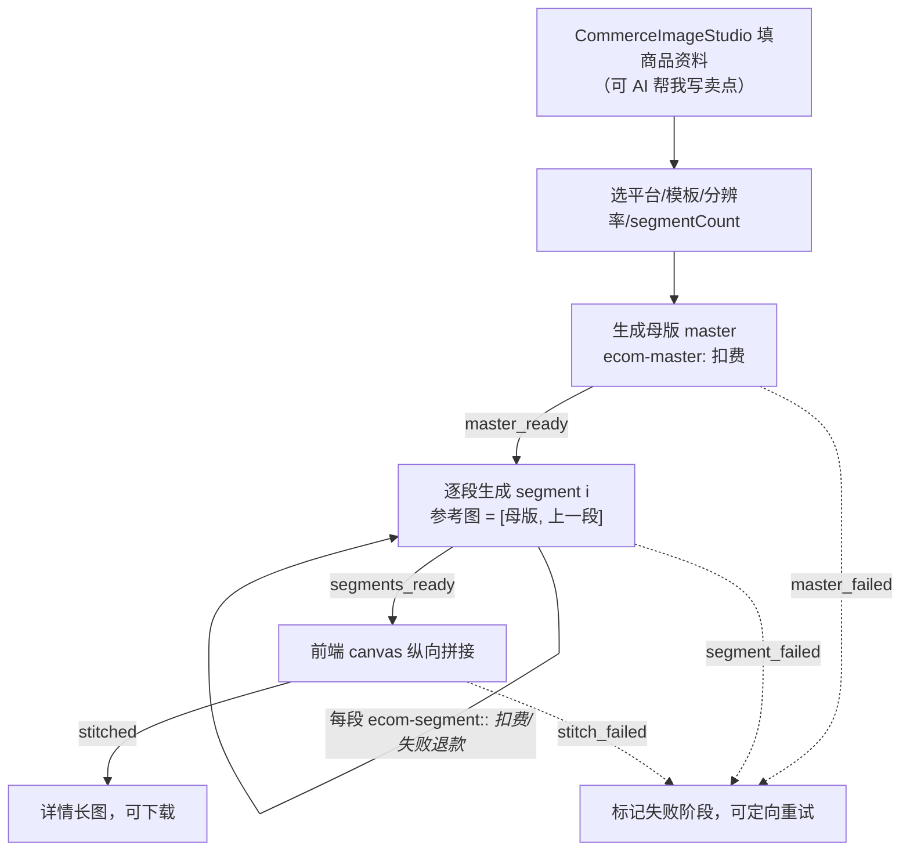

# AI 电商图（深读）

> 自包含学习文档：设计取舍、完整链路、关键参数、踩坑与演进史都在这一篇。核心心法一句话——**电商图本质就是生图，这个模块只做"电商场景的编排与拼接"，底层生成能力全部复用 [生图模块](image.md)**。文中只写环境变量名与占位符，不含真实密钥。

## 一、这个模块是什么

「AI 电商图」是一个容器化的商品图工作台（`CommerceImageStudio`），共享一份商品资料，下挂三个子能力：

| 子模块 | 做什么 | 后端 | 前端 | 数据模型 |
| --- | --- | --- | --- | --- |
| **电商详情长图** | 母版 + 分段 → 纵向拼接成详情长图 | `workflow/ecom-routes.ts` | `EcomWorkflowStudio.tsx` | `EcomWorkflow`（`segmentCount` 默认 3） |
| **电商主图** | 逐张出图 / 按张计费 / 单张重绘 | `workflow/ecom-main-routes.ts` | `EcomMainImageStudio.tsx` | `EcomMainImageJob` |
| **电商帮我写** | LLM 生成卖点 / 额外说明 | `workflow/ecom-helpwrite-service.ts` | 容器内入口 | —（按 token 计费） |

提示词模板在 `ecom-prompts.ts`，尺寸与计费资源键在 `ecom-resolution.ts` / `ecom-main.ts`，前端拼接在 `ecomWorkflowStitch.ts`。

## 二、设计思路（为什么这么做）

### 2.1 只做编排，不碰底层生图

这是这个模块最重要的边界（会话 `019f69e5` 里被用户明确收紧）：**AI 电商图不维护任何独立生图能力**，只保留电商场景特有的东西——商品资料、平台/模板、图组编排、详情长图拼接。底层的模型调用、参考图编辑、重试、素材落库、下载**全部复用生图模块**。代码上就是直接 import：

```ts
// ecom-routes.ts
import {
  callImageEdit, callImageGeneration, retryUntilSuccess,
  storeWorkflowImage, loadImageGenerationConfig,
} from "./image-service.js";
```

好处：模型切换（Qwen / gpt-image-2）、edits 能力、错误分类、尺寸约束改一处，电商自动受益，不会两套实现漂移。

### 2.2 详情长图 = 母版锁定 + 分段续接 + 程序拼接

详情长图不是「一次生成一张超长图」（模型画不了那么高的比例），而是拆成**母版 → 分段 → 拼接**：

1. **母版（master）**：`buildEcomPrompt({ kind: "master" })` 生成整体基调的首图，可带用户参考图。
2. **分段（segment）**：第 `i` 段用 `[母版, 上一段]` 作为参考图生成（`ids = [masterId, previous?.assetId]`），保证纵向视觉连续；每段是**角色化提示词**——`segmentRoleIndex` 把段序钳到三种角色：

   | 角色 | 内容 |
   | --- | --- |
   | 0 首屏 hero | 详情页顶部开场切片 |
   | 1 中段 features | 卖点、参数、材质特写、图标 |
   | 2 尾段 closing | 场景、适用人群、保障、信任背书收尾 |

   提示词里明确写了「只生成第 X 段」「不要照抄母版」「不要重复其它段的主标题/hero」，避免各段雷同。
3. **拼接（stitch）**：前端 `ecomWorkflowStitch.ts` 用 canvas `drawImage` 纵向拼接（客户端拼接，见踩坑 6.5）。

整条链路是一个**阶段状态机**：`master_ready → segments_ready → stitched`，失败标记 `failedStage: master_failed | segment_failed | stitch_failed`，便于精确重试某一段而不是整体重来。

### 2.3 分辨率与按资源键计费

`ecom-resolution.ts` 定义详情图三档尺寸与**按清晰度分档的资源键**：

```ts
const ECOM_SIZE_BY_RESOLUTION = { "1K": "768x1024", "2K": "1536x2048", "4K": "2480x3312" };
ecomMasterResourceKey(res)  // ecom_master_generation_<res>
ecomSegmentResourceKey(res) // ecom_segment_generation_<res>
```

主图侧同理用 `ecom_main_image_generation_<res>`（`ecom-main.ts`）。计费是**先预留、后生成、按交付档结算、失败退款**：母版/分段/主图都走 `reserveResource(请求档)` → 出图 → `settleResource(交付档)`，失败 `refundResource`（`RefundCompensationError` 兜底退款失败的情况）。上游只认宽高比、忽略绝对像素时会按实际交付像素降档收费，见 [image.md](image.md) 6.11；老 billing client 没有 reserve/settle 能力时自动回退到旧的 `chargeResource` 分支。这套资源键必须在计费服务里注册好（后台「电商主图三档清晰度分组」定价），否则会踩 6.2。

> 结算失败**故意不当作失败**：图已经交付，退款等于白送，因此保留预留、打错误日志留给对账，任务状态照常 `ready`/`master_ready`。

> 注：详情图当前保留 1K/2K/4K 三档，而共享的**主生图工作台**因 Qwen 总像素上限 `2048*2048` 移除了 4K（见 [image.md](image.md) 踩坑 6.3）。分辨率与模型能力的匹配是这一类模块最容易出错的地方，改动时务必两侧核对。

## 三、端到端流程（详情长图）



## 四、代码地图

| 文件 | 职责 |
| --- | --- |
| `workflow/ecom-routes.ts` | 详情长图：母版/分段生成、阶段状态机、复用 `image-service` |
| `workflow/ecom-resolution.ts` | 详情图尺寸表 + `ecom_master/segment_generation_<res>` 资源键 |
| `workflow/ecom-prompts.ts` | 母版/分段提示词模板，`segmentRoleIndex` 角色钳制，国内/海外文案 |
| `workflow/ecom-main-routes.ts` · `ecom-main.ts` | 电商主图：逐张出图、按张 `reserveResource` → `settleResource(交付档)`、失败 `refundResource`、单张重绘 |
| `workflow/ecom-helpwrite-service.ts` | 电商帮我写：LLM 生成卖点，按 token 计费 |
| `workflow/ecom-route-{helpers,mutation,types}.ts` | 路由公共逻辑与入参 schema |
| `apps/web/src/components/workflow/CommerceImageStudio.tsx` | 容器：共享商品资料 + 主图/详情图 Tab |
| `apps/web/src/components/workflow/EcomWorkflowStudio.tsx` · `EcomMainImageStudio.tsx` | 详情图 / 主图工作台 |
| `apps/web/src/components/workflow/ecomWorkflowStitch.ts` | 前端 canvas 纵向拼接 |

## 五、关键机制与参数

- **分段续接靠参考图**：第 0 段只用母版；第 i 段用 `[母版, 第 i-1 段]`，靠生图模块的 edits 能力维持连续性（所以电商强依赖生图的参考图链路）。
- **参考图归属校验**：`loadOwnedReferenceImages` 校验参考图属于当前用户；参考图数量上限统一为生图模块的 3 张（Qwen edit 上限）。
- **计费幂等键**：母版 `ecom-master:<workflowId>`、分段 `ecom-segment:<workflowId>:<index>`、主图 `ecom-main:<jobId>:<index>`；每个都可独立退款。
- **失败可定向重试**：阶段状态机让「只重生某一段」成为可能，不必整条链路重跑、重复扣费。
- **帮我写复用全站模型**：不写死模型，走全站配置的百炼模型（见踩坑 6.1）。

## 六、踩坑记录（现象 / 根因 / 修法 / 预防）

> 主要来自 2026-07-16「跑通 AI 电商图模块」会话（`019f69e5`），以及 yun-claude 底座期的电商修复提交。

### 6.1 「帮我写」直接失败——写死 MiniMax-M3
- **现象**：点「AI 帮我写」在上游直接失败。
- **根因**：文案模型被写死为 `MiniMax-M3`，而全站主通道已切到百炼配置模型。
- **修法**：`ecom-helpwrite-service.ts` 改为复用全站已配置的百炼模型。
- **预防**：任何 LLM 调用点都走统一模型配置，不在业务代码里写死模型名。

### 6.2 图已生成却任务失败——计费用了不存在的资源键
- **现象**：图片已由生图引擎成功生成，随后任务却被标成失败。
- **根因**：使用了计费服务里当时**并不存在的独立资源键**（电商主图专用键未注册）。
- **修法**：对齐为使用**已在计费注册**的资源键，并把电商主图/详情分段的扣费统一走生图的计费语义（先扣、失败退款）。
- **预防**：新增计费资源键必须先在计费服务注册（含后台定价），代码与账本两侧一致。

### 6.3 先生成后扣费——白白消耗上游额度
- **现象**：先调上游生成图片、再扣费，一旦扣费环节出问题，上游额度已经消耗。
- **根因**：扣费顺序错误。
- **修法**：改为**先扣现有生图资源、失败自动退回**（`chargeResource` 在前，失败 `refundResource`）。
- **预防**：付费的外部生成一律「先预扣/扣费 → 再调用 → 失败退款」，与全站计费包裹范式一致。

### 6.4 参考图各搞一套
- **现象**：电商自己维护了一套参考图上传，与生图模块重复。
- **根因**：没有复用生图模块的上传/对象存储接口。
- **修法**：参考图上传改走现有生图模块接口，数量与 Qwen 能力统一为最多 3 张。
- **预防**：能复用就复用，尤其是「本质相同」的能力（都是生图 + 参考图）。

### 6.5 详情长图浏览器拼接跨域报错
- **现象**：前端 canvas 拼接分段图时报跨域错误，画布被污染无法导出。
- **根因**：分段图直接从对象存储域拉取，跨域导致 canvas tainted。
- **修法**：新增**同源分段图代理端点**，前端改走代理拉取后再 `drawImage` 拼接。
- **预防**：需要 canvas 导出的图片必须同源（或正确 CORS 头 + `crossOrigin`）。

### 6.6 失败任务永久卡在「生成中」
- **现象**：任务失败后一直显示「生成中」，用户无从判断。
- **修法**：失败任务落到失败态并**展示具体原因**（配合阶段状态机 `failedStage`）。
- **预防**：任务型 UI 必须有明确终态与失败原因，不能只有「进行中」。

## 七、演进史（git × codex 会话）

- **yun-claude 底座期**：电商能力集中成型——`2026-07-01` 电商长图分段修复；`2026-07-07` 一天内密集落地：`EcomWorkflow` 新增 `segmentCount` 字段与迁移、电商主图整套（`EcomMainImageJob` 模型/迁移、逐张出图路由、三档清晰度定价、`buildEcomMainImagePrompt`、`EcomMainImageStudio`、`ecomMainImageModel`）、电商帮我写后端、`CommerceImageStudio` 容器（共享产品资料 + 主图/详情图 Tab）、任务历史移到左侧、**修复浏览器拼接跨域（同源分段图代理端点）**。
- `2026-07-10` `491de0f` 随底座整仓导入本仓库。
- `2026-07-15/16` 生图迁移到百炼后（会话 `019f6402`），`2026-07-16` 会话 `019f69e5` 把电商图**整条跑通并对齐复用生图模块**：修帮我写写死模型、修计费资源键、修扣费顺序、统一参考图、修失败态。真实验收：帮我写 200、主图 Qwen 生成 `ready`、详情两段参考图编辑成功、拼接出 `768×2048` 长图 `stitched`。

## 八、自己动手学习入口

1. 先读完 [image.md](image.md)——电商图是生图的上层编排，不懂生图看不透电商。
2. 读 `ecom-routes.ts` 的 `generateMaster` / `generateSegment`：重点看第 i 段如何用 `[母版, 上一段]` 做参考图、阶段状态机如何流转。
3. 读 `ecom-prompts.ts` 的 `segmentRoleIndex` 与三段角色模板：理解「同一模板如何按段序产出不同构图」。
4. 读 `ecom-main-routes.ts` 的逐张扣费 + `RefundCompensationError`：理解「按张计费 + 失败退款」的补偿逻辑。
