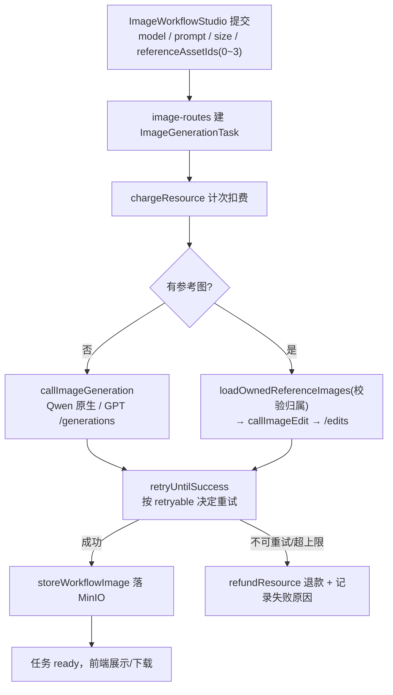

# 生图（深读）

> 自包含学习文档：设计取舍、完整链路、关键参数、踩坑与演进史都在这一篇。生图是**所有图片类工作流的底层能力**——电商图、Codex 桌宠、文章配图、漫剧分镜全都复用它，所以这一篇也是理解后面几条业务线的前置。文中只写环境变量名与占位符，不含真实密钥。

## 一、这个模块是什么

主生图工作台，两件事：**文生图**（纯文字）和**图生图 / 参考图编辑**（带 1~3 张参考图）。它对外只暴露一个统一的生图服务，内部走**双轨模型**：

- **百炼 Qwen Image**（默认）：`qwen-image-2.0-pro-2026-04-22`
- **AI Pixel gpt-image-2**：`gpt-image-2`

后端核心 `apps/api/src/workflow/_shared/image-service.ts`（协议、路由、重试、错误分类都在这里），HTTP 边界 `image-routes.ts`，上游选项 `image-upstream-options.ts`；前端 `apps/web/src/components/workflow/ImageWorkflowStudio.tsx` + `workflowState.ts`。

## 二、设计思路（为什么这么做）

### 2.1 三种模型，单一服务

`image-service.ts` 顶部就是这条设计的浓缩：

```ts
export const QWEN_IMAGE_MODEL = "qwen-image-2.0-pro-2026-04-22";
export const GPT_IMAGE_MODEL = "gpt-image-2";
export const DOUBAO_IMAGE_MODEL = "doubao-seedream-4-5-251128";
export const IMAGE_GENERATION_MODELS = [QWEN_IMAGE_MODEL, GPT_IMAGE_MODEL, DOUBAO_IMAGE_MODEL] as const;
const DEFAULT_IMAGE_MODEL = QWEN_IMAGE_MODEL;
```

两条模型协议完全不同，却收敛到同一个服务里，按 `model` 分发：

- **Qwen Image 2.0 Pro** 走 DashScope 公共模型的**原生同步多模态**标准端点（不是 OpenAI `/images/generations`，也**不需要异步轮询**），凭据复用 `BAILIAN_API_KEY`；只有显式配置 `IMAGE_BASE_URL` / `IMAGE_GENERATION_ENDPOINT` 时才改走自定义入口。
- **GPT Image** 走 **OpenAI Images 兼容协议** `/v1/images/generations`（默认 `https://api.ai-pixel.online/...`），凭据 `GPT_IMAGE_API_KEY`。
- **豆包 Seedream 4.5 文生图** 走火山 Ark 原生图片接口，凭据 `ARK_API_KEY`。

「双轨但单一服务」是刻意的：电商、桌宠等模块只需要依赖这一个 `image-service`，不各自造生图客户端，避免多套实现漂移（这正是电商模块整改时反复强调的，见 [ecom.md](ecom.md)）。

### 2.2 参考图 = 图片编辑（edits），端点靠推导

「根据参考图 + 文字生图」本质是**图片编辑**，不是文生图。GPT 的 `/images/generations` 请求体只能发文字，锁不住同一角色的脸和配件；带参考图必须走 `/v1/images/edits`（`multipart` 的 `image[]`）。为少一个配置项，edits 端点从 generations 地址**推导**：

```ts
if (pathname.endsWith("/generations")) {
  url.pathname = `${pathname.slice(0, -"/generations".length)}/edits`;  // /generations → /edits
} else if (!pathname.endsWith("/edits")) {
  url.pathname = `${pathname}/edits`;                                    // 否则追加 /edits
}
```

`GPT_IMAGE_EDIT_ENDPOINT` 显式配置时优先；`GPT_IMAGE_EDIT_API_KEY` 未配置时复用 generation key。参考图数量上限 `IMAGE_MAX_REFERENCE_COUNT = 3`（`referenceImages.length` 必须 1~3，否则抛错）。参考图还会先做**格式归一化**：BMP/TIFF/GIF 先转成 PNG（取首帧）再喂 GPT edits，因为 edits 只接受 PNG/JPEG/WebP。

### 2.3 尺寸边界 + 错误可重试性分类

- **Qwen 尺寸**：总像素 `512*512` ~ `2048*2048`（`QWEN_IMAGE_MIN_PIXELS` / `QWEN_IMAGE_MAX_PIXELS`），超限后端直接拒绝（这直接导致主工作台**移除 4K**，见踩坑 6.3）。
- **错误分类带 `retryable` 标志**（`classifyImageGenerationError`），决定要不要重试而不是无脑重试：

| 情况 | retryable |
| --- | --- |
| moderation（内容审核） | 否 |
| 401 / 403 认证 | 否 |
| 408 timeout | 是 |
| 429 rate_limit | 是 |
| 5xx upstream | 是 |
| 其它 4xx invalid_request | 否 |
| network / timeout（传输层） | 是 |

`retryUntilSuccess` 按此决定重试；单次尝试超时 `DEFAULT_ATTEMPT_TIMEOUT_MS = 600_000`（10 分钟），`maxAttempts` 达上限抛出。不可重试的错误（如审核拒绝、认证失败）立即失败，不空烧配额。

### 2.4 参考图持久化到任务行

`referenceAssetIds` 落在 `ImageGenerationTask`（迁移 `20260715130000_image_task_references`）。这样服务重启或任务重试时，后台恢复执行会**按原模型 + 原参考图**重放，参考图不丢。计费上先扣（`chargeResource` 按 resourceKey 计次）后生成，失败 `refundResource` 退款。

### 2.5 商品提取只做场景约束，不另建生图链路

生图 Hub 的「商品提取」接收一张商品原图和商品描述，比例、分辨率、模型、上传、任务轮询、取消、历史、下载与计费全部复用通用生图工作台。前端提交时把描述拼成固定的图片编辑约束：保留商品造型与包装细节、正上方平铺构图、纯白 `#FFFFFF` 背景、无人物/道具/水印，并固定单张输出。

商品提取请求使用 `product-extract-` 前缀，通用生图与商品提取在前端按此前缀隔离任务和历史；后端仍走同一个 `/api/workflow/images/generate`，因此没有新增表、队列、计费资源或部署变量。核心文件是 `ProductExtractionWorkflowStudio.tsx`、`productExtractionWorkflowModel.ts` 和可配置的 `useImageWorkflowStudio.ts`。

## 三、端到端流程



## 四、代码地图

| 文件 | 职责 |
| --- | --- |
| `apps/api/src/workflow/_shared/image-service.ts` | **核心**：模型常量、双协议请求构造、edits 端点推导、参考图归一化、错误分类、`retryUntilSuccess`、`storeWorkflowImage` |
| `apps/api/src/workflow/image/image-routes.ts` | HTTP 边界：任务 CRUD、`/references` 上传、计费扣费/退款、后台恢复执行、取消退款 |
| `apps/api/src/workflow/_shared/image-upstream-options.ts` | 上游请求选项 |
| `apps/api/src/workflow/_shared/image-stream.ts` | SSE 读取：绕开中继 60s 读超时，把流式事件归一化回非流式 payload 形状（见 6.8） |
| `apps/api/src/workflow/_shared/image-stream-dispatcher.ts` | undici dispatcher：关掉自带 headers/body 超时，让截止时间只有一个来源（见 6.9） |
| `apps/api/src/workflow/_shared/gpt-image-edit.poc.test.ts` | GPT Image edits 真实链路 POC（`RUN_GPT_IMAGE_EDIT_POC=1` 触发） |
| `apps/web/src/components/workflow/ImageWorkflowStudio.tsx` | 前端工作台（模型选择、参考图上传、尺寸选择） |
| `apps/web/src/components/workflow/ProductExtractionWorkflowStudio.tsx` | 商品提取场景工作台（单原图、描述、白底平铺单张输出） |
| `apps/web/src/components/workflow/productExtractionWorkflowModel.ts` | 商品提取固定提示词、请求前缀与历史作用域 |
| `apps/web/src/workflowState.ts` | 前端纯逻辑状态 |

被复用的下游：电商（`ecom-routes.ts` 直接 `import { callImageEdit, callImageGeneration, retryUntilSuccess, storeWorkflowImage } from "./image-service.js"`）、桌宠（生图走 `gpt-image-2`）、文章配图、漫剧。

## 五、关键机制与参数

- **模型选择贯穿全链路**：任务持久化所选 `model`，后台恢复执行按原模型，不会误切回默认。
- **参考图归属校验**：`loadOwnedReferenceImages` 确认参考图属于当前用户，防跨用户读取（安全边界）。
- **上传端点**：`POST /api/workflow/images/references` 独立上传参考图生成 `ImageAsset`，再由生成任务引用其 id。
- **计费幂等键**：`image:<requestId>`；扣费失败或任务取消都走 `refundResource(chargedOperationId)`。
- **按交付档位结算（2026-07-27）**：`reserveResource(请求档)` → 出图 → `settleResource(交付档)`，差额由 Go 侧 `settlePricedUsage` 自动退回。判定在 `image-delivered-tier.ts`，只降不升，一批图取**最小**那张（宁可少收）。详见 6.11。
- **凭据复用链**：`GPT_IMAGE_EDIT_API_KEY` 缺省复用 `GPT_IMAGE_API_KEY`；Qwen 复用 `BAILIAN_API_KEY`；减少配置项。
- **openai 协议默认流式**：中继有 60s 读超时而真实出图要 56s 以上，必须靠流式保活（见 6.8）。`IMAGE_UPSTREAM_STREAM=0` 可关闭。
- **超时只有一个来源**：单次尝试截止时间由 `IMAGE_ATTEMPT_TIMEOUT_MS`（默认 600s）的 AbortController 掌管，undici 自带的 headers/body 超时一律关掉（见 6.9），避免两套超时打架。
- **跨域共享派发闸门（2026-08-28）**：出图并发过去各域自己定（图文按 2 分批、生图按 count 最多 8 扇出、人像最多 4、桌宠 1），但打的是同一个中继，谁扇得宽谁挤掉谁（429 + 重试放大）。`_shared/image-dispatch-gate.ts` 把许可收到进程级、**按上游 host 分池**：同一 host 同时在飞不超过 `IMAGE_UPSTREAM_CONCURRENCY`（默认 4，0 = 关闭），先到先得。排队超过 `IMAGE_UPSTREAM_QUEUE_WAIT_MS`（默认 120s）**直接放行**（fail open）——闸门永远不许让一次已付费的调用失败。许可在 `onRequestDispatching` 与单次尝试 deadline **之外**获取，排队不吃尝试预算、也不让台账先记下没发出的派发。代价：排队期间不写心跳，因此 `articleProjectStaleMs` / `portraitTaskStaleMs`（try-on 复用）/ `DEFAULT_STALE_TASK_MS` 都把 `imageDispatchWorstWaitMs()` 算进阈值，漏算就会把在排队的行判成卡单收尸。桌宠不受影响：它的心跳是独立定时器。
- **改一处，9 个调用点受益**：所有走 openai 协议的出图都收敛在 `image-service`，因此形象照/电商/通用生图/桌宠/文章配图/漫剧全部自动获得上述两项修复。

## 六、踩坑记录（现象 / 根因 / 修法 / 预防）

> 主要来自 2026-07-15「接入百炼生图模型 / 修参考图上传 / 接入 gpt-image-2」会话（`019f6402`）与桌宠 edits 探测会话（`019f6f66`）。

### 6.1 迁移后生图完全不可用——默认 gpt-image-2 + 死网关回退
- **现象**：生图功能实际不可用。
- **根因**：`image-service.ts` 默认用 `gpt-image-2` 而 `IMAGE_*` 配置为空，回退到**未运行的** `127.0.0.1:9999`。
- **修法**：底层直接适配百炼 `qwen-image-2.0-pro-2026-04-22`，默认模型改为 Qwen，`IMAGE_API_KEY` 为空时复用 `BAILIAN_API_KEY`，地址由 Workspace/Region 生成，删除本地网关回退。
- **预防**：默认配置必须指向真实可达的上游，别让「占位默认值 + 死回退」组合成不可用。

### 6.2 Qwen 被当成 OpenAI 协议调用
- **现象**：按 OpenAI `/v1/images/*` 构造请求，Qwen 型号不工作。
- **根因**：`qwen-image-2.0-pro` 只支持百炼**同步多模态**接口，不是 OpenAI `/images/generations`，也不需要异步轮询。
- **修法**：按百炼原生请求/响应格式重写文生图与图片编辑；主生图路由复用统一服务。
- **预防**：接第三方模型先确认它的**原生协议**，不要假定「都是 OpenAI 兼容」。

### 6.3 主工作台移除 4K
- **现象**：4K 选项生成失败。
- **根因**：Qwen 输出总像素上限 `2048*2048`，4K 超限。
- **修法**：主生图 UI 只保留 1K/2K，后端拒绝超限请求。
- **预防**：能力边界（尺寸/时长/张数）要在 UI 和后端**双侧**约束。

### 6.4 「上传参考图」按钮点了没反应
- **现象**：点击上传参考图无任何反应。
- **根因**：该按钮只有静态样式——没有 `onClick`、没有隐藏 `<input type="file">`，前端状态和后端请求里也没有参考图字段，点了必然无效。
- **修法**：补成完整链路——文件选择、缩略图预览/删除、数量与格式校验（JPG/PNG/WEBP/BMP/TIFF/GIF、单张 ≤10MB、最多 3 张）、参考图先生成资产、任务持久化 `referenceAssetIds`、后台走 Qwen 图片编辑。
- **预防**：「看起来能点」不等于「接了逻辑」；交互组件要连到真实数据流并有测试。

### 6.5 GPT Image 只给了 generations 地址，参考图先禁用后补齐
- **现象**：接 `gpt-image-2` 时只拿到 `/v1/images/generations`，无法处理参考图。
- **根因**：generations 端点只能发文字，参考图必须走 `/edits`，当时不能凭空猜 edits 地址。
- **修法**：第一版 GPT 选参考图时**明确阻止提交**；后来桌宠会话真实探测确认 `/v1/images/edits` 可用（单图/多图/`1536×1024` 横版均 200），才补齐 GPT 多参考图编辑，并让 edits 端点从 generations 推导。
- **预防**：能力未验证前宁可**显式禁用**并提示，也不要靠猜测拼接端点。

### 6.6 网关会改写 quality/size/model 参数
- **现象**：请求 `1024×1024 + low`，响应实际 `1254×1254 + auto`；模型名被改写为 `gpt-image-2-codex`。
- **根因**：中间网关没有严格透传尺寸/质量/模型参数。
- **修法**：**记账与展示一律以响应回传的实际 `quality/size/model/usage` 为准**，不假定请求参数一定生效。
- **预防**：经第三方网关的调用，落库与计费用「上游实际返回值」，别用「请求值」。

### 6.7 用浏览器点页面做验收（被纠正）
- **现象**：早期用浏览器点页面验证生图是否正常。
- **修法**：改用真实最小调用 POC——`512×512` 生成一张、下载校验 HTTP 200 / MIME / 字节数（约 270KB / 7.6s）；GPT edits 用 `RUN_GPT_IMAGE_EDIT_POC=1` 只在部署/网关切换/模型升级时跑。
- **预防**：功能验收用带环境开关的真实 POC，网页只用于查文档。

### 6.8 `fetch failed` 约 50% 概率——中继 nginx 的 60s 读超时

> 来自 2026-07-27 形象照全风格实拍会话。

- **现象**：gpt-image-2 出图约一半概率失败，错误只有一句 `fetch failed`。库里 `PortraitTask` 的耗时呈双峰：57s 成功、188s/162s 失败（后者 = 3 次尝试 × 约 60s）。看起来像尺寸或画质问题。
- **根因**：第三方中继是 nginx，`proxy_read_timeout` 默认 **60s**；而**非流式**出图要等整图就绪才回第一个字节，实测单图真实耗时 56–155s。于是成败纯粹取决于「这次出图有没有跑进 60s 以内」，跟尺寸、画质、HTTP 版本都无关。直连探针拿到硬证据：`SocketError: other side closed` 精确发生在 **60.6s**。
- **修法**：openai 协议出图/改图统一带 `stream=true` + `partial_images`，`image-stream.ts` 读 SSE 并把结果归一化回既有的 `{ data: [{ b64_json }] }` 形状，复用原解析器。流式下响应头 15s 就到，之后 partial 事件持续喂数据，读超时永不触发——实测跑到 99.8s 仍正常收尾。`readImagePayload` 按实际 `content-type` 分派，中继若忽略 `stream` 直接回 JSON 则照旧解析，因此不会让不支持流式的上游失效；`IMAGE_UPSTREAM_STREAM=0` 可整体关掉。
- **预防**：长耗时上游（出图/出视频）走第三方中继时，**默认假设中继有 60s 级的读超时**，优先用流式保活，不要靠加长本地超时——本地 `AbortController` 设到 600s 也救不了服务端主动断连。诊断时先用直连探针打出完整 `error.cause` 链，`fetch failed` 本身不含任何信息。

### 6.9 修好流式后暴露的 `terminated`——undici 自带超时抢在 AbortController 之前

- **现象**：6.8 修完后多数风格正常，但 `poster` 预设失败，错误从 `fetch failed` 变成 `terminated`，耗时 334s。
- **根因（部分确证）**：`terminated` 是 **undici 自带超时**抛的，不是中继断连（那个是 `other side closed`）。undici 默认 `headersTimeout` / `bodyTimeout` 都是 300s，且 `bodyTimeout` 计的是**两个 chunk 之间的间隔**而非总时长；`fetchWithTimeout` 的 600s AbortController 管不到它们。探针实测响应头到达时间在 **15s–76.5s** 之间大幅波动，出图总耗时在 **62s–334s** 之间波动，长尾确实会撞上 300s。
- **修法**：`image-stream-dispatcher.ts` 给 https 上游挂 `headersTimeout: 0` / `bodyTimeout: 0` 的 undici `Agent`，让单次尝试的截止时间**只有一个来源**（`IMAGE_ATTEMPT_TIMEOUT_MS`，默认 600s）。挂在 `fetchWithTimeout` 内部，三个调用点自动受益；显式传入的 dispatcher 不覆盖（保留测试注入）；本地 http（minio/回环）不受影响。`IMAGE_UPSTREAM_DISPATCHER=0` 可关掉。
- **诚实的边界**：修完 poster 以 62s 成功，但**这次成功不构成隔离证据**——62s 本来就碰不到 300s。保留这个改动的理由是架构正确（消除两套互相打架的超时），而非已证明它修复了 334s 那次。
- **预防**：修掉一个超时后要**假设还有下一道**。区分错误文本：`other side closed` = 服务端断连，`terminated` / `UND_ERR_*_TIMEOUT` = 本地 undici 掐的。让探针打印 chunk 间隔最大值和首字节时间，两者能一眼分辨。

### 6.10 不要把耗时波动误判成确定性失败

- **现象**：`magazine` 风格失败，`fetch failed`，但耗时只有 **5s**。
- **根因**：瞬时故障（连接立即被拒），与 6.8/6.9 的超时类失败无关——5s 碰不到任何一道超时。直接重试即成功（63s）。
- **预防**：**先看耗时再判类型**。这个上游的耗时波动极大（同一 `poster` 预设实测 62s / 140s / 334s），所以失败签名要按耗时分三类：约 60s = 中继读超时，约 300s = undici 自带超时，5–10s = 瞬时故障直接重试。不看耗时就归因，会把三个不同的问题混成一个。

### 6.11 请求 2K 收 2K 的钱，上游只给 1K 的图

> 来自 2026-07-27 扣点逻辑优化会话。

- **现象**：形象照 15 张实拍产物里，14 张按 2K（`1728×2304`，3.98 MP）下单、1 张按 1K，落库 `ImageAsset.size` 全是「请求尺寸」，看不出异常。但把二进制拿出来量，**15 张实际都是约 1.573 MP**。也就是说 1K 和 2K 出的是**像素完全一样的图**，而 2K 收双倍点数。
- **根因**：两层叠加。一是中转上游对 gpt-image-2 只认**宽高比**，忽略绝对像素（与 6.6 的参数改写同源）；二是我们只把「请求尺寸」写进 `ImageAsset.size`，从来没记过「交付尺寸」，于是多收这件事在库里**没有任何痕迹**可查。
- **修法**：
  - `ImageAsset` 加 `width` / `height` 两个可空列（迁移 `20260727160000_image_asset_delivered_size`），在 `storeWorkflowImage` 里用 sharp 量一次真实宽高——一个测量点，5 个写库点全部受益；量不出来（上游只给 url 且没配对象存储）就留 `null`。
  - `image-delivered-tier.ts` 定档：从请求档**向下**走，交付像素达到某档的 92%（`DELIVERED_TIER_TOLERANCE`）就落在那档，**永不高于请求档**；一批图用 `minDeliveredPixels` 取最小的那张。
  - 计费改成 `reserveResource(请求档)` → 出图 → `settleResource(交付档)`。Go 侧 `resource.Service.Settle` 用**结算时**传入的 resourceKey 重新报价，`settlePricedUsage` 退回 `预留 − 实收`，所以不需要新增计费原语。通用生图 / 电商长图（主图+分段）/ 电商主图都从「先 `chargeResource` 后干活」改成了预留—结算；`chargeResource` 保留为兼容分支，供没有 reserve/settle 能力的老 billing client 使用。
  - 历史行 `width/height` 为 `null` 时**回退到请求档**——没有证据就不改价，既不误退也不多收。
  - 电商两条链的结算失败**故意不致命**：图已经交出去了，退款等于白送，因此保留预留、打错误日志留给对账，测试对这点有断言。
- **预防**：**「请求参数」和「交付结果」必须分两列落库**，否则按请求收费的错误在数据层不可见、不可审计。经中转的生图，计费口径一律用交付像素；四舍五入的方向永远选对用户有利的那边。
- **未回收的历史多收**：14 张 2K 实拍多收的点数**没有追溯退款**，只修了口径。

## 七、演进史（git × codex 会话）

- **yun-claude 底座期**：生图基础成型——`2026-07-06` 工作流生图显示算力点价格；`2026-07-07` 生图支持多 prompt 并发提交 + 最近任务独立队列侧栏 + 未完成任务后台生成动画。
- `2026-07-15`（会话 `019f6402`）：迁移到百炼 `qwen-image-2.0-pro`（原生同步多模态）、修复参考图上传全链路、接入第二后端 `gpt-image-2`（白名单路由 + 真实端点验证）、移除 4K。
- `2026-07-17`（桌宠会话 `019f6f66`）：真实探测 `/v1/images/edits`（单图/多图/横版），确认网关改写参数与 `gpt-image-2-codex` relay alias，为桌宠「`4×2` 姿势板 + 程序化拼接」链路铺路（见 [codex-pet.md](codex-pet.md)）。

## 八、自己动手学习入口

1. 读 `image-service.ts`：抓住「模型常量 → `loadImageGenerationConfigForModel` 分发 → edits 端点推导 → `classifyImageGenerationError` → `retryUntilSuccess`」这条主线。
2. 看 `image-routes.ts` 的后台执行：`reserveResource` → 有无参考图分支 → `storeWorkflowImage`（顺手量交付宽高）→ `settleResource(交付档)`，失败 `refundResource`。
3. 真实验证 GPT edits：`set -a; source .env; set +a; RUN_GPT_IMAGE_EDIT_POC=1 pnpm --filter @ai-assistant/api exec vitest run src/workflow/_shared/gpt-image-edit.poc.test.ts`。
