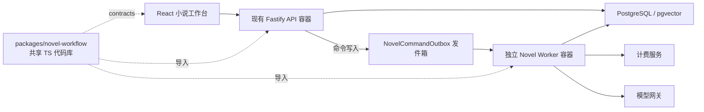

# 小说工作流（深读）

> 自包含学习文档：设计取舍、完整链路、关键机制、踩坑与演进史都在这一篇里。全项目最重的业务线——约 33 个 `Novel*` 数据模型、一个独立 Worker 进程、一个前后端共享的领域包。

## 一、这个模块要解决什么问题

普通对话「一问一答」，小说要解决的是另一个量级的工程问题：**让 AI 在数十万字的跨度里维持人物一致性、因果链完整、伏笔闭合，并且能无人值守地一章章推进**。模型自身的上下文窗口装不下整本书，所以核心思路不是「把书塞进 prompt」，而是**引擎在数据库里维护完整的叙事状态，每写一章都从状态里动态装配上下文**。

后端设施在 `apps/api/src/novel/`，生成链路在 `apps/api/src/workflow/novel-*.ts`，前后端共享纯逻辑在 `packages/novel-workflow/`，独立执行进程是 `apps/api/src/workers/novel-worker.ts`，前端在 `apps/web/src/components/novel/`。

## 二、血统：一个产品前身 + 一个外部蓝本

理解这个模块必须先理清它的来历，否则会困惑于「为什么它和别的模块气质不一样」。

- **fqxs（产品前身）**：番茄小说自动平台原型（Python/FastAPI + React）。2026-07-10 有一份《fqxs 小说工作台整合计划》，07-11 落地为 `05bf3ac feat: add novel workbench integration`。它贡献了第一版工作台的**产品形态**与「自动持续迭代」思路。代码里还留有痕迹，如测试名 `builds fqxs-style layered context`。
- **PlotPilot 墨枢（外部蓝本）**：开源「叙事引擎内核」（Python/FastAPI + Vue + SQLite/ChromaDB），[github.com/shenminglinyi/PlotPilot](https://github.com/shenminglinyi/PlotPilot)。2026-07-14 起，小说引擎**按它的概念体系用 TypeScript 在本仓库重写**，测试直接以它为基准（`uses PlotPilot-compatible convergence thresholds`、`allocates the full completion budget for PlotPilot story-tree planning`）。

**为什么是「clean-room 重写」而不是直接搬 PlotPilot 代码**：codex 会话里明确核对过——PlotPilot 采用 Apache 2.0 + Commons Clause，限制把其功能性衍生作品用于收费产品，而本项目有计费。所以决策是：参考其交互、信息架构、行为规格和官方截图作为验收基准，用当前 TS 技术栈**独立实现**，不复制其源码、提示词、品牌、Logo 或素材。

## 三、核心架构决策：独立 Worker 容器 + 共享代码包

这是小说模块最重要的一条决策（codex 会话 `019f5f3a` 里反复推敲过），直接决定了它的形态。

**结论：现有 API + 独立小说 Worker 容器，不做完整微服务，也不把生成引擎塞在 API 进程内。**



**为什么不塞在 API 进程里**：API 有 2–6 个副本、滚动发布、单副本 1 CPU/1 GiB 限额；而全托管小说任务持续时间长、模型调用多。嵌进 API 会导致：多副本重复抢任务、发布滚动中断长任务、生成负载拖慢登录/聊天等普通接口、无法独立扩容。仓库已有成熟先例——本地商家宣传用同一镜像另起一个 Worker Deployment，小说直接复用这个「模块化单体 + 独立任务进程」模式。

**`packages/novel-workflow` 是什么**：它是 pnpm monorepo 里的一个**共享 TypeScript 代码包**，不是微服务——不监听端口、不拥有数据库、不单独部署。内部分层：

- `contracts`：前后端共享的 zod Schema、DTO、状态枚举、流事件类型（浏览器安全）。
- `domain`（5 个纯逻辑模块）：`chapter-progress`、`context-budget`、`quality-gate`、`review-policy`、`story-phase`——故事阶段、上下文预算、质量门禁、审阅策略、章节进度，全是可独立单测的纯函数。
- `server`：上下文装配、提示词运行时、生成管线（只允许 API/Worker 服务端导入）。
- `ports`：数据库、模型、计费、队列、事件发布的接口。

实际部署入口仍在 `apps/api`：`novel/routes.ts`（HTTP）、`workers/novel-worker.ts`（Worker 入口）、`apps/web/src/components/novel`（前端）。

## 四、异步与一致性的三道保险

小说任务动辄几分钟、要能断点恢复、要防止同一本书被并发写，靠三个机制叠起来。

### 4.1 发件箱（Outbox）— 命令与业务同事务
`apps/api/src/novel/outbox.ts`：API 端把生成命令先写进 `NovelCommandOutbox`（与业务数据同一事务），Worker 端 `dispatchNovelOutboxBatch` 轮询认领。认领用**乐观并发**而非锁：

```ts
where: { status: "pending", availableAt: { lte: now } }  // 取待投递
// 再逐条 CAS 认领：
updateMany({ where: { id: row.id, status: "pending" }, data: { status: "dispatching", attempts: { increment: 1 } } })
if (claimed.count !== 1) continue;   // 没抢到就跳过（多副本安全）
// 投递成功 → status: "sent"；失败 → 退回 "pending"
```

好处：命令不会因为「业务写成功但消息没发出去」而丢，也不会因为多副本而重复消费。

### 4.2 项目级串行锁 — 一本书同时只有一个任务
`apps/api/src/novel/project-lock.ts` 的 `withNovelProjectLock`：Redis 锁 `novel:project-lock:<projectId>`，TTL 5 分钟、每 30 秒续租、获取超时 90 秒（超时报「同一作品的前序任务仍在执行，请稍后重试」）。这保证「规划 / 写章 / 章后分析」不会对同一本书并发跑，避免叙事状态被并发写坏。

### 4.3 中断恢复 — Worker 崩了任务不卡死
Worker 启动时和定时器里都会跑 `recoverInterruptedNovelSteps`（`running` 且超过 `NOVEL_INTERRUPTED_WORK_MS = 90_000` 未更新 → 退回 `queued`）和 `recoverInterruptedNovelTasks`（悬挂的 queued/running 任务重新排队）。Worker 有两个定时器：`dispatchTimer`（投递）和 `recoveryTimer`（恢复），健康端口 `NOVEL_WORKER_HEALTH_PORT`（默认 8091）只提供 `/health`。

运行过程以事件溯源方式落 `NovelRun` / `NovelRunStep` / `NovelRunEvent`，前端「全托管驾驶」页靠读这些表渲染进度、DAG 和运行日志。

## 五、PlotPilot 概念 → 本仓库实现对照

| PlotPilot 内核子系统 | 本仓库对应 |
| --- | --- |
| 叙事状态机（Story Bible / 章级摘要链 / 叙事事件流 / 故事线 DAG） | `NovelBible`、`NovelWorldDimension`、`NovelCharacter`/`Relation`、`NovelLocation`、`NovelStructureNode` + `NovelTimelineEvent`/`NarrativeEvent`/`CausalEdge` + `NovelStoryline`/`Milestone` |
| 伏笔与叙事债生命周期 | `NovelForeshadowItem`/`Event`、`NovelNarrativeDebt`、`novel/narrative-ledger.ts`（07-16 修复后才有真正的状态机，见踩坑 7.4） |
| 向量语义检索层（原 ChromaDB） | `NovelVectorMemory` + pgvector（`workflow/novel-vector-memory.ts`），统一 1024 维 |
| 自动驾驶守护进程 | novel-worker + `NovelRun/RunStep/RunEvent` + `NovelCommandOutbox` + `project-lock` |
| 提示词策略层（接点/提示包） | `NovelPromptTemplate`/`Version` + `workflow/novel-prompts.ts` |
| 质量监控（张力/文风/陈词滥调） | `NovelQualityReport` + `novel/score-backfill.ts` + `workflow/novel-review.ts`、`novel-text-analysis.ts` |
| SQLite 单写者路由 | 不需要——Postgres 事务 + Redis 项目锁替代 |

**上下文装配优先级（固定）**：叙事契约与硬约束 → 当前章执行剧本 → 世界/人物状态 → 最近章节摘要 → 语义召回 → 伏笔/故事线/道具 → 文风约束。按模型上下文窗口分配预算（`domain/context-budget`），超限时压缩低优先级记忆，**绝不截断硬约束**。

## 六、写作模型选择（一个小而完整的设计样本）

来自会话 `019f6bc9`「确定写作模型入口位置」，展示了「先想清放哪、数据流是否成立，再动手」的方法。

- **放在哪**：小说工作台顶部项目级工具栏（作品统计/设置附近），语义是「整本作品的默认写作模型」，始终可见。不放在「生成正文」按钮旁（会暗示只对单章生效），也不藏进设置弹窗（模型是高频、影响成本的重要选项）。
- **数据落哪**：项目现有的 `generationPrefs` JSON 字段（`withNovelWritingModel` / `novelWritingModel`）。
- **优先级**：`novel-task-runner.ts` 里 `templateModel`（提示词节点绑定）> `novelWritingModel(project.generationPrefs)`（项目写作模型）> 系统默认（`NOVEL_TEXT_MODEL` 或 `GLM-5.2`）。
- **切换时机**：每个生成任务**启动时冻结**本次模型（写进 run snapshot），生成过程中不可改；切换只对下一次尚未开始的任务生效。全托管模式下如果下一章已排队，提示「将从第 N+1 章起生效」。
- **兼容性筛选**：`openai-only` 等暂不兼容小说引擎的模型「展示但不可选」；非模型广场（`showInMarketplace !== true`）的模型除非被模板显式指定，否则拒绝。

## 七、踩坑记录（现象 / 根因 / 修法 / 预防）

### 7.1 fqxs 审阅闭环缺口（会话 019f5ec3）
- **现象**：整合 fqxs 后小说流程看似跑通，但下一章闸门会误判。
- **根因**：两处闭环断裂——① 已通过的章节被再次编辑后没回退「待审」，下一章闸门用了过期的「已通过」；② 上一章的开放线索虽已存库，却没进入下一章的连续层和收尾钩子。
- **修法**：开放线索进入下一章任务卡；已通过章节再编辑自动撤销通过状态；改稿率低于 15% 时后端拒绝标记「已通过」；仅更新审阅状态时不清空人工备注。
- **预防**：「生成 → 改稿 → 审阅 → 续写」是一个状态闭环，任何一环的状态漂移都会让门禁失灵，要有回归测试守住。

### 7.2 张力趋势图「每章都一样」（四问题报告 2026-07-16）
- **现象**：31 章张力评分全是 100，趋势图看起来毫无变化。
- **根因**：不是数据没变，而是**评分算法严重饱和** + 概览图只画张力、不画质量，缺项放大了「都一样」的错觉。
- **修法**：修正评分算法脱离饱和区间，概览补上质量维度。
- **预防**：可视化「看起来没变」时，先怀疑算法饱和与展示缺项，别急着以为数据管线坏了。

### 7.3 运行日志无法定位时间
- **现象**：运行日志用序号而非时间戳，排查时对不上时间。
- **修法**：日志前缀改为时分秒。
- **预防**：面向排查的日志，时间戳是刚需。

### 7.4 伏笔/叙事债 31 章「零变化」——只有检测没有状态机
- **现象**：伏笔与叙事债跨 31 章完全不变。
- **根因**：系统只做「新增检测」，没有强化/回收/关闭的**生命周期状态机**，还叠加了历史脏数据。
- **修法**：`narrative-ledger.ts` 建真正的状态机，让跨章实体能演进。
- **预防**：跨章演进的实体（伏笔、债、人物状态）必须建状态机，而不是只在生成时「新增」。

### 7.5 生成请求无法复现——没留档完整 prompt
- **现象**：出问题想复现，却发现只存了参数和结构化上下文快照，没存最终发给模型的完整 system/user prompt。
- **修法**：展示并留档每章生成前发给 AI 的提示词。
- **预防**：付费/复杂生成链路要留 prompt 审计，可观测性要提前设计。

### 7.6 计费口径——只数作者可见文本
- **设计**：`novel-billable.ts` 的 `visibleCharCount`/`billableCharCount` 只统计作者可见值，**不数 JSON key**，避免结构化输出把计费撑大；章后分析、向量索引、质量评分不重复扣费；若 AI 结果不是完整 JSON 则取消保存、不扣费（报「AI 生成结果不是完整 JSON，已取消保存，请重新生成」）。

### 7.7 迁移「假通过」——包名过滤器失效
- **现象**：按历史计划跑测试，命令「通过」了却其实没跑到小说用例。
- **根因**：包名已从 `@yc/*` 迁到 `@ai-assistant/*`，旧的 `--filter` 过滤器匹配不到，等于空跑；另外全量 API 测试里依赖 `DATABASE_URL` 的集成用例会因未加载 `.env` 而报错，容易和真实回归混淆。
- **修法**：改用当前包名和精确的 Vitest 文件入口跑；加载 `.env` 后区分环境问题与真实回归。
- **预防**：迁移后不能只信历史命令，一切以当前仓库为准；注意「假通过」。

## 八、演进史（git × codex 会话）

- `2026-07-10` fqxs 整合计划 → `2026-07-11` `05bf3ac` 落地（会话 `019f5ec3`，补齐审阅闭环）。
- `2026-07-14` 规划按 PlotPilot 重写（会话 `019f5eec`/`019f5f3a`：确认 clean-room 边界、独立 Worker 架构）→ `c07be4a 重构小说引擎并接入独立工作进程` → `986e9f9` 向导实时输出 + 切换步骤 bug 修复。
- `2026-07-15` `33ce69c 完成小说全流程测试`（首次全流程跑通，见本文附录 B）→ `605dd23` 工作台 UI 优化。
- `2026-07-16` `555679f` 修复小说四问题（张力/日志/prompt 留档/伏笔，见本文附录 A）；会话 `019f6a29`（排查章节生成）、`019f6b80`（脚本微节拍空白排查）、`019f6bc9`（写作模型入口）。
- `2026-07-17` `9dc3362` 修复执行剧本与微节拍 → `4b552c2`「监控与 DAG」并入「全托管驾驶」（信息架构收敛）。
- 过程花絮：规划阶段一度误用本机 `all-plan` skill 触发了 CCB 的 `ask`/`pend` 外部顾问，被用户当即叫停并要求恢复原状——项目已明确弃用 CCB。这也提醒：动手前要确认所用流程是否符合项目当前约定。

## 九、自己动手学习入口

1. 先读 `packages/novel-workflow/src/domain/` 五个纯逻辑模块（带测试），它们是引擎的「规则内核」，最容易独立理解。
2. 再读 `apps/api/src/novel/outbox.ts` + `project-lock.ts`：理解「命令发件箱 + 项目串行锁 + 中断恢复」这套一致性三件套。
3. 顺着 `apps/api/src/workers/novel-worker.ts` 看两个定时器如何驱动整条流水线。
4. 精读两篇深度排查报告（见本文附录 A、B 全文）；fqxs 整合计划见附录 C。


## 附录 A：四项问题排查报告（2026-07-16，全文）

### 小说模块四项问题排查报告（2026-07-16）

#### 1. 排查范围与结论摘要

本报告第一版先按要求完成了源码、接口和本地真实数据库的只读排查。随后根据后续“逐一修复”的指令完成了代码修改、数据库迁移、历史 31 章受控重算/重扫和页面验收。前半部分保留原始根因与方案，实施结果见第 8 节。排查对象为截图中的作品：

- 作品：`全球程序员的能力下降 10000 倍`
- 项目 ID：`cmrkoxh67000qc3rq6cheiwnt`
- 当前正文：第 1–31 章，共 31 章
- 当前状态：第 31 章生成完成，等待人工审阅

| 问题 | 结论 | 性质 | 建议优先级 |
| --- | --- | --- | --- |
| 1. 张力与质量趋势都一样 | 真实数据库中 31 章张力全部为 100；质量分并不完全相同，而是 78/82/88 三档。概览图只画张力柱、没有画质量，张力算法又严重饱和，因此页面看起来完全一样 | 评分算法 Bug + 展示缺项 | P0 |
| 2. 运行日志前缀改为时分秒 | 事件表和 API 已经完整返回 `createdAt`，前端却使用事件序号 `sequence` 作为前缀；不需要改数据库或后端协议 | 纯前端展示问题 | P2 |
| 3. 展示每章生成前发给 AI 的提示词 | 当前只保存任务参数、结构化上下文快照和模型名，没有保存最终发给模型的完整 system/user prompt；现有 31 章无法保证精确还原 | 可观测性与审计能力缺失 | P1 |
| 4. 伏笔和叙事债务 31 章无变化 | 确实有 Bug/设计缺口。当前 5 条伏笔和 5 条债务全部来自第 1 章的普通对白问句，之后 30 章没有新增、强化、回收或关闭；系统只有有限的“新增检测”，没有真正的生命周期状态机 | 数据抽取误判 + 状态机缺失 + 历史脏数据 | P0 |

建议先修复问题 1 和问题 4 的计算/状态逻辑，再做问题 3 的完整请求留档，最后完成问题 2 的低风险展示修改。若先只改图表和页面，底层错误数据仍会继续误导用户。

---

#### 2. 问题一：张力与质量趋势为什么都是一样的

##### 2.1 真实数据结果

数据库中 31 章的分数分布为：

- `tensionScore`：最小 100、最大 100、不同取值数 1。
- `qualityScore`：最小 78、最大 88、不同取值数 3，实际取值为 78、82、88。
- `plotTension`：31 章全部为 100。
- `emotionalTension`：多数为 100，少数为 80。
- `pacingTension`：90、95、100 三档。

因此截图中的相同柱高不是前端把不同的张力数据画错了，而是后端持久化的总张力本身全部为 100。与此同时，标题写着“张力与质量趋势”，但这个页面实际上没有绘制质量分，所以用户看不到质量的少量变化。

##### 2.2 根因一：张力公式很容易超过 100，最后被统一截断

当前张力计算位于 `apps/api/src/workflow/novel-text-analysis.ts` 的 `buildNovelQualityDiagnostics`：

```text
张力 = min(100,
  min(字数 / 18, 28)
  + 问号数 × 7
  + 感叹号数 × 4
  + min(张力关键词命中数 × 5, 35)
  + 章末钩子 12
)
```

该公式使用标点和关键词的绝对次数，而不是按字数或句子数归一化。对 2,400–3,200 字的正常章节：

- 字数项固定拿满 28 分；
- 10 个问号已经贡献 70 分；
- 10 个感叹号再贡献 40 分；
- 还没有计算关键词和章末钩子，就已经超过 100。

对这 31 章的质量报告反算后：

- 25/31 章仅“字数 + 问号 + 感叹号”三项就已经达到或超过 100；
- 这三项的最低值为 65，最高值为 250；
- 剩余 6 章加上关键词和章末钩子后也全部达到 100。

这证明张力曲线失去区分度的直接原因是评分饱和，不是小说 31 章的实际张力真的完全一致。

##### 2.3 根因二：三个子张力并非独立计算

`apps/api/src/novel/runner.ts` 的 `scoreTension` 步骤中：

- 情节张力 = 总张力 × 1.05，最高 100；
- 情绪张力 = 总张力 × 1 或 0.8；
- 节奏张力 = `(质量诊断分 + 总张力) / 2`。

三个子维度都直接派生自同一个已经饱和的总张力，缺少独立的情节升级、人物情绪压力和节奏变化证据。因此即使页面将三个维度展开，仍会高度同质化。

##### 2.4 根因三：概览图没有真正展示“质量”

`apps/web/src/components/novel/NovelIntelligenceWorkspace.tsx` 的概览图：

- 标题是“张力与质量趋势”；
- tooltip 中包含 `qualityScore`；
- 实际 DOM 只渲染了以 `tensionScore` 为高度的单组柱子。

全托管页面 `NovelRunCockpit.tsx` 另有一个“柱高为张力、圆点为质量”的图，但故事导航概览页没有复用该表现。截图所在页面因此只显示 31 根相同的张力柱。

##### 2.5 质量分本身也过于离散

质量门禁的总分由一致性、文风和张力加权产生。由于张力固定 100，一致性和文风又主要使用少数离散档位，最终 31 章只出现 78、82、88 三个质量值。质量并非完全相同，但区分能力仍然偏弱。

##### 2.6 建议修改方案

###### A. 重做张力评分标定

1. 不再让篇幅直接增加张力。字数只用于判断样本是否足够，不能把长章节天然判为高张力。
2. 将问号、感叹号和关键词改为密度指标，例如“每百句”或“每千字”命中率，并使用有上限的非线性映射。
3. 独立计算三个子维度：
   - 情节张力：冲突事件、风险升级、目标受阻、代价和转折；
   - 情绪张力：人物对立、恐惧/愤怒/犹豫、关系变化和不可逆选择；
   - 节奏张力：场景推进速度、动作密度、长短句和段落变化、章末压力。
4. 总张力由三个独立维度加权，而不是先计算总分再反推子分。
5. 给算法增加 `scoringVersion`，避免以后公式变化后无法判断历史分数由哪一版产生。

可以保留规则评分作为快速基础分，但建议用一组人工标注的低/中/高张力章节做标定，确保普通章节不会大量堆在 95–100。

###### B. 修复图表表达

1. 在故事导航概览页明确画两条序列：张力用柱或折线，质量用另一条折线/圆点。
2. 增加图例、0–100 纵轴刻度和 hover 明细。
3. 抽出共用图表组件，故事导航和全托管仪表盘使用同一数据语义。
4. 数据缺失时显示“未评分”，不要用 0 冒充真实低分。

###### C. 对现有 31 章重新评分

新公式上线后，需要通过受控的重算任务对已有章节生成新版报告和曲线。不要直接覆盖而不留痕；至少保留评分版本和重算时间。当前 31 个 `tensionScore=100` 不能通过前端修改恢复出真实差异。

##### 2.7 验收标准

- 使用固定的低、中、高张力测试文本时，分数顺序稳定且有明显间隔。
- 正常 3,000 字章节不会仅因问号、感叹号较多就自动达到 100。
- 31 章重算后不再全部同分，且可解释每章三个子维度的来源。
- 概览图同时显示张力和质量，图例、tooltip 与数据一致。
- API、数据库和两个图表页面对同一章节显示相同分数和评分版本。

---

#### 3. 问题二：运行日志前缀改为时间（时分秒）

##### 3.1 当前链路

数据库 `NovelRunEvent` 已有 `createdAt` 字段。`apps/api/src/novel/events.ts` 会把它序列化为 ISO 时间，`apps/web/src/api.ts` 的事件类型也已包含 `createdAt: string`。

第 31 章最近事件的数据库时间示例：

- `06:53:42.854`：张力评分开始；
- `06:53:42.863`：张力评分完成；
- `06:53:42.894`：进入等待审阅。

但 `apps/web/src/components/novel/NovelRunCockpit.tsx` 当前渲染的是：

```text
[event.sequence] 步骤名 事件内容
```

所以截图显示 `[2]`、`[3]`……，这只是本次 Run 内的事件游标，不是时间。

##### 3.2 结论

这是纯前端展示问题，数据已经具备，不需要数据库迁移，也不需要改变 SSE 格式。

##### 3.3 建议修改方案

1. 增加统一格式化函数，将 `event.createdAt` 显示为浏览器本地时间 `HH:mm:ss`，使用 24 小时制。
2. 日志前缀改为 `[06:53:42]`。
3. 在时间元素的 `title` 中保留完整日期、毫秒和时区，方便精确排障。
4. 事件序号继续作为内部去重和 SSE 游标，不再占用每行主前缀；顶部的 `SSE #37` 可以继续保留。
5. 如果 `createdAt` 无效，降级显示 `--:--:--`，不要让单条异常事件导致日志崩溃。

##### 3.4 验收标准

- 历史事件和实时 SSE 事件都显示 `HH:mm:ss`。
- 页面刷新前后同一事件的时间一致。
- 事件排序和去重仍使用 `sequence`，改显示后不影响续流。
- 增加前端单元测试，覆盖正常 ISO、跨日和无效时间。

---

#### 4. 问题三：展示每章生成前发给 AI 的提示词

##### 4.1 当前保存了什么

每章目前可以找到以下信息：

- `NovelTask.requestPayload`：章节号、标题、概要、目标字数等原始任务参数；
- `NovelChapter.contextSnapshot`：结构化上下文快照；
- `NovelChapter.generationMeta`：模型名和计费操作 ID；
- `NovelPromptTemplate/Version`：用户配置的项目级提示词模板及版本。

第 31 章实际只保存了：

- requestPayload：`chapterIndex=31`、标题“第 31 章”、空概要、目标 3000 字；
- generationMeta：模型 `qwen3.7-plus` 和 operationId；
- contextSnapshot：章节目标、微节拍、近期摘要、伏笔、稳定事实等结构化数据。

##### 4.2 缺失的关键数据

真正发给模型的请求在 `apps/api/src/workflow/novel-generation.ts` 中临时组装：

- system prompt：由 `buildNovelSystemPrompt` 生成；
- user prompt：由 `buildNovelUserPrompt` 或渲染后的项目模板生成；
- model、temperature、max_tokens；
- 组装后的 `contextText`，其中还可能包含向量检索结果。

这个完整请求只存在于内存中，发送后没有原样落库。现有字段不能保证精确重建，原因包括：

- 默认提示词代码以后可能变化；
- 项目模板可能被编辑或回滚；
- 向量检索结果没有作为最终 prompt 原文单独保存；
- 模型默认值、temperature 和 max_tokens 可能随配置变化；
- 自动返修和局部改写可能对同一章产生多次不同请求。

因此，现有 31 章可以做“近似重建”，但不能诚实地标记为“当时实际发给 AI 的提示词”。

另外，现有“提示词工作台”是模板编辑器，不是每章请求记录，两者不能混为一处。

##### 4.3 建议的数据模型

新增不可变的生成请求快照表，例如 `NovelGenerationRequest`，一条模型请求一条记录，而不是只在 `NovelChapter` 上保存最后一次结果。建议字段：

| 字段 | 用途 |
| --- | --- |
| `projectId/chapterId/chapterIndex` | 归属作品和章节 |
| `taskId/runId/stepId` | 关联任务、全托管运行和 DAG 步骤 |
| `targetKind` | 章节生成、自动返修、局部改写等 |
| `attempt` | 同章第几次生成/返修 |
| `systemPrompt` | 实际发送的 system prompt 原文 |
| `userPrompt` | 实际发送的 user prompt 原文 |
| `model/temperature/maxTokens` | 实际请求参数 |
| `templateId/templateVersion` | 使用的项目模板版本，可为空 |
| `requestHash` | 防篡改/排重校验 |
| `createdAt` | 真正提交模型前的时间 |

提示词可能包含完整作品设定和正文片段，接口必须继续使用项目所有权鉴权，不应写入普通运行日志或服务端明文日志。

##### 4.4 建议的后端实现

1. 将 `system + messages + model + temperature + max_tokens` 的构建抽成一个纯函数，模型调用和留档共用同一个返回对象，避免“保存的内容”和“实际发送内容”由两段代码分别生成。
2. 在真正调用 `client.messages.stream/create` 前写入不可变快照；请求若失败也保留，并记录失败状态，便于排查。
3. 自动返修、人工重写和局部改写都创建新快照，不覆盖旧记录。
4. 增加按章节查询的只读 API，例如：
   - `GET /projects/:projectId/chapters/:chapterIndex/generation-requests`
5. API 默认返回元数据和摘要；用户点开某条记录时再加载完整 prompt，避免章节工作台初始响应过大。

##### 4.5 建议的前端位置

在章节工作台现有“章节正文 / 执行剧本 / 微节拍 / 原稿对比 / 版本历史”导航中增加“提示词记录”页签，符合截图中希望按当前章查看的使用场景。

页签内容建议包括：

- 左侧：本章每次生成、返修、局部改写记录及时间；
- 右侧：system prompt、user prompt 分区展示；
- 顶部：模型、temperature、max_tokens、模板版本、Run/Task 信息；
- 支持复制，不允许直接编辑历史记录；
- 明确标记“实际发送”或“近似重建”，不能混淆。

##### 4.6 现有 31 章如何处理

- 推荐：只对功能上线后的新请求标记“实际发送”。
- 如果产品必须展示历史章节，可基于 `requestPayload + contextSnapshot + 当前默认提示词` 生成“近似重建”，但必须明显标注“非原始请求，可能与当时实际内容不同”。
- 不建议把重建结果伪装成历史原文写入新快照表。

##### 4.7 验收标准

- 每次模型请求在发送前都有一条不可变快照。
- 页面展示内容与测试用模型客户端实际收到的 system/user prompt 字节一致。
- 同章自动返修两次时能看到三条独立请求记录。
- 更改提示词模板后，旧请求仍显示旧内容和旧版本。
- 无权限用户不能读取其他作品的提示词。
- 现有历史数据明确显示“无原始记录”或“近似重建”，不误导用户。

---

#### 5. 问题四：伏笔和叙事债务 31 章没有变化

##### 5.1 真实数据库结果

当前作品的数据不是“故事确实一直没有变化”，而是资产链路没有正确工作：

- 伏笔共 5 条，全部：
  - 第 1 章引入；
  - 预计第 4 章回收；
  - 状态一直为 `open`；
  - 第 2–31 章没有新伏笔。
- 叙事债务共 5 条，全部：
  - 第 1 章引入；
  - 到期第 4 章；
  - 状态一直为 `open`；
  - `updatedAt` 与创建时间相同，说明从未被关闭或更新。
- 第 2–31 章的 `NovelChapter.openThreads` 全部为空数组。

现存 5 条内容为：

1. “你一个连基础增删改查都要敲半天的菜鸟，也敢接这单悬赏？”
2. “这小子是想用物理敲击的速度来弥补他脑机算力的不足吗？”
3. “他在干嘛？”
4. “真写啊？”
5. “就这？”

这些主要是当场对白或嘲讽，不是需要跨章追踪的伏笔，也不应全部成为叙事债务。截图中的 5 条并非有效稳定的叙事资产，而是第 1 章抽取产生的历史误判。

##### 5.2 当前代码为什么停止增长

当前 `apps/api/src/workflow/novel-postprocess.ts` 已经收紧了规则：

- 只检查章末最后 5 句；
- 必须同时包含问号和“谁、为何、真相、秘密、身份”等开放问题提示词；
- 每章最多生成 1 条。

现有测试也专门验证“不把普通对白变成五条伏笔”。这能防止继续爆炸式新增，但它只解决了误报数量，没有解决历史脏数据，也没有建立强化、回收和关闭逻辑。

第 2–31 章在该规则下没有匹配到 `openThreads`，所以伏笔和债务数量一直保持 5。

##### 5.3 核心 Bug 一：没有伏笔生命周期状态机

伏笔写入使用 `(projectId, title)` upsert。重复命中时当前更新分支是空对象 `update: {}`，目的是保护“首次出现章节”和人工状态，但副作用是：

- 不记录后续章节再次提及；
- 不会从 `open` 变为 `hinted`；
- 不识别兑现并变为 `resolved`；
- 不记录回收章节和证据；
- 已过预计回收章仍只显示 `open`。

数据库模型也只有单个当前状态，没有“埋设/强化/兑现”的事件记录，因此无法展示真正的变化过程。

##### 5.4 核心 Bug 二：叙事债务只新增，不自动解决

全托管章后步骤会把本章 `openThreads` 逐条创建为 `NovelNarrativeDebt`，到期章固定为“本章 + 3”。代码中没有任何自动更新债务为 resolved/waived 的路径；目前只有人工新增、编辑和删除接口。

因此即使正文已经回答了某个问题，系统也不会自动识别和关闭债务。

##### 5.5 核心 Bug 三：伏笔与债务被机械复制，语义没有区分

同一个 `openThread` 同时创建一条伏笔和一条叙事债务，却没有两者之间的关联字段。

- 伏笔应表达作者主动埋设、后续强化和回收的叙事设计；
- 叙事债务应表达已经向读者作出但尚未兑现的承诺、问题或连续性风险。

两者可能相关，但不应对每个问句无条件复制两份。当前做法导致截图左右两栏几乎相同，同时以后也无法原子化关闭对应项。

##### 5.6 核心 Bug 四：没有针对伏笔/债务的历史重扫与修复

当前工作区新增的“从正文补齐”能力只处理时间线和道具，不处理伏笔和叙事债务。此前审计把资产数量从爆炸增长控制到 5 条，但这 5 条第 1 章误判仍然保留，并在第 31 章继续作为开放上下文进入后续生成。

##### 5.7 建议修改方案

###### A. 建立“资产 + 事件”模型

保留伏笔主表，同时增加伏笔事件表，例如：

- `planted`：首次埋设；
- `reinforced`：后续强化/再次提及；
- `paidOff`：兑现回收；
- `invalidated/abandoned`：判定为误报或放弃。

事件至少保存 `chapterIndex`、原文证据、动作类型、置信度、来源（AI/规则/人工）和时间。伏笔主表保存聚合后的当前状态、最后提及章、实际回收章。

叙事债务同样需要解决事件、解决章节和证据；若债务来源于某条伏笔，应保存可空的 `foreshadowId`，而不是复制后互不相识。

###### B. 让章后分析输出“增量动作”而不是只有新问句

每章章后分析需要同时对照现有开放账本，输出结构化增量：

- 本章新埋设了什么；
- 强化了哪一条既有伏笔；
- 兑现/回答了哪一条；
- 哪些债务仍开放但已经逾期；
- 每项判断的原文证据和置信度。

规则可以做候选召回，但最终识别跨章同义表达和兑现关系更适合受约束的结构化 AI 分析。高置信结果自动应用，低置信结果进入人工确认队列。

###### C. 修复状态流转和到期语义

1. 伏笔状态建议至少为 `open/hinted/resolved/abandoned`。
2. 债务状态建议至少为 `open/resolved/waived`；`overdue` 可根据 `dueChapter < currentChapter && status=open` 动态计算，避免混入终态。
3. 到期章应优先来自故事大纲、收尾钩子或作者设置，不应全部固定为 `chapter + 3`。
4. 同章重写时只替换该章自动派生的事件，不覆盖人工编辑资产。
5. 回收伏笔时应同步处理与其关联的债务，但保留完整审计记录。

###### D. 对当前 31 章执行一次受控修复

新逻辑完成后再执行，不应现在直接改数据：

1. 先建立检查点/备份；
2. 按第 1–31 章顺序重扫正文；
3. 生成“建议新增、强化、回收、作废”的候选清单；
4. 将当前 5 条普通对白优先标记为疑似误报，由人工确认后作废或删除；
5. 对真正的跨章伏笔和债务回填事件链、首次章节、最后提及章、回收章；
6. 刷新向量记忆和生成上下文，防止旧误报继续污染第 32 章。

##### 5.8 验收标准

- 普通对白问句不会自动成为跨章伏笔或债务。
- 新伏笔首次出现后，后续强化能看到章节和证据，首次章节保持不变。
- 正文兑现后，伏笔和关联债务能进入 resolved，并记录实际回收章。
- 第 4 章以后仍未解决的第 1 章债务能明确显示“逾期”，而不是普通 open。
- 同章重写不会留下旧的自动派生事件，也不会覆盖人工资产。
- 对 31 章重扫后，资产账本能反映真实剧情，不再只剩第 1 章的 5 个对白问句。
- 有单元测试覆盖新增、重复提及、强化、回收、误报、逾期、重写和人工覆盖保护。

---

#### 6. 推荐实施顺序与影响文件

##### 阶段一：修复底层正确性（P0）

1. 重做张力评分并增加评分版本。
2. 建立伏笔/债务增量事件与状态流转。
3. 为现有 31 章提供受控重算/重扫工具，但先输出预览，再由用户确认应用。

主要影响：

- `apps/api/src/workflow/novel-text-analysis.ts`
- `apps/api/src/workflow/novel-postprocess.ts`
- `apps/api/src/novel/runner.ts`
- `apps/api/src/workflow/novel-task-runner.ts`
- `packages/db/prisma/schema.prisma` 及新迁移
- 对应 API/领域测试

##### 阶段二：补齐生成请求审计（P1）

1. 抽出唯一的最终模型请求构建器。
2. 新增不可变生成请求快照和查询 API。
3. 章节工作台增加“提示词记录”页签。

主要影响：

- `apps/api/src/workflow/novel-generation.ts`
- `apps/api/src/workflow/novel-task-runner.ts`
- `apps/api/src/workflow/novel-routes.ts`
- `apps/web/src/api.ts`
- `apps/web/src/components/novel/NovelChapterDesk.tsx`
- `packages/db/prisma/schema.prisma` 及新迁移

##### 阶段三：统一可视化与日志展示（P1/P2）

1. 故事导航概览同时绘制张力和质量。
2. 两个页面复用同一图表语义。
3. 运行日志前缀使用 `HH:mm:ss`。

主要影响：

- `apps/web/src/components/novel/NovelIntelligenceWorkspace.tsx`
- `apps/web/src/components/novel/NovelRunCockpit.tsx`
- `apps/web/src/api.ts`（通常只需复用现有类型）
- 对应前端组件测试

---

#### 7. 数据安全与上线注意事项

- 不要直接用新公式无痕覆盖历史质量报告；需要评分版本或重算记录。
- 不要直接删除当前 5 条资产后宣称修复；应先完成公共抽取和状态逻辑，再做一次可审阅的数据修复。
- 完整 prompt 包含作品设定、历史正文和可能的作者私有信息，必须进行项目级鉴权、限制日志输出并制定保留策略。
- 历史 31 章没有原始最终 prompt，产品上必须明确区分“实际发送记录”和“近似重建”。
- 当前工作区已有其他未提交改动，实施时需要按文件逐项合并，避免覆盖现有小说连续性资产相关修改。

#### 8. 实施结果（已完成）

##### 8.1 张力与质量趋势

已将容易饱和的绝对次数公式替换为 `density-v2` 密度评分：

- 情节、情绪、节奏三个维度独立计算，再加权得到总张力；
- 问号、感叹号、关键词等按文本密度计算，篇幅不再直接堆高张力；
- 重算报告在 `generationMeta` 中记录评分版本；
- 故事导航和全托管页复用 `NovelScoreTrend`，同时显示张力柱、质量点、图例和 0–100 标尺。

对本作品 31 章重算后的真实结果：

| 指标 | 修复前 | 修复后 |
| --- | --- | --- |
| 张力范围 | 100–100 | 51–68 |
| 张力不同取值数 | 1 | 14 |
| 质量范围 | 78–88 | 65–80 |
| 质量不同取值数 | 3 | 12 |
| 页面序列 | 实际只有张力柱 | 张力柱 + 质量点 |

31 章中 30 章通过新版质量门禁；第 4 章历史正文为 2,384 字，低于 3,000 字目标的 80%（2,400 字）16 字，因此该章在新版重算中如实标记为未通过，而不是评分故障。

##### 8.2 运行日志时间

已将每行前缀从事件序号改为 `event.createdAt` 的本地 24 小时制 `HH:mm:ss`：

- 页面实际显示示例：`[14:49:46] 运行 运行已入队`；
- 完整日期时间保留在时间元素的 `title` 中；
- 非法时间降级为 `--:--:--`；
- `sequence` 仍用于 SSE 续流、排序和去重，并继续在日志顶部显示游标。

##### 8.3 每章实际发送提示词

已新增不可变的 `NovelGenerationRequest` 请求快照，并确保“保存的请求”和“发给模型的请求”来自同一个构建结果。每次生成或返修会记录：

- 完整 system prompt、user prompt；
- model、temperature、max tokens；
- 模板及版本、task/run/step、attempt；
- 请求 SHA-256、请求状态、创建/完成时间。

已新增按项目和章节读取的鉴权 API，并在章节工作台增加“提示词记录”页签，可查看每次请求并复制 system/user prompt。请求失败也会保留记录并标记失败，方便审计。

历史限制按真实情况处理：现有 31 章生成时尚未启用请求快照，因此页面明确显示“本章生成于提示词审计功能上线前，暂无可验证的原始请求”，没有用当前模板伪造历史原文。功能上线后的新生成/重写会开始产生可验证记录。

##### 8.4 伏笔与叙事债务生命周期

已建立伏笔事件链和关联债务状态：

- 伏笔事件支持 `planted`（埋设）、`reinforced`（强化）、`paidOff`（回收）；
- 事件保存章节、正文证据、置信度、来源和稳定来源键；
- 伏笔回收时会同步关闭关联债务，并保存解决章节和证据；
- 逾期由当前章节、到期章节和开放状态动态计算；
- 同章重写只替换该章自动派生资产，人工编辑会转为 `manual`，不会被重扫覆盖；
- 普通对白反问和重复口头禅（如“真写啊？”“他在干嘛？”“就这？”）不再作为跨章资产。

对本作品第 1–31 章受控重扫后：

| 指标 | 修复前 | 修复后 |
| --- | --- | --- |
| 伏笔 | 5 条，全部为第 1 章误判对白 | 8 条真实候选 |
| 伏笔事件 | 无 | 26 条 |
| 强化事件 | 无 | 17 条 |
| 已回收 | 0 | 1 |
| 叙事债务 | 5 条，全部长期不变 | 8 条，与伏笔关联并可关闭 |

当前候选包括远古 API 碎片、物理抹杀协议、真正猎手、覆写全人类潜意识、活的暗红代码，以及第 31 章“救出苏橙的哥哥并切断物理锚点”等跨章内容。页面已能展示每条伏笔的埋设/强化/回收证据、开放/逾期/已解决状态以及债务解决证据。

这是保守的规则与语义匹配结果，明显优于原先 5 条普通对白，但仍属于辅助账本；低置信的文学语义判断后续仍应允许人工校正。

#### 9. 数据迁移、备份与历史修复

- 已生成并应用迁移：`packages/db/prisma/migrations/20260716183000_novel_prompt_audit_and_ledgers/migration.sql`。
- 历史数据修复前已在 PostgreSQL 容器 `aiproject-postgres-1` 内创建完整备份：`/tmp/novel-four-fixes-before-backfill-20260716.dump`，约 37 MB，并已复核文件存在。
- 重扫前的 5 条错误伏笔和 5 条错误债务已经移除，由第 1–31 章正文按新规则重建。
- 历史评分以新版重算报告留档，并带 `density-v2` 版本；没有通过前端伪造差异。
- 未触发新的 AI 正文生成，历史修复只分析已有正文。

#### 10. 验证结果

##### 10.1 自动化验证

- API TypeScript 类型检查：通过。
- Web TypeScript 类型检查：通过。
- DB TypeScript 类型检查：通过。
- API 小说相关测试：19 个文件、77 个测试，全部通过。
- Web 小说相关测试：8 个文件、21 个测试，全部通过。
- `novel-workflow` 领域测试：5 个文件、13 个测试，全部通过。
- `git diff --check`：通过，无空白符错误。

新增/更新测试覆盖张力区分度、提示词“实际保存内容 = 模型实际接收内容”、伏笔埋设/强化/回收、重写幂等、人工资产保护、鉴权、日志时间和两个趋势图页面。

##### 10.2 已登录页面验收

在本地已登录作品工作台逐项验收：

- “张力与质量趋势”显示 31 章，张力为 51–68 的多档柱高，质量为 65–80 的独立圆点，并显示图例与 0–100 标尺；
- “运行日志”每条均使用 `[HH:mm:ss]`，SSE 游标仍单独显示；
- 第 31 章“提示词记录”页签存在，并对历史章节显示不可追溯原始请求的诚实说明；
- “伏笔与债务”显示 8 条伏笔、埋设/强化/回收事件、开放/逾期/已解决状态和关联债务证据。

浏览器控制台没有发现应用自身的新错误；日志中的 `message channel closed` 来自浏览器扩展消息通道，不是小说工作台代码或 API 报错。

#### 11. 最终结论

四项问题均已处理：第 1、4 项确认是底层算法/生命周期 Bug，不是作品真的完全没有变化；第 2 项是前端误用序号；第 3 项是此前没有完整请求审计能力。代码、迁移、历史 31 章数据修复、自动化测试和已登录页面验收均已完成。


## 附录 B：首次 E2E 全流程审计（2026-07-15，全文）

### 小说模块全流程审计与修复记录（2026-07-15）

#### 目标

对小说模块从作品设置、章节生成、质量门禁、人工审阅、全托管续写、暂停/恢复/取消到导出的完整流程进行真实运行验证。所有问题先记录证据、根因和验收标准，再逐项修复；修复后启动目标 30 章的全托管运行，持续复测直到可以稳定按章节顺序迭代。

#### 测试对象与基线

- 项目：`全球程序员的能力下降 10000 倍`
- 已生成正文：第 1 章《这代码有342个Bug》
- 故事树预创建章节：第 1–24 章，其中第 2–24 章为空草稿
- 第 1 章质量报告：总分 88、一致性 80、文风 90、张力 100、`gatePassed=true`
- 第 1 章一致性提醒：`本章未引用核心地点信息，世界感可能偏弱`
- 首次辅助写作运行：完成全部 8 个步骤后产生 `reviewRequired`，事件载荷仍为 `gatePassed=true`
- 首次全托管运行：错误地从第 25 章开始；停止时已写入错误的第 25 章，并短暂出现已取消运行下仍在执行第 26 章步骤的现象

#### 全流程测试矩阵

| 环节 | 验收目标 | 当前状态 |
| --- | --- | --- |
| 作品设置 | Bible、人物、地点、故事树可供写作上下文使用 | 通过 |
| 辅助写作 | 单章按指定章节生成，完成后进入明确的人工审阅状态 | 通过 |
| 质量门禁 | 指标、阈值、失败原因和最终状态一致 | 通过 |
| 人工审阅 | 待审/修订/通过能正确驱动运行状态 | 通过 |
| 全托管起点 | 从第一篇未完成章节开始，不受预创建空章节影响 | 通过：从第 2 章启动 |
| 全托管续章 | 按 2、3、4……顺序连续生成，不跳章、不覆盖错误章节 | 通过：完成 30/30 |
| 自动继续策略 | 门禁通过且开启自动继续时续章；关闭时等待人工确认 | 通过 |
| 暂停/恢复 | 在持久化边界暂停，恢复后只执行正确的下一步 | 通过 |
| 取消 | 运行、步骤、模型生成任务和计费状态一致终止 | 通过 |
| 断点恢复 | Worker 重启后不重复写章、不产生孤儿步骤 | 通过；恢复等待已缩短 |
| 仪表盘 | 完成章数、当前位置、质量分和实际数据库一致 | 通过：30/30、100% |
| 导入/导出 | Markdown、DOCX、EPUB、PDF 内容与章节顺序正确 | 通过 |

#### 已发现问题

##### NW-001（P0）全托管从第 25 章开始，而不是第 2 章

**现象**

第 1 章已有正文，第 2–24 章只是故事树预创建的空草稿。启动全托管后，界面当前位置直接显示“第 25 章”。

**证据**

- 前端把 `chapters.at(-1).chapterIndex + 1` 作为下一章。
- 后端启动路由查询数据库最大 `chapterIndex` 后加一。
- 数据库最大预创建章节为 24，因此前后端都计算出 25。

**根因**

系统混淆了“已规划章节”和“已完成正文”。下一章应该是第一篇正文为空的章节，而不是数据库中最大的章节号之后。

**验收标准**

- 第 1 章有正文、第 2–24 章为空草稿时，前端显示下一章为 2。
- 未显式传 `startChapter` 时，后端也必须从第 2 章启动。
- 存在章节号缺口时选择最早缺失或未完成章节。
- 前端参数即使过期，后端仍要校验并拒绝跳过未完成章节。

##### NW-002（P0）辅助写作恢复后进入“排队中”，但没有任何待执行步骤

**现象**

辅助写作完成人工审阅后点击“恢复”，运行状态从 `awaitingReview` 变成 `queued`，但 8 个步骤均已成功，待执行步骤为 0，运行永久空转。

**根因**

恢复接口只为 `autopilot` 且还有后续章节的运行创建新步骤，却无条件把所有运行更新成 `queued`。`assisted` 没有待执行步骤时没有完成分支。

**验收标准**

- 辅助写作人工通过后，恢复操作应把该次单章运行标记为 `completed`。
- 未人工通过时不能绕过审阅直接恢复。
- 不允许出现 `queued` 且无 queued/running step 的活跃运行。

##### NW-003（P0）取消全托管后，正在流式生成的步骤没有同步取消

**现象**

全托管运行已经是 `cancelled`，第 26 章 `writeChapter` 步骤仍短暂保持 `running`，模型继续返回内容。

**根因**

- 取消接口只把 `queued` 步骤更新为 `cancelled`，没有处理 `running` 步骤。
- 引擎步骤内部创建的 `NovelTask` 没有随运行取消。
- 流式 `onChunk` 不检查任务/运行是否已取消，只在模型完整输出后再次检查。

**验收标准**

- 取消后运行、所有 queued/running step、关联 NovelTask、待发送 outbox 一致进入终态。
- 流式回调在下一个 chunk 发现取消并中止保存。
- 被取消章节不得写入正文或生成版本。
- 计费预留能够退款，且不会重复退款/结算。

##### NW-004（P1）门禁通过的辅助写作仍显示“质量门禁要求人工审阅”

**现象**

第 1 章 `gatePassed=true`、原因列表为空，但运行日志仍显示“质量门禁要求人工审阅”。

**根因**

辅助写作按产品策略每章都产生 `reviewRequired`；前端没有区分“辅助写作例行人工确认”和“质量门禁失败”，对所有 `reviewRequired` 使用同一文案。

**验收标准**

- `assisted + gatePassed=true` 显示“辅助写作完成，等待人工确认”。
- `gatePassed=false` 显示“质量门禁未通过”，并展示具体失败原因。
- 事件载荷包含结构化 `reason` 和 `gateReasons`。

##### NW-005（P1）要求人工审阅时，章节已被自动标记为 approved

**现象**

辅助写作进入 `awaitingReview` 的同时，`finalizeChapter` 已把章节 `reviewStatus` 写为 `approved` 并填写 `reviewedAt`。

**根因**

章节审阅状态只依据 `gatePassed` 写入，没有考虑运行模式和人工审阅策略。

**验收标准**

- 辅助写作门禁通过后应为 `pending`，`reviewedAt=null`。
- 门禁失败应为 `revise`，并保留门禁失败原因。
- 全托管自动门禁通过才允许自动写为 `approved`。

##### NW-006（P1）“质量通过后自动继续”关闭时不会等待人工审阅

**现象**

全托管 `autoReview=false` 且门禁通过时，代码把运行直接标记为 `completed`，而不是 `awaitingReview`。

**根因**

续章条件使用了 `autoReview`，但最终状态只判断 `assisted || !gatePassed`，遗漏了 `!autoReview`。

**验收标准**

- `autopilot + autoReview=true + gatePassed=true`：继续下一章。
- `autopilot + autoReview=false`：每章结束等待人工确认。
- `autopilot + gatePassed=false`：无论配置如何都等待人工处理。

##### NW-007（P1）恢复接口没有校验人工审阅结果

**现象**

运行处于 `awaitingReview` 时，即使章节仍是 `pending` 或 `revise`，也可以调用恢复接口。

**根因**

恢复路由没有读取当前章节的 `reviewStatus`。

**验收标准**

- 只有 `reviewStatus=approved` 才能越过人工审阅边界。
- `pending/revise` 返回清晰的 409 错误。

##### NW-008（P1）完成章数显示为 0/100，与已有第 1 章不一致

**现象**

截图中第 1 章已有正文，但新全托管运行显示完成章节 `0/100`。

**根因**

新建 `NovelRun` 的 `completedChapters` 使用数据库默认值 0，没有根据项目已有 ready/有正文章节初始化；界面优先显示运行快照而非作品统计。

**验收标准**

- 从第 2 章启动时完成章数显示为 1。
- 续写过程中完成数与 ready 章节数一致。

##### NW-009（P2）运行日志重复显示步骤名，且不展示门禁详情

**现象**

日志出现“章节剧本 章节剧本”“上下文装配 上下文装配”等重复文本；质量门禁失败原因只存在于步骤输出，界面没有展示。

**根因**

日志前缀和默认事件正文都使用同一个步骤标签；质量报告 API/界面没有完整呈现 `gate.reasons`。

**验收标准**

- stepStarted/stepCompleted 显示清晰的开始/完成状态，不重复标签。
- 门禁失败事件直接展示一致性、文风、张力等失败原因。

##### NW-010（P1）错误生成的未来章节可能污染后续流程

**现象**

错误运行已经写入第 25 章正文，并创建第 26 章草稿。若不处理，30 章实跑可能遇到错误正文、版本、质量报告或叙事资产残留。

**验收标准**

- 实跑前清理错误运行产生的第 25/26 章正文及其派生资产，恢复原故事树规划状态。
- 保留合法的第 1 章与第 2–24 章规划。
- 清理前建立检查点或数据库备份，避免误删用户有效内容。

##### NW-011（P0）重复伏笔会被后续章节改写“首次出现章节”

**现象**

第 1 章首次创建的伏笔，在错误生成第 25/26 章时因标题重复而被 upsert 更新，`introducedInChapterIndex` 从第 1 章漂移到了第 25/26 章；记录的 `createdAt` 仍是第 1 章时间，来源章节却已经错误。

**根因**

伏笔以 `(projectId, title)` 唯一，后续章节命中同标题时，更新分支同时覆盖了 `introducedInChapterId` 和 `introducedInChapterIndex`。首次引入信息应当不可变，后续命中只能更新状态、回收窗口或追加证据。

**验收标准**

- 后续章节重复命中同一伏笔时，首次引入章节保持不变。
- 取消章节不得更新既有伏笔、事实或其他叙事资产。
- 修复现有被第 25/26 章污染但实际创建于第 1 章的伏笔来源。

##### NW-012（P1）终态历史运行覆盖作品当前进度

**现象**

错误章节已经清理、作品实际为第 1 章完成后，全托管页仍显示最近一次已取消运行的“当前位置第 26 章、完成 2/100”，而作品头部正确显示 `1/100`。

**根因**

驾驶舱只要存在任意历史运行就优先使用该运行的 `currentChapter/completedChapters`，没有区分活跃运行和 `completed/cancelled` 历史运行。

**验收标准**

- 活跃运行使用运行快照。
- 没有活跃运行时显示作品统计，并将当前位置标为第一篇未完成章节。
- 选择历史运行仍可查看其日志，但不能冒充作品当前进度。

##### NW-013（P2）启动全托管后作品头部仍显示旧目标章数

**现象**

目标 30 章的新运行已经正确显示 `1/30`，作品头部仍暂时显示 `1/100`，直到后续章节事件触发项目刷新。

**根因**

启动成功后驾驶舱只更新本地运行列表，没有立即通知作品工作台刷新项目详情。

**验收标准**

- 启动成功后立即刷新项目详情，头部与运行卡片同时显示 30 章目标。

##### NW-014（P0）在步骤边界暂停可能跳过当前章剩余管线

**现象**

代码在任意步骤成功后发现 `pauseRequested` 就直接返回，不创建下一步骤。恢复接口在没有 pending step 时按“第一篇空正文”创建新章：如果暂停发生在 `writeChapter` 之后，正文已保存，恢复会直接进入下一章，从而跳过本章内容质检、文风审计、章后同步、张力评分和状态推进。

**根因**

暂停状态没有保存明确的下一执行步骤，把“章节进度游标”错误地当成“步骤断点”。

**验收标准**

- 非最终步骤暂停时，必须先持久化下一步骤为 queued，再进入 paused。
- 最终步骤暂停时，必须完成质量/审阅决策并持久化下一章首步骤。
- 恢复只能继续已有断点，不得根据正文是否存在猜测并跳过管线。

##### NW-015（P1）短暂连接失败会触发三次重试并打开熔断

**现象**

第 5 章写作在一次 Worker 热更新导致 `terminated`、随后两次 `Connection error` 后进入 `failed`；第 5 章正文尚未写入，失败步骤保留为 `writeChapter`、attempt=3。

**判断**

三次指数退避重试和熔断本身符合保护策略，但必须验证人工恢复会重试同一 `writeChapter`，且不会重复结算、跳章或重跑已成功的 `prepare/assembleContext`。

**验收标准**

- 恢复后仍执行第 5 章 `writeChapter`。
- 失败的三个 NovelTask 均退款，成功任务只结算一次。
- 熔断事件在界面清晰说明错误和可恢复操作。

##### NW-016（P0）取消与步骤成功写入存在竞态

**现象**

步骤执行体完成后使用无条件 update 写 `succeeded`。如果取消接口刚把 running step 改为 `cancelled`，Worker 仍可能随后把它覆盖回 `succeeded`。

**验收标准**

- 步骤只有在仍为当前 Worker 持有的 `running` 状态时才能提交成功。
- 已取消步骤不得被成功提交覆盖。

##### NW-017（P1）刷新小说工作台深链接后退回聊天页

**现象**

浏览器地址仍为 `#novel/<projectId>/workbench`，刷新后主界面却显示“新对话”，无法回到正在运行的全托管驾驶舱。

**根因**

- `App` 的初始页面和工作流模块固定为 `chat/image`，没有读取当前 hash。
- `NovelWorkflowStudio` 只会在用户从书库点击作品时加载详情，挂载时不会从深链接恢复项目。

**验收标准**

- 直接打开或刷新小说工作台 hash 时，自动进入小说模块并恢复对应作品。
- 非小说 hash 保持原有默认页面。

##### NW-018（P2）恢复历史运行时控制区仍显示默认目标 100 章

**现象**

运行卡片和作品头部都正确显示 `4/30`，但控制区的“目标章节”仍显示默认值 `100`，与选中的 30 章运行不一致。

**根因**

驾驶舱输入框只在组件初始化时设置默认值，没有在选中/恢复运行后同步 `targetChapters`、`targetCharsPerChapter` 和 `autoReview`。

**验收标准**

- 选中任一运行时，控制区显示该运行的目标章数、每章字数和自动审阅策略。

##### NW-019（P1）正文流式预览混合多个历史章节

**现象**

第 5 章失败/恢复时，“正文流式预览”拼接显示第 2–4 章的大量历史 chunk，不是当前第 5 章草稿。

**根因**

预览汇总当前运行内所有 `chapterChunk`，没有按 `currentChapter` 过滤。

**验收标准**

- 流式预览只显示当前章节的 chunk；切到下一章后不残留上一章正文。

##### NW-020（P1）质量门禁不校验正文是否严重偏离目标字数

**现象**

第 5 章目标 3000 字，实际只有 1793 字；门禁因一致性 60 分拦截，但字数不足本身没有出现在失败原因中。

**根因**

质量门禁只检查一致性、文风、张力和严重问题数量，没有接收实际字数与目标字数。

**验收标准**

- 正文少于目标字数 80% 时门禁失败并显示实际/目标字数。
- 生成提示明确正文最低字数，降低模型大幅欠写概率。

##### NW-021（P1）门禁失败后缺少同一运行内的 AI 返修闭环

**现象**

等待审阅时只能手工修改后“通过”；现有“重写正文”会尝试创建另一个辅助运行，但作品已有活跃全托管运行，会被唯一活跃运行约束拒绝。

**根因**

运行状态机只有人工通过后恢复，没有在原运行、原章节上创建新 `writeChapter → validate → finalize` 返修链路。

**验收标准**

- 等待审阅时可选择“AI 修订重检”，在同一 run、同一 chapter 创建新写作步骤。
- 返修提示携带字数不足和 AI 行动项；返修后重新走完整质量管线。
- 重写时清理该章节旧的事实/伏笔派生项，避免失败版本污染叙事资产。

##### NW-022（P1）普通对白问句被批量写成开放伏笔和叙事债务

**现象**

仅 5 章就出现 24 条开放伏笔；第 5 章生成的 5 条包括“你懂硬件？”“你在干嘛？”“你修改了底层指针？”等普通对白。

**根因**

章后分析把全章所有带问号的句子当作 `openThreads`，取前 5 条，并一对一创建伏笔和叙事债务。

**验收标准**

- 只从章末窗口提取最后一个未解问题，每章最多创建 1 条开放线索。
- 返修/重写同章时替换该章旧派生项，不重复累计。
- 清理本轮第 2–5 章已经产生的伪伏笔和伪债务，避免继续污染上下文。

##### NW-023（P1）全托管门禁失败依赖人工逐章触发返修

**现象**

人工“AI 修订重检”已证明同章返修链路有效，但 30 章长跑中第 7、8、11、14、16、18、19、20 章先后需要人工点击，不能算稳定的全托管流程。

**根因**

质量门禁失败后状态机直接进入 `awaitingReview`，没有在有限次数内自动使用门禁原因和行动项进行自愈。

**验收标准**

- `autopilot + autoReview=true` 门禁失败后，在同一章自动返修并完整重检，最多 2 次。
- 自动返修仍失败才进入人工审阅，避免无限循环或静默放行。
- 运行日志明确显示自动返修次数和门禁原因。

##### NW-024（P1）Worker 中断后恢复等待过长，界面看起来像再次卡死

**现象**

第 30 章 `writeChapter` 在 12:58:18 由 Worker `51971` 首次接手，Worker 随后中断。步骤直到 13:04:12 才由 Worker `83918` 重新接手；这段时间页面停在正文生成低进度，用户无法判断是模型首包慢、Worker 中断还是死锁。

**根因**

- 步骤每 30 秒写一次数据库心跳，但中断回收阈值为 5 分钟，回收扫描周期又是 60 秒，最坏需要约 6 分钟才会重新排队。
- 驾驶舱只显示步骤自身的 `1%`，没有展示关联模型任务的真实进度、已接收字数和等待首包说明。
- 运行日志把每个正文分片当作日志行；长跑产生 751 条正文分片、总事件序号达到 1446，有用的步骤和返修信息被正文淹没。
- 历史运行首次加载从第 1 条事件开始取 500 条，再靠 SSE 多轮追尾，页面会短暂显示 `SSE #0 / 等待运行事件`。

**修复与验收**

- 无心跳回收阈值缩短为 90 秒，扫描周期缩短为 15 秒；正常模型等待期间仍由步骤/任务心跳保活，不会误回收。
- 运行详情返回关联 `NovelTask` 的真实阶段、百分比、提示、流式字数和更新时间。
- 正文分片仅进入“正文流式预览”，流程日志只显示开始、完成、返修、门禁和运行状态事件。
- 首次打开历史运行直接加载最近 200 条事件并以最新序号继续 SSE；实测刷新后直接显示 `SSE #1446`。
- 第 30 章第二次接手后 2 分 23 秒完成，随后质检到状态推进在 1 秒内完成；最终 Run 为 `completed`、`30/30`、连续失败数 0。

#### 修复顺序

1. NW-001、NW-008：统一“下一篇未完成章节”和初始完成章数算法。
2. NW-003、NW-014、NW-016：修复取消、暂停、恢复的步骤生命周期一致性。
3. NW-011：保证伏笔首次引入信息不可变，并修复污染数据。
4. NW-002、NW-005、NW-006、NW-007：重建人工审阅和恢复状态机。
5. NW-004、NW-009、NW-012、NW-013：修复事件语义和界面可观测性。
6. NW-010：备份并清理错误数据。
7. 自动化回归后启动 30 章全托管实跑。

#### 实跑记录

后续每轮按以下格式追加：

| 轮次 | 起止章节 | 运行模式 | 结果 | 门禁情况 | 暂停/恢复/取消 | 新问题 |
| --- | --- | --- | --- | --- | --- | --- |
| Baseline | 1、错误的 25–26 | assisted + autopilot | 失败 | 第 1 章门禁通过但仍提示门禁审阅 | 取消存在延迟 | NW-001–NW-010 |
| 修复迭代 | 2–20 | autopilot | 连续推进 | 旧策略下门禁失败需人工触发 AI 修订重检 | 验证暂停、恢复、熔断和同章返修 | NW-011–NW-023 |
| 自动返修迭代 | 21–30 | autopilot | 完成 | 第 21 章自动返修 2 次，第 26 章自动返修 1 次，均通过后自动续章 | 第 30 章真实验证 Worker 中断恢复 | NW-024 |

#### 最终实跑结果

- 项目 ID：`cmrkoxh67000qc3rq6cheiwnt`
- 30 章 Run ID：`cmrltip2m0002c3httiqfhyx8`
- 起点与终点：从第 2 章开始，最终 `completed`、`30/30`；章节号 1–30 连续，无缺章、无空正文。
- Run 步骤：316 条，全部 `succeeded`；无 queued/running/failed 步骤，无 pending/dispatching outbox。
- 章节状态：30 章全部 `approved`；30 份最终质量报告全部 `gatePassed=true`，质量分 78–88。
- 正文字数：总计 84,134 字，单章 2,384–3,254 字。第 4 章的 2,384 字是在字数门禁部署前生成并放行的历史结果；当前代码与测试会在少于目标 80% 时拦截，未对该章做逐章数据修补。
- 自动返修：新策略生效后，第 21 章触发 2 次、第 26 章触发 1 次，均未进入人工审阅；最大次数没有超过 2。
- 叙事资产：伏笔 5 条、叙事债务 5 条、事实 105 条、叙事事件 120 条，没有再次出现普通问句导致的资产爆炸。
- 模型任务：50 条成功、5 条历史失败；失败任务对应计费记录均为 `refunded`，成功任务均结算。计费库共有 51 条已结算、5 条已退款小说记录，其中 1 条已结算记录来自项目重置前的历史任务，主库任务已被旧数据清理。

#### 数据迁移与运行环境

- 主库卷已从弃用的 `aiproject_yc_pg` 迁移到 `aiproject_ai_assistant_pg`。
- 计费库卷已从弃用的 `aiproject_yc_billing_pg` 迁移到 `aiproject_ai_assistant_billing_pg`。
- 当前 Compose 只挂载新卷；旧卷仅保留作最终验收前回退，不再被服务使用。
- 迁移备份：`/tmp/ai-project-yc-to-ai-assistant-20260715/main.dump`、`/tmp/ai-project-yc-to-ai-assistant-20260715/billing.dump`。
- Docker 数据盘异常时已切换到恢复后的 `Docker.raw`，原始文件保留为 `Docker.original.raw`；验收前不删除备份、旧卷或原始数据盘。

#### 导出验收

使用真实 30 章数据直接调用与 HTTP 路由相同的导出构建器：

| 格式 | 文件级结果 |
| --- | --- |
| Markdown | 249,443 bytes；重新导入可识别 30 章，书名与第 30 章序号正确 |
| DOCX | 111,911 bytes；有效 `PK` 文档包，正文 XML 包含书名、首章和末章 |
| EPUB | 145,649 bytes；mimetype 正确，包含 30 个 XHTML 章节文件及首末章目录项 |
| PDF | 205,101 bytes；有效 `%PDF-` 签名，共生成 96 个页面对象 |

#### 自动化验证结果

- API TypeScript 类型检查通过。
- Web TypeScript 类型检查通过。
- API 小说相关测试：17 个文件、67 项全部通过。
- Web 小说相关测试：5 个文件、17 项全部通过。
- `novel-workflow` 领域测试：5 个文件、13 项全部通过。
- 合计 97 项相关测试通过；API 与 Novel Worker 健康检查均返回 200。

#### 修复状态汇总

| 问题 | 状态 | 主要证据 |
| --- | --- | --- |
| NW-001、008、012、013、017–019 | 已修复 | 起点第 2 章；深链接恢复；仪表盘 30/30；当前章预览不串章 |
| NW-002、004–007、009 | 已修复 | 人工审阅语义、恢复边界和日志文案均有自动化覆盖 |
| NW-003、014–016 | 已修复 | 取消/暂停/恢复/成功提交竞态和同章恢复测试通过 |
| NW-010、011、022 | 已修复 | 错误未来章与伪伏笔已清理；首次来源不可变；资产数量稳定 |
| NW-020、021、023 | 已修复 | 字数门禁、同章完整返修、最多 2 次自动自愈已在真实 Run 触发 |
| NW-024 | 已修复 | 中断回收缩短，真实进度和心跳可见，历史事件立即追到最新游标 |

#### 完成性审计

| 原始要求 | 直接证据 | 结论 |
| --- | --- | --- |
| 先记录跑流程遇到的问题 | 本文在基线后按发现顺序记录 NW-001–NW-024，每项含现象、根因和验收标准 | 已满足 |
| 按问题逐项修复 | 修复状态汇总对应源码与自动化测试；没有用逐章人工改数据替代公共流程修复 | 已满足 |
| 全流程能正常迭代小说 | 真实 Run 从第 2 章连续完成至第 30 章；新增测试证明完成 30 章后下一轮从第 31 章启动并保留 `completedChapters=30` | 已满足 |
| 质量门禁与人工审阅可用 | 字数/一致性等失败原因进入门禁；自动返修最多 2 次，仍失败才人工审阅；辅助写作保留人工确认 | 已满足 |
| 暂停、恢复、取消和中断可恢复 | 状态机、条件提交、任务取消退款、断点恢复均有测试；真实第 30 章经历 Worker 中断后同章恢复 | 已满足 |
| 数据、界面、日志和计费一致 | 30/30、316 步全部成功、无活跃孤儿、SSE #1446、失败计费退款 | 已满足 |
| 导入导出可用 | Markdown、DOCX、EPUB、PDF 均使用真实 30 章数据完成文件级验收 | 已满足 |
| 总结踩坑 | 下方“踩坑总结”记录本轮可复用的工程结论 | 已满足 |

#### 踩坑总结

1. **规划数据不能当完成数据。** 故事树预创建 24 个空章节时，`max(chapterIndex)+1` 会直接跳到第 25 章。所有入口必须共享“第一个缺失或正文为空的连续章节”算法，后端必须再次校验过期的前端游标。
2. **运行游标必须精确到步骤。** 只保存当前章、不保存下一 DAG 步骤，会在暂停/恢复时跳过质检或状态推进。每个成功步骤必须先持久化下一步骤，再允许进入暂停态。
3. **取消是跨层状态转换。** Run、RunStep、NovelTask、Outbox 和计费预留必须一起进入终态；Worker 提交结果要带 `status=running + workerId` 条件，不能无条件覆盖取消状态。
4. **质量门禁不仅是一个分数。** 必须保留结构化失败原因、实际/目标字数和行动项；返修必须重新执行写作到状态推进的完整链路，并替换失败版本产生的事实、伏笔和报告。
5. **自动化需要有限自愈。** 全托管如果每个门禁失败都停给人点按钮，仍不是真正的全托管；最多 2 次同章自动返修能覆盖常见欠写，同时避免无限循环。
6. **启发式资产抽取必须保守。** 把全章普通问句都当伏笔会迅速污染上下文。只分析章末未解问题、每章限额，并在同章重写时删除旧派生项。
7. **长任务必须同时有心跳和业务进度。** 单独显示 `1%` 无法区分模型首包慢与 Worker 已死；步骤心跳用于恢复判断，任务阶段/已接收字数用于用户判断，两者不能混为一谈。
8. **恢复阈值要和心跳周期配套。** 30 秒心跳配 5 分钟阈值和 60 秒扫描，最坏约 6 分钟才恢复。当前 90 秒阈值加 15 秒扫描容忍多个丢失心跳，同时把感知停顿降到约 105 秒内。
9. **SSE 不能从头重放无限事件。** 正文分片会让长跑轻易超过千条事件。首次打开应取最近事件尾部，正文分片进入预览而非流程日志，再从最新游标持续订阅。
10. **开发热更新本身就是故障注入。** `tsx watch` 在长跑期间重启 Worker 会制造真实中断；开发环境不能据此假设生产流程失败，但持久化流程必须能从这种中断恢复且不重复计费。
11. **数据迁移要区分数据库名、Compose 卷名和物理数据盘。** 仅修改连接串不代表切卷完成；应核对容器挂载、表计数、dump、旧卷未被使用，并在 Docker 数据盘异常时保留原始 inode 供回退。
12. **验收不能只看按钮或 HTTP 200。** 导出必须解析实际文件结构；运行必须同时核对 UI、Run、Step、Task、Outbox、质量报告、叙事资产和计费记录。

#### 最终验收条件

- 目标 30 章运行始终按最早未完成章节推进，不跳章。
- 每章恰好生成一次有效正文和质量报告。
- 自动/人工审阅策略与运行状态一致，无法绕过门禁。
- 暂停、恢复、取消后无孤儿步骤、孤儿任务或活跃运行锁。
- SSE 日志、仪表盘、章节工作台和数据库状态一致。
- 导出文件章节顺序、标题和正文完整。
- 自动化测试覆盖关键状态转换，文档记录全部修复与实跑结论。


## 附录 C：fqxs 小说工作台集成实施计划（全文）

### fqxs 小说工作台集成实施计划

> **给智能体执行者：** 必需子技能：使用 `superpowers:subagent-driven-development`（推荐）或 `superpowers:executing-plans`，按任务逐步实施本计划。步骤使用复选框（`- [ ]`）语法进行跟踪。

**目标：** 将 fqxs 小说工作台中有价值的能力迁移到现有 `/Users/z/code/ai project` 小说工作流中，但不复制 fqxs 的运行时架构或密钥。

**架构：** 保持 `ai project` 作为唯一可写仓库，并扩展当前 TypeScript/Fastify/Prisma/React 小说工作流。fqxs 仅作为只读的产品与算法参考，将上下文构建、章节后处理、审阅、事实、伏笔和工作台信号迁移为聚焦的 TypeScript 模块，并接入现有 `NovelProject`、`NovelSection`、`NovelChapter`、`NovelTask` 与计费流程。

**技术栈：** TypeScript、Fastify、Prisma/Postgres、Vitest、React、Tailwind、Iconify、现有 `@yc/llm`、现有 `@yc/billing`。

---

#### 不可协商的约束

- 只在 `/Users/z/code/ai project` 内工作。
- 将 `/Users/z/code/jshl/yun-claude` 和 `/Users/z/code/fqxs` 视为只读参考。
- 不复制 `.env`、API key、供应商 token、私有凭据或密钥清单。
- 不引入 Django、FastAPI、Celery、AntD 或 fqxs provider-manager 代码。
- 不替换现有小说工作流，只做扩展。
- 第一版实现聚焦单章节工作台质量。流式生成和多章节自动驾驶不在本计划范围内。
- 保持当前路由向后兼容：
  - `GET /api/workflow/novels/projects/:projectId`
  - `POST /api/workflow/novels/projects/:projectId/chapters/generate`
  - `PUT /api/workflow/novels/projects/:projectId/chapters/:chapterIndex`

#### 源码参考

开始实现前先阅读这些文件：

- 当前 API 路由：`apps/api/src/workflow/novel-routes.ts`
- 当前任务运行器：`apps/api/src/workflow/novel-task-runner.ts`
- 当前提示词：`apps/api/src/workflow/novel-prompts.ts`
- 当前向量记忆：`apps/api/src/workflow/novel-vector-memory.ts`
- 当前 Prisma 模型：`packages/db/prisma/schema.prisma`
- 当前 Web API 客户端：`apps/web/src/api.ts`
- 当前小说 UI：`apps/web/src/components/workflow/NovelWorkflowStudio.tsx`
- fqxs 上下文构建参考：`/Users/z/code/fqxs/backend/apps/novels/services/assets.py`
- fqxs 工作台聚合参考：`/Users/z/code/fqxs/backend/apps/novels/services/workbench.py`
- fqxs 质量分析参考：`/Users/z/code/fqxs/backend/apps/chapters/services/analysis.py`
- fqxs 审阅参考：`/Users/z/code/fqxs/backend/apps/chapters/services/review.py`
- fqxs 提示词参考：`/Users/z/code/fqxs/fastapi_service/services/prompt_builder.py`

#### 目标文件结构

创建这些后端文件：

- `apps/api/src/workflow/novel-workbench-types.ts`
  - 用于事实、伏笔项、章节质量、审阅、上下文快照和工作台载荷的共享 TypeScript 类型。
- `apps/api/src/workflow/novel-text-analysis.ts`
  - 句子切分、分词、重复短语检测、实体提及检测、事件卡片推导。
- `apps/api/src/workflow/novel-postprocess.ts`
  - 章节摘要、关键事件、开放线索、质量载荷、事实和伏笔提取。
- `apps/api/src/workflow/novel-review.ts`
  - 无需调用 LLM 的修改率估算与 AI 风格审阅载荷生成。
- `apps/api/src/workflow/novel-context-builder.ts`
  - 为章节生成构建 fqxs 风格的 `foundation`、`continuity` 和 `tactical` 上下文层。
- `apps/api/src/workflow/novel-workbench.ts`
  - 将项目详情、统计、事实、伏笔项、审阅、质量和上下文信号聚合为工作台载荷。

修改这些后端文件：

- `packages/db/prisma/schema.prisma`
  - 增加章节元数据和轻量级事实/伏笔表。
- `apps/api/src/workflow/novel-task-runner.ts`
  - 章节生成前使用增强上下文，并对生成章节做后处理。
- `apps/api/src/workflow/novel-routes.ts`
  - 增加工作台、审阅和分析端点。
- `apps/api/src/workflow/novel-routes.test.ts`
  - 扩展路由 mock，并补充新端点与后处理的路由覆盖。

创建这些前端文件：

- `apps/web/src/components/workflow/NovelChapterListPanel.tsx`
  - 带状态、审阅和质量徽标的章节列表。
- `apps/web/src/components/workflow/NovelChapterEditorPanel.tsx`
  - 章节标题、摘要、目标字数、正文编辑器和保存状态。
- `apps/web/src/components/workflow/NovelChapterIntelligencePanel.tsx`
  - 焦点卡、微节拍、连续性提醒、事实、伏笔和质量。
- `apps/web/src/components/workflow/NovelReviewPanel.tsx`
  - 审阅状态、AI 审阅文本、行动项、人工备注和保存按钮。
- `apps/web/src/components/workflow/NovelWorkbenchSignals.tsx`
  - 用于焦点章节、闸门状态、开放伏笔数量和最新质量的紧凑信号条。

修改这些前端文件：

- `apps/web/src/api.ts`
  - 增加工作台/审阅/分析类型和 fetch helper。
- `apps/web/src/components/workflow/NovelWorkflowStudio.tsx`
  - 用新的面板组件替换草稿 tab 内联布局。
- `apps/web/src/components/workflow/NovelWorkflowStudio.test.tsx`
  - 增加右侧情报面板和审阅徽标的冒烟覆盖。
- `apps/web/src/api.test.ts`
  - 增加新端点的 fetch 契约测试。

#### 数据模型设计

扩展 `NovelChapter`，不要创建并行的 fqxs `Chapter` 模型：

```prisma
model NovelChapter {
  id              String                @id @default(cuid())
  projectId       String
  volumeIndex     Int                   @default(1)
  chapterIndex    Int
  title           String                @default("")
  summary         String                @default("")
  content         String                @default("")
  rawContent      String                @default("")
  openThreads     Json                  @default("[]")
  contextSnapshot Json?
  generationMeta  Json?
  consistencyJson Json?
  status          String                @default("draft")
  reviewStatus    String                @default("pending")
  reviewNotes     String                @default("")
  aiReview        String                @default("")
  aiActionItems   Json                  @default("[]")
  modificationRate Int                  @default(0)
  reviewedAt      DateTime?
  billableChars   Int                   @default(0)
  lastTaskId      String?
  createdAt       DateTime              @default(now())
  updatedAt       DateTime              @updatedAt
  project         NovelProject          @relation(fields: [projectId], references: [id], onDelete: Cascade)
  versions        NovelChapterVersion[]

  @@unique([projectId, chapterIndex])
  @@index([projectId, updatedAt])
  @@index([projectId, reviewStatus])
}
```

增加轻量级表：

```prisma
model NovelKnowledgeFact {
  id            String       @id @default(cuid())
  projectId     String
  chapterId     String?
  chapterIndex  Int?
  subject       String
  predicate     String
  object        String
  sourceExcerpt String       @default("")
  confidence    Float        @default(0.7)
  status        String       @default("confirmed")
  createdAt     DateTime     @default(now())
  updatedAt     DateTime     @updatedAt
  project       NovelProject @relation(fields: [projectId], references: [id], onDelete: Cascade)

  @@unique([projectId, chapterIndex, subject, predicate, object])
  @@index([projectId, status])
  @@index([projectId, updatedAt])
}

model NovelForeshadowItem {
  id                       String       @id @default(cuid())
  projectId                String
  introducedInChapterId    String?
  introducedInChapterIndex Int?
  title                    String
  description              String       @default("")
  expectedPayoffChapter    Int          @default(0)
  status                   String       @default("open")
  relatedCharacter         String       @default("")
  createdAt                DateTime     @default(now())
  updatedAt                DateTime     @updatedAt
  project                  NovelProject @relation(fields: [projectId], references: [id], onDelete: Cascade)

  @@unique([projectId, title])
  @@index([projectId, status])
  @@index([projectId, expectedPayoffChapter])
}
```

同时给 `NovelProject` 增加关联：

```prisma
knowledgeFacts NovelKnowledgeFact[]
foreshadowItems NovelForeshadowItem[]
```

#### 任务 1：Prisma 模型和迁移

**文件：**
- 修改：`packages/db/prisma/schema.prisma`
- 命令生成：`packages/db/prisma/migrations/<timestamp>_novel_workbench_assets/migration.sql`

- [ ] **步骤 1：编辑 Prisma schema**

应用“数据模型设计”一节中的模型变更。

- [ ] **步骤 2：创建迁移**

运行：

```bash
pnpm --filter @yc/db migrate -- --name novel_workbench_assets
```

预期：

```text
The following migration(s) have been created and applied
```

- [ ] **步骤 3：生成 Prisma client**

运行：

```bash
pnpm --filter @yc/db generate
```

预期：

```text
Generated Prisma Client
```

- [ ] **步骤 4：提交**

```bash
git add packages/db/prisma/schema.prisma packages/db/prisma/migrations
git commit -m "feat: add novel workbench asset schema"
```

#### 任务 2：共享小说工作台类型

**文件：**
- 创建：`apps/api/src/workflow/novel-workbench-types.ts`

- [ ] **步骤 1：创建共享后端类型文件**

创建 `apps/api/src/workflow/novel-workbench-types.ts`，并导出以下接口：

```ts
export interface NovelKnowledgeFactPayload {
  readonly id?: string;
  readonly chapterIndex?: number | null;
  readonly subject: string;
  readonly predicate: string;
  readonly object: string;
  readonly sourceExcerpt: string;
  readonly confidence: number;
  readonly status: "confirmed" | "draft" | "conflict";
}

export interface NovelForeshadowPayload {
  readonly id?: string;
  readonly introducedInChapterIndex?: number | null;
  readonly title: string;
  readonly description: string;
  readonly expectedPayoffChapter: number;
  readonly status: "open" | "hinted" | "resolved" | "abandoned";
  readonly relatedCharacter: string;
}

export interface NovelQualityIssue {
  readonly code: string;
  readonly severity: "low" | "medium" | "high";
  readonly message: string;
  readonly suggestion: string;
}

export interface NovelQualityDiagnostics {
  readonly score: number;
  readonly tensionScore: number;
  readonly rhythmStatus: "steady" | "needs_tune" | "unstable";
  readonly styleRisk: "low" | "medium" | "high";
  readonly endingHook: boolean;
  readonly repeatedPhrases: string[];
  readonly clicheHits: string[];
  readonly issues: NovelQualityIssue[];
  readonly metrics: {
    readonly wordCount: number;
    readonly paragraphCount: number;
    readonly sentenceCount: number;
    readonly averageSentenceLength: number;
    readonly dialogueRatio: number;
    readonly questionCount: number;
    readonly exclamationCount: number;
    readonly duplicateSentenceCount: number;
  };
}

export interface NovelEventCard {
  readonly label: string;
  readonly eventType: "action" | "reveal" | "investigation" | "conflict" | "emotion" | "progress";
  readonly tensionLevel: "low" | "medium" | "high";
  readonly actors: string[];
  readonly locations: string[];
  readonly evidence: string;
}

export interface NovelMention {
  readonly name: string;
  readonly kind: "character" | "location";
  readonly count: number;
  readonly evidence: string;
}

export interface NovelChapterAssetSnapshot {
  readonly eventCards: NovelEventCard[];
  readonly characterMentions: NovelMention[];
  readonly locationMentions: NovelMention[];
}

export interface NovelConsistencyStatus {
  readonly status: "ok" | "warning";
  readonly conflicts: string[];
  readonly risks: string[];
  readonly checkedEntities: string[];
  readonly quality: NovelQualityDiagnostics;
  readonly chapterAssets: NovelChapterAssetSnapshot;
}

export interface NovelChapterSummaryPayload {
  readonly summary: string;
  readonly keyEvents: string[];
  readonly openThreads: string[];
}

export interface NovelReviewPayload {
  readonly aiReview: string;
  readonly aiActionItems: string[];
  readonly modificationRate: number;
  readonly suggestedStatus: "pending" | "approved" | "revise";
}

export interface NovelFocusCard {
  readonly chapterNumber: number;
  readonly mission: string;
  readonly conflict: string;
  readonly keyTurn: string;
  readonly emotionalNote: string;
  readonly endingHook: string;
  readonly mustKeep: string[];
  readonly mustPayoff: string[];
  readonly mustFix: string[];
  readonly avoid: string[];
}

export interface NovelMicroBeat {
  readonly index: number;
  readonly label: string;
  readonly focus: "sensory" | "dialogue" | "action" | "emotion";
  readonly objective: string;
  readonly targetWords: number;
}

export interface NovelContinuityAlert {
  readonly level: "info" | "warning" | "critical";
  readonly title: string;
  readonly detail: string;
}

export interface NovelWorkflowGateReason {
  readonly code: string;
  readonly level: "info" | "warning" | "critical";
  readonly title: string;
  readonly detail: string;
}

export interface NovelWorkflowGate {
  readonly allowed: boolean;
  readonly status: "ok" | "warning" | "blocked";
  readonly summary: string;
  readonly checkedChapter: {
    readonly id: string;
    readonly chapterIndex: number;
    readonly title: string;
    readonly status: string;
    readonly reviewStatus: string;
    readonly modificationRate: number;
  } | null;
  readonly blockingReasons: NovelWorkflowGateReason[];
  readonly warnings: NovelWorkflowGateReason[];
  readonly minimumModificationRate: number;
}

export interface NovelGenerationContextPayload {
  readonly project: {
    readonly id: string;
    readonly title: string;
    readonly genre: string;
  };
  readonly chapterNumber: number;
  readonly chapterGoal: string;
  readonly contextLayers: {
    readonly foundation: string[];
    readonly continuity: string[];
    readonly tactical: string[];
  };
  readonly focusCard: NovelFocusCard;
  readonly microBeats: NovelMicroBeat[];
  readonly continuityAlerts: NovelContinuityAlert[];
  readonly workflowGate: NovelWorkflowGate;
  readonly knowledgeFacts: NovelKnowledgeFactPayload[];
  readonly foreshadowItems: NovelForeshadowPayload[];
  readonly recentSummaries: NovelChapterSummaryPayload[];
  readonly styleProfile: {
    readonly content: string;
    readonly structuredData: Record<string, unknown>;
  };
}
```

- [ ] **步骤 2：类型检查**

运行：

```bash
pnpm --filter @yc/api typecheck
```

在下游导入前的预期结果：

```text
无 TypeScript 错误
```

- [ ] **步骤 3：提交**

```bash
git add apps/api/src/workflow/novel-workbench-types.ts
git commit -m "feat: add novel workbench payload types"
```

#### 任务 3：文本分析和质量诊断

**文件：**
- 创建：`apps/api/src/workflow/novel-text-analysis.ts`
- 测试：`apps/api/src/workflow/novel-text-analysis.test.ts`

- [ ] **步骤 1：编写失败测试**

创建 `apps/api/src/workflow/novel-text-analysis.test.ts`：

```ts
import { describe, expect, it } from "vitest";
import { buildNovelQualityDiagnostics, deriveNovelChapterAssets, splitNovelSentences } from "./novel-text-analysis.js";

describe("novel text analysis", () => {
  it("splits Chinese chapter text into sentence-like units", () => {
    expect(splitNovelSentences("林岚停住脚步。门外有人？她握紧剑！")).toEqual([
      "林岚停住脚步。",
      "门外有人？",
      "她握紧剑！",
    ]);
  });

  it("derives character and location mentions from known names", () => {
    const result = deriveNovelChapterAssets({
      content: "林岚在寒泉院发现密信。赵虎随后闯入寒泉院质问她。",
      characters: ["林岚", "赵虎"],
      locations: ["寒泉院"],
    });

    expect(result.characterMentions.map((item) => item.name)).toEqual(["林岚", "赵虎"]);
    expect(result.locationMentions[0]).toMatchObject({ name: "寒泉院", count: 2 });
    expect(result.eventCards[0]?.evidence).toContain("发现密信");
  });

  it("flags low quality chapter text with concrete issues", () => {
    const result = buildNovelQualityDiagnostics("嘴角微微上扬。嘴角微微上扬。门外没有钩子。");

    expect(result.score).toBeLessThan(100);
    expect(result.issues.map((item) => item.code)).toContain("low_word_count");
    expect(result.clicheHits).toContain("嘴角微微上扬");
  });
});
```

- [ ] **步骤 2：运行测试并确认失败**

运行：

```bash
pnpm --filter @yc/api test -- novel-text-analysis
```

预期：

```text
FAIL
Cannot find module './novel-text-analysis.js'
```

- [ ] **步骤 3：实现分析模块**

创建 `apps/api/src/workflow/novel-text-analysis.ts`，并包含以下导出：

```ts
import type { NovelChapterAssetSnapshot, NovelEventCard, NovelMention, NovelQualityDiagnostics, NovelQualityIssue } from "./novel-workbench-types.js";

const SENTENCE_RE = /(?<=[。！？?!])/u;
const NON_WHITESPACE_RE = /\S/gu;
const CHINESE_PHRASE_RE = /[\u4e00-\u9fff]{4,8}/gu;
const DIALOGUE_MARKER_RE = /[“”「」『』"]/u;
const ACTION_HINT_RE = /(发现|进入|离开|追查|追踪|质问|决定|揭开|暴露|潜入|逃离|收到|确认|锁定|怀疑|救下|袭击|反击|调查|谈判|搜查|交手|对峙|得知|看见|看到)/u;
const TENSION_KEYWORDS = ["危险", "危机", "威胁", "真相", "秘密", "追击", "追杀", "冲突", "对峙", "失控", "崩塌", "血", "杀", "爆炸", "质问", "怀疑", "异常", "反击", "暴露"] as const;
const CLICHE_SNIPPETS = ["嘴角微微上扬", "倒吸了一口凉气", "瞳孔骤缩", "心头一震", "不由得", "空气仿佛凝固", "时间仿佛静止", "深吸一口气", "头皮发麻"] as const;

export function splitNovelSentences(content: string): string[] {
  return (content || "").split(SENTENCE_RE).map((part) => part.trim()).filter(Boolean);
}

function compactText(content: string): string {
  return (content || "").replace(/\s+/g, "");
}

function collectRepeatedPhrases(content: string): string[] {
  const normalized = compactText(content);
  if (normalized.length < 24) return [];
  const counts = new Map<string, number>();
  for (const match of normalized.matchAll(CHINESE_PHRASE_RE)) {
    const phrase = match[0];
    if (new Set(Array.from(phrase)).size <= 2) continue;
    counts.set(phrase, (counts.get(phrase) ?? 0) + 1);
  }
  return [...counts.entries()]
    .filter(([, count]) => count >= 3)
    .sort((a, b) => b[1] - a[1])
    .slice(0, 5)
    .map(([phrase]) => phrase);
}

function detectCliches(content: string): string[] {
  return CLICHE_SNIPPETS.filter((snippet) => content.includes(snippet)).slice(0, 5);
}

function mentionRows(sentences: readonly string[], names: readonly string[], kind: "character" | "location"): NovelMention[] {
  return names
    .map((name) => {
      const matched = sentences.filter((sentence) => sentence.includes(name));
      return matched.length > 0 ? { name, kind, count: matched.length, evidence: matched[0].slice(0, 180) } : null;
    })
    .filter((item): item is NovelMention => item !== null)
    .sort((a, b) => b.count - a.count || a.name.localeCompare(b.name, "zh-CN"))
    .slice(0, 8);
}

function eventType(sentence: string): NovelEventCard["eventType"] {
  if (/[追打杀战交手突袭反击冲出逃离]/u.test(sentence)) return "action";
  if (/(发现|真相|秘密|揭开|得知|暴露|线索)/u.test(sentence)) return "reveal";
  if (/(调查|追查|搜查|试探|潜入|锁定|怀疑)/u.test(sentence)) return "investigation";
  if (/(质问|对峙|争吵|谈判|冲突|逼问)/u.test(sentence)) return "conflict";
  if (/(心头|沉默|犹豫|悲伤|愤怒|和解|告白)/u.test(sentence)) return "emotion";
  return "progress";
}

function buildEventCards(sentences: readonly string[], characters: readonly string[], locations: readonly string[]): NovelEventCard[] {
  const rows = sentences.flatMap((sentence, index) => {
    const text = sentence.trim();
    if (text.length < 12) return [];
    const actors = characters.filter((name) => text.includes(name)).slice(0, 3);
    const places = locations.filter((name) => text.includes(name)).slice(0, 2);
    let score = 0;
    if (ACTION_HINT_RE.test(text)) score += 3;
    score += Math.min(actors.length, 2) * 2;
    if (places.length) score += 1;
    if (/[？?]/u.test(text)) score += 2;
    if (TENSION_KEYWORDS.some((keyword) => text.includes(keyword))) score += 2;
    if (/(但|却|然而|忽然|最终|没想到)/u.test(text)) score += 1;
    if (score <= 0) return [];
    return [{
      score,
      index,
      card: {
        label: `${text.slice(0, 32)}${text.length > 32 ? "..." : ""}`,
        eventType: eventType(text),
        tensionLevel: score >= 6 ? "high" : score >= 3 ? "medium" : "low",
        actors,
        locations: places,
        evidence: text.slice(0, 180),
      } satisfies NovelEventCard,
    }];
  });
  const seen = new Set<string>();
  return rows
    .sort((a, b) => b.score - a.score || a.index - b.index)
    .flatMap((row) => {
      if (seen.has(row.card.label)) return [];
      seen.add(row.card.label);
      return [row.card];
    })
    .slice(0, 4);
}

export function deriveNovelChapterAssets(args: {
  readonly content: string;
  readonly characters: readonly string[];
  readonly locations: readonly string[];
}): NovelChapterAssetSnapshot {
  const sentences = splitNovelSentences(args.content);
  return {
    eventCards: buildEventCards(sentences, args.characters, args.locations),
    characterMentions: mentionRows(sentences, args.characters, "character"),
    locationMentions: mentionRows(sentences, args.locations, "location"),
  };
}

export function buildNovelQualityDiagnostics(content: string): NovelQualityDiagnostics {
  const normalized = content || "";
  const sentences = splitNovelSentences(normalized);
  const paragraphs = normalized.split(/\n{1,}/u).map((part) => part.trim()).filter(Boolean);
  const wordCount = [...normalized.matchAll(NON_WHITESPACE_RE)].length;
  const sentenceLengths = sentences.length ? sentences.map((sentence) => Array.from(sentence).length) : [0];
  const averageSentenceLength = Number((sentenceLengths.reduce((sum, value) => sum + value, 0) / sentenceLengths.length).toFixed(2));
  const longSentenceCount = sentenceLengths.filter((length) => length >= 38).length;
  const questionCount = (normalized.match(/[？?]/gu) ?? []).length;
  const exclamationCount = (normalized.match(/[！!]/gu) ?? []).length;
  const dialogueSentenceCount = sentences.filter((sentence) => DIALOGUE_MARKER_RE.test(sentence)).length;
  const dialogueRatio = Number((dialogueSentenceCount / Math.max(sentences.length, 1)).toFixed(2));
  const sentenceCounts = new Map<string, number>();
  for (const sentence of sentences) sentenceCounts.set(sentence, (sentenceCounts.get(sentence) ?? 0) + 1);
  const duplicateSentenceCount = [...sentenceCounts.entries()].reduce((sum, [sentence, count]) => sum + (sentence.length >= 12 && count > 1 ? count - 1 : 0), 0);
  const repeatedPhrases = collectRepeatedPhrases(normalized);
  const clicheHits = detectCliches(normalized);
  const endingWindow = sentences.length ? sentences.slice(-2).join("") : normalized.slice(-120);
  const endingHook = /[？?！!]|却|然而|没想到/u.test(endingWindow);
  const tensionHits = TENSION_KEYWORDS.reduce((sum, keyword) => sum + (normalized.split(keyword).length - 1), 0);
  const tensionScore = Math.min(100, Math.round(Math.min(wordCount / 18, 28) + questionCount * 7 + exclamationCount * 4 + Math.min(tensionHits * 5, 35) + (endingHook ? 12 : 0)));
  const issues: NovelQualityIssue[] = [];
  if (wordCount < 800) issues.push({ code: "low_word_count", severity: "high", message: "章节偏短，情节推进和场景展开可能不足。", suggestion: "补足动作反应、环境细节或人物决策链，避免只给结论。" });
  if (paragraphs.length <= 1 && wordCount >= 500) issues.push({ code: "flat_paragraphs", severity: "medium", message: "段落切分过少，阅读节奏偏闷。", suggestion: "按动作、对话和情绪转折拆段，给读者留出呼吸点。" });
  if (averageSentenceLength >= 38 && longSentenceCount / Math.max(sentenceLengths.length, 1) >= 0.35) issues.push({ code: "long_sentences", severity: "medium", message: "长句占比偏高，叙述容易拖慢节奏。", suggestion: "把关键动作和判断拆成短句，减少多层并列信息堆叠。" });
  if (dialogueRatio < 0.08 && wordCount >= 1000) issues.push({ code: "low_dialogue_density", severity: "medium", message: "对话密度偏低，人物关系和冲突不够具象。", suggestion: "让冲突落到对话、试探和反问中，不要只写旁白总结。" });
  if (duplicateSentenceCount >= 2 || repeatedPhrases.length > 0) issues.push({ code: "repetition_risk", severity: duplicateSentenceCount >= 3 ? "high" : "medium", message: "存在重复表达，章节语言可能显得机械。", suggestion: "替换高频短语，压缩重复句式，让信息推进而不是原地复述。" });
  if (clicheHits.length >= 2) issues.push({ code: "cliche_risk", severity: "medium", message: "套话痕迹偏明显，文风辨识度不足。", suggestion: "优先改写套话句，换成角色专属反应和更具体的感官细节。" });
  if (!endingHook && sentences.length >= 3) issues.push({ code: "weak_ending_hook", severity: "medium", message: "收尾钩子偏弱，读者继续追更的驱动力不够。", suggestion: "结尾留一个未解问题、代价升级，或明确抛出下一步压力。" });
  const score = Math.max(18, issues.reduce((value, issue) => value - (issue.severity === "high" ? 18 : issue.severity === "medium" ? 10 : 6), 100));
  return {
    score,
    tensionScore,
    rhythmStatus: score >= 80 ? "steady" : score >= 60 ? "needs_tune" : "unstable",
    styleRisk: issues.some((issue) => issue.severity === "high") ? "high" : issues.length ? "medium" : "low",
    endingHook,
    repeatedPhrases,
    clicheHits,
    issues,
    metrics: {
      wordCount,
      paragraphCount: paragraphs.length,
      sentenceCount: sentences.length,
      averageSentenceLength,
      dialogueRatio,
      questionCount,
      exclamationCount,
      duplicateSentenceCount,
    },
  };
}
```

- [ ] **步骤 4：运行测试**

运行：

```bash
pnpm --filter @yc/api test -- novel-text-analysis
```

预期：

```text
PASS apps/api/src/workflow/novel-text-analysis.test.ts
```

- [ ] **步骤 5：提交**

```bash
git add apps/api/src/workflow/novel-text-analysis.ts apps/api/src/workflow/novel-text-analysis.test.ts
git commit -m "feat: add novel text diagnostics"
```

#### 任务 4：章节后处理和审阅

**文件：**
- 创建：`apps/api/src/workflow/novel-postprocess.ts`
- 创建：`apps/api/src/workflow/novel-review.ts`
- 测试：`apps/api/src/workflow/novel-postprocess.test.ts`
- 测试：`apps/api/src/workflow/novel-review.test.ts`

- [ ] **步骤 1：添加审阅测试**

创建 `apps/api/src/workflow/novel-review.test.ts`：

```ts
import { describe, expect, it } from "vitest";
import { buildNovelReviewPayload, estimateNovelModificationRate } from "./novel-review.js";

describe("novel review", () => {
  it("estimates modification rate from raw and revised content", () => {
    expect(estimateNovelModificationRate("abcdef", "abcXYZ")).toBe(50);
    expect(estimateNovelModificationRate("", "新稿")).toBe(100);
  });

  it("suggests revise when chapter has low modification rate and quality risks", () => {
    const payload = buildNovelReviewPayload({
      rawContent: "嘴角微微上扬。嘴角微微上扬。",
      finalContent: "嘴角微微上扬。嘴角微微上扬。",
      summary: "重复表达明显。",
      openThreads: [],
      consistencyRisks: ["章节字数偏低"],
    });

    expect(payload.modificationRate).toBe(0);
    expect(payload.suggestedStatus).toBe("revise");
    expect(payload.aiActionItems.join("\n")).toContain("人工改稿幅度偏低");
  });
});
```

- [ ] **步骤 2：添加后处理测试**

创建 `apps/api/src/workflow/novel-postprocess.test.ts`：

```ts
import { describe, expect, it } from "vitest";
import { buildNovelChapterPostprocessPayload } from "./novel-postprocess.js";

describe("novel postprocess", () => {
  it("builds summary, open threads, facts, foreshadow and consistency payload", () => {
    const result = buildNovelChapterPostprocessPayload({
      projectTitle: "寒泉烬",
      chapterIndex: 2,
      title: "锁灵坠",
      content: "林岚在寒泉院发现密信。赵虎为何知道锁灵坠？她决定追查真相。",
      knownCharacters: ["林岚", "赵虎"],
      knownLocations: ["寒泉院"],
    });

    expect(result.summary.summary).toContain("发现密信");
    expect(result.summary.openThreads[0]).toContain("为何");
    expect(result.facts.map((item) => item.subject)).toContain("林岚");
    expect(result.foreshadowItems[0]?.title).toContain("赵虎为何知道锁灵坠");
    expect(result.consistencyStatus.chapterAssets.eventCards.length).toBeGreaterThan(0);
  });
});
```

- [ ] **步骤 3：运行测试并确认失败**

运行：

```bash
pnpm --filter @yc/api test -- novel-postprocess novel-review
```

预期：

```text
FAIL
Cannot find module
```

- [ ] **步骤 4：实现 `novel-review.ts`**

创建 `apps/api/src/workflow/novel-review.ts`：

```ts
import { buildNovelQualityDiagnostics } from "./novel-text-analysis.js";
import type { NovelReviewPayload } from "./novel-workbench-types.js";

const MIN_MANUAL_MODIFICATION_RATE = 15;

function compact(content: string): string {
  return (content || "").replace(/\s+/g, "");
}

export function estimateNovelModificationRate(rawContent: string | null | undefined, finalContent: string | null | undefined): number {
  const original = compact(rawContent ?? "");
  const revised = compact(finalContent ?? "");
  if (!original) return revised ? 100 : 0;
  const compareLength = Math.min(original.length, revised.length);
  let sameCount = 0;
  for (let index = 0; index < compareLength; index += 1) {
    if (original[index] === revised[index]) sameCount += 1;
  }
  return Math.max(0, Math.round((1 - sameCount / Math.max(original.length, revised.length, 1)) * 100));
}

export function buildNovelReviewPayload(args: {
  readonly rawContent: string;
  readonly finalContent: string;
  readonly summary: string;
  readonly openThreads: readonly string[];
  readonly consistencyRisks: readonly string[];
}): NovelReviewPayload {
  const quality = buildNovelQualityDiagnostics(args.finalContent || args.rawContent);
  const modificationRate = estimateNovelModificationRate(args.rawContent, args.finalContent);
  const strengths: string[] = [];
  if (args.summary.trim()) strengths.push("本章主事件已经可被快速复述");
  if (args.openThreads.length) strengths.push("章节结尾保留了后续推进空间");
  if (quality.metrics.wordCount >= 1200) strengths.push("篇幅基本支撑起单章节奏");
  if (quality.score >= 75) strengths.push("节奏和信息组织基本稳定");
  if (quality.endingHook) strengths.push("章节收尾具备追读钩子");

  const actionItems: string[] = [];
  if (modificationRate < MIN_MANUAL_MODIFICATION_RATE) actionItems.push("人工改稿幅度偏低，发布前需要继续强化措辞、节奏和细节。");
  if (quality.metrics.wordCount < 800) actionItems.push("章节字数偏少，建议补足场景铺垫或关键反应。");
  if (args.openThreads.length === 0) actionItems.push("当前章节缺少明显钩子，建议补一个未解问题或下一步压力。");
  for (const issue of quality.issues.slice(0, 3)) actionItems.push(issue.suggestion || issue.message);
  for (const risk of args.consistencyRisks.slice(0, 3)) actionItems.push(`一致性复核：${risk}`);
  if (actionItems.length === 0) actionItems.push("结构和信息密度基本达标，建议重点做语句润色和错字复查。");

  const hasHighQualityIssue = quality.issues.some((issue) => issue.severity === "high");
  const sections = [
    args.summary ? `本章概述：${args.summary}` : "",
    strengths.length ? `优点：${strengths.slice(0, 3).join("；")}` : "",
    `诊断：质量分 ${quality.score} /100；张力 ${quality.tensionScore}；节奏 ${quality.rhythmStatus}；风格风险 ${quality.styleRisk}`,
    `建议：${actionItems.slice(0, 4).join("；")}`,
  ].filter(Boolean);

  return {
    aiReview: sections.join("\n"),
    aiActionItems: actionItems.slice(0, 5),
    modificationRate,
    suggestedStatus: modificationRate < MIN_MANUAL_MODIFICATION_RATE || args.consistencyRisks.length > 0 || hasHighQualityIssue ? "revise" : "approved",
  };
}
```

- [ ] **步骤 5：实现 `novel-postprocess.ts`**

创建 `apps/api/src/workflow/novel-postprocess.ts`：

```ts
import { buildNovelQualityDiagnostics, deriveNovelChapterAssets, splitNovelSentences } from "./novel-text-analysis.js";
import type { NovelChapterSummaryPayload, NovelConsistencyStatus, NovelForeshadowPayload, NovelKnowledgeFactPayload } from "./novel-workbench-types.js";

const ACTION_HINT_RE = /(发现|得知|看到|进入|离开|追查|追踪|质问|交手|对峙|决定|揭开|暴露|潜入|逃离|收到|确认|锁定|怀疑|救下|袭击|反击|谈判|搜查|击退)/u;

function dedupe(values: readonly string[]): string[] {
  const seen = new Set<string>();
  const out: string[] = [];
  for (const value of values) {
    const text = value.trim();
    if (!text || seen.has(text)) continue;
    seen.add(text);
    out.push(text);
  }
  return out;
}

function keyEventsFromSentences(sentences: readonly string[]): string[] {
  const scored = sentences
    .map((sentence, index) => {
      let score = 0;
      if (ACTION_HINT_RE.test(sentence)) score += 3;
      if (/[？?]/u.test(sentence)) score += 2;
      if (/(但|却|然而|忽然|没想到|最终)/u.test(sentence)) score += 2;
      if (sentence.length >= 14 && sentence.length <= 60) score += 1;
      return { sentence: sentence.slice(0, 180), score, index };
    })
    .filter((item) => item.score > 0)
    .sort((a, b) => b.score - a.score || a.index - b.index)
    .map((item) => item.sentence);
  return dedupe(scored.length ? scored : sentences.slice(0, 3).map((sentence) => sentence.slice(0, 180))).slice(0, 4);
}

export function buildNovelChapterSummaryPayload(content: string): NovelChapterSummaryPayload {
  const normalized = (content || "").replace(/\s+/g, " ").trim();
  if (!normalized) return { summary: "", keyEvents: [], openThreads: [] };
  const sentences = splitNovelSentences(normalized);
  const keyEvents = keyEventsFromSentences(sentences);
  const summaryParts: string[] = [];
  for (const sentence of [...keyEvents, ...sentences]) {
    if (summaryParts.join("").length + sentence.length > 180 && summaryParts.length > 0) break;
    summaryParts.push(sentence);
  }
  return {
    summary: summaryParts.join("").slice(0, 220),
    keyEvents,
    openThreads: dedupe(sentences.filter((sentence) => /[？?]/u.test(sentence))).slice(0, 5),
  };
}

export function buildNovelChapterPostprocessPayload(args: {
  readonly projectTitle: string;
  readonly chapterIndex: number;
  readonly title: string;
  readonly content: string;
  readonly knownCharacters: readonly string[];
  readonly knownLocations: readonly string[];
}): {
  readonly summary: NovelChapterSummaryPayload;
  readonly facts: NovelKnowledgeFactPayload[];
  readonly foreshadowItems: NovelForeshadowPayload[];
  readonly consistencyStatus: NovelConsistencyStatus;
} {
  const sentences = splitNovelSentences(args.content);
  const summary = buildNovelChapterSummaryPayload(args.content);
  const quality = buildNovelQualityDiagnostics(args.content);
  const chapterAssets = deriveNovelChapterAssets({
    content: args.content,
    characters: args.knownCharacters,
    locations: args.knownLocations,
  });
  const facts: NovelKnowledgeFactPayload[] = [
    ...args.knownCharacters.flatMap((name) => {
      const sentence = sentences.find((item) => item.includes(name));
      return sentence ? [{
        chapterIndex: args.chapterIndex,
        subject: name,
        predicate: "本章动向",
        object: `第${args.chapterIndex}章出现`,
        sourceExcerpt: sentence.slice(0, 240),
        confidence: 0.78,
        status: "confirmed" as const,
      }] : [];
    }),
    ...args.knownLocations.flatMap((name) => {
      const sentence = sentences.find((item) => item.includes(name));
      return sentence ? [{
        chapterIndex: args.chapterIndex,
        subject: name,
        predicate: "章节地点",
        object: `第${args.chapterIndex}章涉及`,
        sourceExcerpt: sentence.slice(0, 240),
        confidence: 0.74,
        status: "confirmed" as const,
      }] : [];
    }),
  ].slice(0, 10);
  const fallbackFacts = facts.length ? facts : sentences.slice(0, 1).map((sentence) => ({
    chapterIndex: args.chapterIndex,
    subject: `第${args.chapterIndex}章`,
    predicate: "关键事件",
    object: sentence.slice(0, 80),
    sourceExcerpt: sentence.slice(0, 240),
    confidence: 0.68,
    status: "confirmed" as const,
  }));
  const foreshadowItems = summary.openThreads.map((thread) => ({
    introducedInChapterIndex: args.chapterIndex,
    title: thread.slice(0, 80),
    description: thread.slice(0, 220),
    expectedPayoffChapter: args.chapterIndex + 3,
    status: "open" as const,
    relatedCharacter: "",
  })).slice(0, 5);
  const risks: string[] = [];
  if (quality.metrics.wordCount < 500) risks.push("章节字数偏低，可能影响节奏展开");
  if (args.knownCharacters.length > 0 && !args.knownCharacters.slice(0, 3).some((name) => args.content.includes(name))) risks.push("本章未触达主要角色，可能与主线推进脱节");
  if (args.knownLocations.length > 0 && !args.knownLocations.slice(0, 3).some((name) => args.content.includes(name))) risks.push("本章未引用核心地点信息，世界感可能偏弱");
  risks.push(...quality.issues.slice(0, 4).map((issue) => issue.message));
  return {
    summary,
    facts: fallbackFacts,
    foreshadowItems,
    consistencyStatus: {
      status: risks.length ? "warning" : "ok",
      conflicts: [],
      risks: risks.slice(0, 6),
      checkedEntities: [...args.knownCharacters.slice(0, 5), ...args.knownLocations.slice(0, 5)],
      quality,
      chapterAssets,
    },
  };
}
```

- [ ] **步骤 6：运行测试**

运行：

```bash
pnpm --filter @yc/api test -- novel-postprocess novel-review
```

预期：

```text
PASS apps/api/src/workflow/novel-postprocess.test.ts
PASS apps/api/src/workflow/novel-review.test.ts
```

- [ ] **步骤 7：提交**

```bash
git add apps/api/src/workflow/novel-postprocess.ts apps/api/src/workflow/novel-postprocess.test.ts apps/api/src/workflow/novel-review.ts apps/api/src/workflow/novel-review.test.ts
git commit -m "feat: add novel chapter postprocess and review"
```

#### 任务 5：上下文构建器

**文件：**
- 创建：`apps/api/src/workflow/novel-context-builder.ts`
- 测试：`apps/api/src/workflow/novel-context-builder.test.ts`
- 修改：`apps/api/src/workflow/novel-task-runner.ts`

- [ ] **步骤 1：编写上下文构建器测试**

创建 `apps/api/src/workflow/novel-context-builder.test.ts`：

```ts
import { describe, expect, it } from "vitest";
import { buildNovelEnhancedContextText, buildNovelGenerationContext } from "./novel-context-builder.js";

describe("novel context builder", () => {
  it("builds fqxs-style layered context for a target chapter", () => {
    const payload = buildNovelGenerationContext({
      project: { id: "project-1", title: "寒泉烬", genre: "玄幻" },
      chapterIndex: 4,
      chapterTitle: "血脉回响",
      chapterSummary: "回收锁灵坠伏笔。",
      sections: [
        { kind: "world", displayText: "寒泉院只能由沈氏血脉进入。", structuredJson: null },
        { kind: "chars", displayText: "林岚：主角。\n赵虎：反派。", structuredJson: null },
        { kind: "style", displayText: "短句推进，结尾留钩子。", structuredJson: null },
      ],
      previousChapters: [
        { id: "c1", chapterIndex: 1, title: "寒泉院", summary: "林岚发现锁灵坠。", content: "林岚发现锁灵坠。" },
      ],
      facts: [{ subject: "锁灵坠", predicate: "能力", object: "护住心脉", sourceExcerpt: "锁灵坠护住心脉", confidence: 0.9, status: "confirmed" }],
      foreshadowItems: [{ title: "锁灵坠来历", description: "锁灵坠与沈氏血脉相关。", expectedPayoffChapter: 4, status: "open", relatedCharacter: "林岚" }],
      reviewFeedback: [],
    });

    expect(payload.focusCard.mission).toContain("回收锁灵坠伏笔");
    expect(payload.focusCard.mustPayoff).toContain("锁灵坠来历");
    expect(payload.continuityAlerts.map((item) => item.title)).toContain("伏笔接近回收窗口");
    expect(payload.contextLayers.foundation.join("\n")).toContain("寒泉院");

    const text = buildNovelEnhancedContextText(payload);
    expect(text).toContain("【章节任务卡】");
    expect(text).toContain("【稳定事实】");
    expect(text).toContain("【伏笔账本】");
  });
});
```

- [ ] **步骤 2：运行测试并确认失败**

运行：

```bash
pnpm --filter @yc/api test -- novel-context-builder
```

预期：

```text
FAIL
Cannot find module './novel-context-builder.js'
```

- [ ] **步骤 3：实现上下文构建器**

创建 `apps/api/src/workflow/novel-context-builder.ts`，内容如下：

```ts
import type { NovelContinuityAlert, NovelForeshadowPayload, NovelGenerationContextPayload, NovelKnowledgeFactPayload, NovelMicroBeat, NovelWorkflowGate } from "./novel-workbench-types.js";

type SectionLike = { readonly kind: string; readonly displayText: string; readonly structuredJson: unknown };
type ChapterLike = { readonly id: string; readonly chapterIndex: number; readonly title: string; readonly summary: string; readonly content: string };
type ReviewFeedbackLike = { readonly chapterIndex: number; readonly status: string; readonly reviewNotes: string; readonly aiReview: string; readonly aiActionItems: readonly string[]; readonly modificationRate: number };

const MIN_MANUAL_MODIFICATION_RATE = 15;

function compact(text: string, max = 240): string {
  const value = (text || "").replace(/\s+/g, " ").trim();
  return value.length > max ? `${Array.from(value).slice(0, max - 3).join("")}...` : value;
}

function dedupe(values: readonly string[]): string[] {
  const seen = new Set<string>();
  const out: string[] = [];
  for (const value of values) {
    const text = value.trim();
    if (!text || seen.has(text)) continue;
    seen.add(text);
    out.push(text);
  }
  return out;
}

function sectionText(sections: readonly SectionLike[], kind: string): string {
  return compact(sections.find((section) => section.kind === kind)?.displayText ?? "", 420);
}

function evaluateWorkflowGate(args: { readonly chapterIndex: number; readonly previousChapters: readonly ChapterLike[]; readonly reviewFeedback: readonly ReviewFeedbackLike[] }): NovelWorkflowGate {
  const latestChapter = [...args.previousChapters].filter((chapter) => chapter.chapterIndex < args.chapterIndex).sort((a, b) => b.chapterIndex - a.chapterIndex)[0];
  if (!latestChapter) return { allowed: true, status: "ok", summary: "当前还没有历史章节，可以直接开始生成。", checkedChapter: null, blockingReasons: [], warnings: [], minimumModificationRate: MIN_MANUAL_MODIFICATION_RATE };
  const latestReview = args.reviewFeedback.find((review) => review.chapterIndex === latestChapter.chapterIndex);
  const blockingReasons = latestReview?.status === "revise" ? [{ code: "review_revise", level: "critical" as const, title: "上一章仍需修订", detail: `第${latestChapter.chapterIndex}章审阅状态为“需修订”，应先处理审阅意见再继续生成。` }] : [];
  const warnings = [
    ...(!latestReview ? [{ code: "review_missing", level: "warning" as const, title: "上一章缺少审阅记录", detail: `第${latestChapter.chapterIndex}章还没有正式审阅记录，建议先补审后再继续。` }] : []),
    ...(latestReview?.status === "pending" ? [{ code: "review_pending", level: "warning" as const, title: "上一章尚未审定", detail: `第${latestChapter.chapterIndex}章还未完成正式审阅，继续生成有承接风险。` }] : []),
    ...(latestReview && latestReview.modificationRate < MIN_MANUAL_MODIFICATION_RATE ? [{ code: "low_modification_rate", level: "warning" as const, title: "人工改稿幅度不足", detail: `第${latestChapter.chapterIndex}章当前修改率仅 ${latestReview.modificationRate}% ，建议先补强人工润色。` }] : []),
  ];
  return {
    allowed: blockingReasons.length === 0,
    status: blockingReasons.length ? "blocked" : warnings.length ? "warning" : "ok",
    summary: blockingReasons[0]?.detail ?? warnings[0]?.detail ?? `第${latestChapter.chapterIndex}章已满足继续生成条件。`,
    checkedChapter: { id: latestChapter.id, chapterIndex: latestChapter.chapterIndex, title: latestChapter.title || `第${latestChapter.chapterIndex}章`, status: "ready", reviewStatus: latestReview?.status ?? "missing", modificationRate: latestReview?.modificationRate ?? 0 },
    blockingReasons,
    warnings,
    minimumModificationRate: MIN_MANUAL_MODIFICATION_RATE,
  };
}

function buildMicroBeats(chapterIndex: number, mission: string, conflict: string, endingHook: string): NovelMicroBeat[] {
  const totalWords = chapterIndex <= 3 ? 2800 : 3200;
  const rows = [
    { label: "场景落位", focus: "sensory" as const, objective: "用环境与人物状态快速完成开场定位。", ratio: 0.2 },
    { label: "主任务推进", focus: "dialogue" as const, objective: `围绕本章目标推进核心事件：${compact(mission, 80)}`, ratio: 0.32 },
    { label: "阻力显形", focus: "action" as const, objective: `中段必须出现阻力、误差或压力源。当前冲突核心：${compact(conflict, 80)}`, ratio: 0.26 },
    { label: "钩子收尾", focus: "emotion" as const, objective: `章节尾部挂出下一步问题：${compact(endingHook, 80)}`, ratio: 0.22 },
  ];
  return rows.map((row, index) => ({ index: index + 1, label: row.label, focus: row.focus, objective: row.objective, targetWords: Math.max(240, Math.round(totalWords * row.ratio)) }));
}

function buildAlerts(args: { readonly chapterIndex: number; readonly openThreads: readonly string[]; readonly dueForeshadow: readonly NovelForeshadowPayload[]; readonly facts: readonly NovelKnowledgeFactPayload[]; readonly reviewFeedback: readonly ReviewFeedbackLike[] }): NovelContinuityAlert[] {
  const alerts: NovelContinuityAlert[] = [];
  if (args.dueForeshadow.length) alerts.push({ level: "warning", title: "伏笔接近回收窗口", detail: `第${args.chapterIndex}章附近应优先处理：${args.dueForeshadow.slice(0, 3).map((item) => item.title).join("；")}` });
  if (args.openThreads.length >= 5) alerts.push({ level: "warning", title: "开放线索偏多", detail: "近期未收束线索已经堆积，本章更适合回收或聚焦，而不是继续扩坑。" });
  if (args.facts.length === 0) alerts.push({ level: "info", title: "稳定事实较少", detail: "本章写作时尽量复用既有设定锚点，避免一次性引入太多新世界规则。" });
  const latestFeedback = args.reviewFeedback[0];
  if (latestFeedback?.status === "revise") alerts.push({ level: "critical", title: "上一章仍需修订", detail: `第${latestFeedback.chapterIndex}章审阅状态为“需修订”，应先处理：${compact(latestFeedback.reviewNotes || latestFeedback.aiReview || "补齐审阅意见", 90)}` });
  return alerts;
}

export function buildNovelGenerationContext(args: {
  readonly project: { readonly id: string; readonly title: string; readonly genre: string };
  readonly chapterIndex: number;
  readonly chapterTitle: string;
  readonly chapterSummary: string;
  readonly sections: readonly SectionLike[];
  readonly previousChapters: readonly ChapterLike[];
  readonly facts: readonly NovelKnowledgeFactPayload[];
  readonly foreshadowItems: readonly NovelForeshadowPayload[];
  readonly reviewFeedback: readonly ReviewFeedbackLike[];
}): NovelGenerationContextPayload {
  const recentSummaries = args.previousChapters.slice(-5).map((chapter) => ({ summary: compact(chapter.summary || chapter.content, 220), keyEvents: [], openThreads: [] }));
  const openThreads = dedupe(recentSummaries.flatMap((summary) => summary.openThreads));
  const dueForeshadow = args.foreshadowItems.filter((item) => item.status !== "resolved" && (item.expectedPayoffChapter || args.chapterIndex) <= args.chapterIndex + 1).slice(0, 4);
  const mission = args.chapterSummary || args.chapterTitle || "推进主线，并在本章留下明确的新压力。";
  const conflict = sectionText(args.sections, "macro") || "让角色在推进目标时必须付出代价。";
  const endingHook = openThreads[0] || dueForeshadow[0]?.title || "让下一章目标自然浮出水面。";
  const focusCard = {
    chapterNumber: args.chapterIndex,
    mission,
    conflict,
    keyTurn: args.chapterSummary || "在章节后半段给出足以改变下一步行动的转折。",
    emotionalNote: sectionText(args.sections, "style") || "情绪推进要贴着动作和对话走，不要空转抒情。",
    endingHook,
    mustKeep: args.facts.slice(0, 4).map((item) => `${item.subject} ${item.predicate} ${item.object}`),
    mustPayoff: dueForeshadow.slice(0, 3).map((item) => item.title),
    mustFix: args.reviewFeedback.flatMap((item) => [...item.aiActionItems, item.reviewNotes || item.aiReview]).filter(Boolean).slice(0, 3),
    avoid: ["不要一次性解决所有开放线索", "不要引入未经铺垫的新设定替代现有冲突", "不要让角色动机与前文已确认事实脱节", "不要用总结性旁白替代具体场景推进"],
  };
  const workflowGate = evaluateWorkflowGate({ chapterIndex: args.chapterIndex, previousChapters: args.previousChapters, reviewFeedback: args.reviewFeedback });
  return {
    project: args.project,
    chapterNumber: args.chapterIndex,
    chapterGoal: args.chapterSummary,
    recentSummaries,
    knowledgeFacts: args.facts.slice(0, 12),
    foreshadowItems: args.foreshadowItems.slice(0, 8),
    styleProfile: { content: sectionText(args.sections, "style"), structuredData: {} },
    workflowGate,
    focusCard,
    microBeats: buildMicroBeats(args.chapterIndex, mission, conflict, endingHook),
    continuityAlerts: buildAlerts({ chapterIndex: args.chapterIndex, openThreads, dueForeshadow, facts: args.facts, reviewFeedback: args.reviewFeedback }),
    contextLayers: {
      foundation: dedupe([`世界底层：${sectionText(args.sections, "world")}`, `角色阵列：${sectionText(args.sections, "chars")}`, `主线前提：${sectionText(args.sections, "macro")}`, `风格基调：${sectionText(args.sections, "style")}`]),
      continuity: dedupe([...recentSummaries.slice(0, 3).map((item, index) => `前文摘要${index + 1}：${item.summary}`), ...args.facts.slice(0, 5).map((item) => `稳定事实：${item.subject} ${item.predicate} ${item.object}`), dueForeshadow.length ? `待回收伏笔：${dueForeshadow.map((item) => item.title).join("；")}` : ""]),
      tactical: dedupe([`本章任务：${focusCard.mission}`, `当前冲突：${focusCard.conflict}`, `关键转折：${focusCard.keyTurn}`, `收尾钩子：${focusCard.endingHook}`, focusCard.mustFix.length ? `优先修复：${focusCard.mustFix.join("；")}` : ""]),
    },
  };
}

function bulletBlock(title: string, items: readonly string[]): string {
  const rows = items.map((item) => item.trim()).filter(Boolean).map((item) => `- ${item}`);
  return rows.length ? `${title}\n${rows.join("\n")}` : "";
}

export function buildNovelEnhancedContextText(payload: NovelGenerationContextPayload): string {
  return [
    `【项目卡】\n书名：${payload.project.title}\n题材：${payload.project.genre || "未指定"}\n章节：第${payload.chapterNumber}章`,
    `【章节任务卡】\n- 主任务：${payload.focusCard.mission}\n- 核心冲突：${payload.focusCard.conflict}\n- 关键转折：${payload.focusCard.keyTurn}\n- 情绪提示：${payload.focusCard.emotionalNote}\n- 收尾钩子：${payload.focusCard.endingHook}`,
    bulletBlock("【基础层】", payload.contextLayers.foundation),
    bulletBlock("【连续层】", payload.contextLayers.continuity),
    bulletBlock("【战术层】", payload.contextLayers.tactical),
    payload.microBeats.length ? `【微节拍】\n${payload.microBeats.map((beat) => `${beat.index}. ${beat.label} (${beat.focus} / ${beat.targetWords}字)：${beat.objective}`).join("\n")}` : "",
    bulletBlock("【稳定事实】", payload.knowledgeFacts.map((item) => `${item.subject} ${item.predicate} ${item.object}`)),
    bulletBlock("【伏笔账本】", payload.foreshadowItems.map((item) => `${item.title}（${item.status}，回收章 ${item.expectedPayoffChapter}）：${item.description}`)),
    bulletBlock("【连续性警报】", payload.continuityAlerts.map((item) => `[${item.level}] ${item.title}: ${item.detail}`)),
    bulletBlock("【硬性写作规则】", [
      "只输出正文，不要输出标题、说明、提纲、分析、标签或自我解释。",
      "严格延续既有设定与稳定事实，禁止凭空改写人物关系、能力、地点规则和已发生事件。",
      "节奏遵循任务卡与微节拍，每个节拍必须落到可见动作、对话、心理反应或环境细节。",
      "不要用大段总结替代场景推进，不要把冲突轻易化解。",
      "如果埋新伏笔，必须与已有主线、开放线索或当前冲突直接相关。",
    ]),
  ].filter(Boolean).join("\n\n");
}
```

- [ ] **步骤 4：运行测试**

运行：

```bash
pnpm --filter @yc/api test -- novel-context-builder
```

预期：

```text
PASS apps/api/src/workflow/novel-context-builder.test.ts
```

- [ ] **步骤 5：提交**

```bash
git add apps/api/src/workflow/novel-context-builder.ts apps/api/src/workflow/novel-context-builder.test.ts
git commit -m "feat: add enhanced novel generation context"
```

#### 任务 6：在任务运行器中持久化后处理结果

**文件：**
- 修改：`apps/api/src/workflow/novel-task-runner.ts`
- 测试：`apps/api/src/workflow/novel-routes.test.ts`

- [ ] **步骤 1：扩展后处理持久化的路由测试**

在 `apps/api/src/workflow/novel-routes.test.ts` 现有章节生成测试附近添加一个 API 测试用例：

```ts
it("post-processes generated chapter into review and workbench assets", async () => {
  const prisma = createPrismaMock([{ id: "project-1", userId: "u1", title: "长夜纪元", genre: "玄幻", status: "active", createdAt: now(), updatedAt: now() }]);
  prisma._rows.sections.push({
    id: "section-chars",
    projectId: "project-1",
    kind: "chars",
    status: "ready",
    displayText: "【角色】\n沈九泠\n赵虎",
    structuredJson: null,
    billableChars: 6,
    lastTaskId: null,
    createdAt: now(),
    updatedAt: now(),
  });
  const billing = createBillingMock();
  const generator = vi.fn(async () => ({
    text: JSON.stringify({ title: "锁灵坠", content: "沈九泠在寒泉院发现锁灵坠。赵虎为何提前知道此物？" }),
    model: "server-model",
  }));
  const scheduled: Promise<void>[] = [];
  const app = await createApp({ prisma, billing, generator, scheduled });

  const response = await app.inject({
    method: "POST",
    url: "/api/workflow/novels/projects/project-1/chapters/generate",
    payload: { chapterIndex: 2, title: "锁灵坠", summary: "取得保命线索。", targetChars: 3000 },
  });

  expect(response.statusCode).toBe(202);
  await scheduled[0];
  const chapter = prisma._rows.chapters.find((row: ChapterRow) => row.chapterIndex === 2);
  expect(chapter.summary).toContain("锁灵坠");
  expect(chapter.openThreads).toContain("赵虎为何提前知道此物？");
  expect(chapter.consistencyJson.quality.score).toBeLessThanOrEqual(100);
  expect(chapter.aiReview).toContain("诊断");
  expect(chapter.reviewStatus).toBe("pending");
  await app.close();
});
```

扩展 `createPrismaMock` 的行数据，使其支持新字段：

```ts
openThreads: [],
rawContent: "",
contextSnapshot: null,
generationMeta: null,
consistencyJson: null,
reviewStatus: "pending",
reviewNotes: "",
aiReview: "",
aiActionItems: [],
modificationRate: 0,
reviewedAt: null,
```

同时添加 mock delegate：

```ts
novelKnowledgeFact: {
  upsert: vi.fn(async (args: any) => ({ id: `fact-${Math.random()}`, ...args.create })),
  findMany: vi.fn(async () => []),
},
novelForeshadowItem: {
  upsert: vi.fn(async (args: any) => ({ id: `foreshadow-${Math.random()}`, ...args.create })),
  findMany: vi.fn(async () => []),
},
```

- [ ] **步骤 2：运行测试并确认失败**

运行：

```bash
pnpm --filter @yc/api test -- novel-routes
```

预期：

```text
FAIL
expected chapter.summary to contain
```

- [ ] **步骤 3：更新任务运行器**

修改 `apps/api/src/workflow/novel-task-runner.ts`：

- 导入 `buildNovelChapterPostprocessPayload`。
- 导入 `buildNovelReviewPayload`。
- 导入 `buildNovelGenerationContext` 和 `buildNovelEnhancedContextText`。
- 在章节生成中，只替换章节 `contextText` 的构建方式：使用增强上下文文本，并追加当前向量上下文。
- 在 `saveGeneratedResult` 中，当 `targetKind === "chapter"` 时：
  - 将 `rawContent` 设置为生成的展示文本；
  - 将 `content` 设置为生成的展示文本；
  - 将 `summary` 设置为后处理摘要；
  - 设置 `openThreads`；
  - 设置 `contextSnapshot`；
  - 将 `generationMeta` 设置为 `{ model, operationId }`；
  - 设置 `consistencyJson`；
  - 设置 `reviewStatus: "pending"`；
  - 设置 `aiReview`、`aiActionItems`、`modificationRate`。
- 在章节 upsert 后，在同一事务内 upsert 生成的事实和伏笔项。

使用以下 helper 形状：

```ts
const postprocess = buildNovelChapterPostprocessPayload({
  projectTitle: project.title,
  chapterIndex,
  title,
  content: displayText,
  knownCharacters,
  knownLocations,
});
const review = buildNovelReviewPayload({
  rawContent: displayText,
  finalContent: displayText,
  summary: postprocess.summary.summary,
  openThreads: postprocess.summary.openThreads,
  consistencyRisks: postprocess.consistencyStatus.risks,
});
```

从现有 section 中保守提取已知角色和地点：

```ts
function extractKnownNamesFromSections(sections: readonly { kind: string; displayText: string }[]): { characters: string[]; locations: string[] } {
  const chars = sections.find((section) => section.kind === "chars")?.displayText ?? "";
  const world = sections.find((section) => section.kind === "world")?.displayText ?? "";
  const names = (text: string) => Array.from(new Set((text.match(/[\u4e00-\u9fff]{2,8}/gu) ?? []).slice(0, 30)));
  return { characters: names(chars), locations: names(world) };
}
```

- [ ] **步骤 4：运行路由测试**

运行：

```bash
pnpm --filter @yc/api test -- novel-routes
```

预期：

```text
PASS apps/api/src/workflow/novel-routes.test.ts
```

- [ ] **步骤 5：提交**

```bash
git add apps/api/src/workflow/novel-task-runner.ts apps/api/src/workflow/novel-routes.test.ts
git commit -m "feat: postprocess novel chapters into workbench assets"
```

#### 任务 7：工作台聚合和路由

**文件：**
- 创建：`apps/api/src/workflow/novel-workbench.ts`
- 修改：`apps/api/src/workflow/novel-routes.ts`
- 测试：`apps/api/src/workflow/novel-routes.test.ts`

- [ ] **步骤 1：添加路由测试**

添加以下测试：

```ts
it("returns a novel workbench payload for an owned project", async () => {
  const prisma = createPrismaMock([{ id: "project-1", userId: "u1", title: "长夜纪元", genre: "玄幻", status: "active", createdAt: now(), updatedAt: now() }]);
  prisma._rows.chapters.push({
    id: "chapter-1",
    projectId: "project-1",
    volumeIndex: 1,
    chapterIndex: 1,
    title: "寒泉院",
    summary: "沈九泠发现锁灵坠。",
    content: "正文",
    rawContent: "正文",
    openThreads: ["锁灵坠是谁留下的？"],
    contextSnapshot: null,
    generationMeta: null,
    consistencyJson: { status: "warning", risks: ["章节字数偏低"], quality: { score: 70, styleRisk: "medium" } },
    status: "ready",
    reviewStatus: "pending",
    reviewNotes: "",
    aiReview: "诊断：质量分 70 /100",
    aiActionItems: ["补足场景"],
    modificationRate: 0,
    reviewedAt: null,
    billableChars: 2,
    lastTaskId: null,
    createdAt: now(),
    updatedAt: now(),
  });
  const app = await createApp({ prisma, billing: createBillingMock() });

  const response = await app.inject({ method: "GET", url: "/api/workflow/novels/projects/project-1/workbench" });

  expect(response.statusCode).toBe(200);
  expect(response.json().data.stats.finishedChapters).toBe(1);
  expect(response.json().data.workbenchHighlights.focusChapterNumber).toBe(2);
  expect(response.json().data.chapters[0].reviewStatus).toBe("pending");
  await app.close();
});

it("saves chapter review status and notes", async () => {
  const prisma = createPrismaMock([{ id: "project-1", userId: "u1", title: "长夜纪元", genre: "玄幻", status: "active", createdAt: now(), updatedAt: now() }]);
  prisma._rows.chapters.push({
    id: "chapter-1",
    projectId: "project-1",
    volumeIndex: 1,
    chapterIndex: 1,
    title: "寒泉院",
    summary: "旧摘要",
    content: "人工润色后的正文",
    rawContent: "AI正文",
    openThreads: [],
    contextSnapshot: null,
    generationMeta: null,
    consistencyJson: null,
    status: "ready",
    reviewStatus: "pending",
    reviewNotes: "",
    aiReview: "",
    aiActionItems: [],
    modificationRate: 0,
    reviewedAt: null,
    billableChars: 8,
    lastTaskId: null,
    createdAt: now(),
    updatedAt: now(),
  });
  const app = await createApp({ prisma, billing: createBillingMock() });

  const response = await app.inject({
    method: "POST",
    url: "/api/workflow/novels/projects/project-1/chapters/1/review",
    payload: { status: "approved", reviewNotes: "已补强结尾。" },
  });

  expect(response.statusCode).toBe(200);
  expect(response.json().data.chapter.reviewStatus).toBe("approved");
  expect(response.json().data.chapter.reviewNotes).toBe("已补强结尾。");
  expect(response.json().data.chapter.reviewedAt).not.toBeNull();
  await app.close();
});
```

- [ ] **步骤 2：实现 `novel-workbench.ts`**

创建 `apps/api/src/workflow/novel-workbench.ts`，并导出：

```ts
export async function getNovelWorkbench(prisma: PrismaClient, userId: string, projectId: string) { ... }
export function serializeNovelWorkbenchChapter(chapter: NovelChapterRow) { ... }
```

载荷形状：

```ts
{
  project,
  stats: {
    totalWords,
    finishedChapters,
    completionRate,
    averageWords,
    lastUpdate,
  },
  chapters,
  sections,
  knowledgeFacts,
  foreshadowItems,
  workbenchHighlights: {
    focusChapterNumber,
    recommendedFocus,
    dueForeshadowItems,
    continuityAlerts,
    microBeats,
    focusCard,
    qualitySnapshot,
    workflowGate,
  },
}
```

使用 `buildNovelGenerationContext`，基于最新 section、章节、事实、伏笔和审阅反馈填充 highlights。

- [ ] **步骤 3：添加路由**

在 `novel-routes.ts` 中：

- 添加 `GET /api/workflow/novels/projects/:projectId/workbench`。
- 添加 `POST /api/workflow/novels/projects/:projectId/chapters/:chapterIndex/review`。
- 添加 `POST /api/workflow/novels/projects/:projectId/chapters/:chapterIndex/analyze`。

Schema：

```ts
const reviewChapterSchema = z.object({
  status: z.enum(["pending", "approved", "revise"]).optional(),
  reviewNotes: z.string().max(20_000).optional().default(""),
  regenerateAi: z.boolean().optional().default(false),
});
```

路由行为：

- 非本人项目访问工作台路由时返回 404。
- 审阅路由更新 `reviewStatus`、`reviewNotes`、`reviewedAt`，并刷新 `modificationRate`。
- 分析路由基于当前章节内容重新运行后处理，并更新 summary/openThreads/consistency/review 载荷。
- 这些路由都不扣计费点数。

- [ ] **步骤 4：运行测试**

运行：

```bash
pnpm --filter @yc/api test -- novel-routes
```

预期：

```text
PASS apps/api/src/workflow/novel-routes.test.ts
```

- [ ] **步骤 5：提交**

```bash
git add apps/api/src/workflow/novel-workbench.ts apps/api/src/workflow/novel-routes.ts apps/api/src/workflow/novel-routes.test.ts
git commit -m "feat: expose novel workbench routes"
```

#### 任务 8：Web API 客户端类型

**文件：**
- 修改：`apps/web/src/api.ts`
- 测试：`apps/web/src/api.test.ts`

- [ ] **步骤 1：添加 fetch 契约测试**

追加到 `apps/web/src/api.test.ts`：

```ts
import { analyzeNovelChapter, getNovelWorkbench, saveNovelChapterReview } from "./api";

it("fetches novel workbench payload", async () => {
  const fetchMock = vi.spyOn(globalThis, "fetch").mockResolvedValue(new Response(JSON.stringify({
    data: {
      project: { id: "project-1", title: "长夜纪元", genre: "玄幻", status: "active", createdAt: "2026-07-01T08:00:00.000Z", updatedAt: "2026-07-01T08:00:00.000Z" },
      stats: { totalWords: 10, finishedChapters: 1, completionRate: 8, averageWords: 10, lastUpdate: "2026-07-01T08:00:00.000Z" },
      chapters: [],
      sections: [],
      knowledgeFacts: [],
      foreshadowItems: [],
      workbenchHighlights: { focusChapterNumber: 2, recommendedFocus: "", dueForeshadowItems: [], continuityAlerts: [], microBeats: [], focusCard: null, qualitySnapshot: { consistencyStatus: "ok", consistencyRisks: [], styleRisk: "low", styleTone: "" }, workflowGate: null },
    },
  }), { status: 200 }));

  await getNovelWorkbench("token", "project-1");

  expect(fetchMock).toHaveBeenCalledWith(
    "/api/workflow/novels/projects/project-1/workbench",
    expect.objectContaining({ method: "GET" }),
  );
});

it("saves novel chapter review", async () => {
  const fetchMock = vi.spyOn(globalThis, "fetch").mockResolvedValue(new Response(JSON.stringify({
    data: { chapter: { id: "chapter-1", chapterIndex: 1, reviewStatus: "approved", reviewNotes: "已改。" } },
  }), { status: 200 }));

  await saveNovelChapterReview("token", "project-1", 1, { status: "approved", reviewNotes: "已改。" });

  expect(fetchMock).toHaveBeenCalledWith(
    "/api/workflow/novels/projects/project-1/chapters/1/review",
    expect.objectContaining({
      method: "POST",
      body: JSON.stringify({ status: "approved", reviewNotes: "已改。" }),
    }),
  );
});

it("requests chapter analysis refresh", async () => {
  const fetchMock = vi.spyOn(globalThis, "fetch").mockResolvedValue(new Response(JSON.stringify({
    data: { chapter: { id: "chapter-1", chapterIndex: 1 } },
  }), { status: 200 }));

  await analyzeNovelChapter("token", "project-1", 1);

  expect(fetchMock).toHaveBeenCalledWith(
    "/api/workflow/novels/projects/project-1/chapters/1/analyze",
    expect.objectContaining({ method: "POST" }),
  );
});
```

- [ ] **步骤 2：运行测试并确认失败**

运行：

```bash
pnpm --filter @yc/web test -- api
```

预期：

```text
FAIL
getNovelWorkbench is not exported
```

- [ ] **步骤 3：添加类型和 helper**

在 `apps/web/src/api.ts` 中添加接口：

```ts
export interface NovelWorkbenchStats {
  totalWords: number;
  finishedChapters: number;
  completionRate: number;
  averageWords: number;
  lastUpdate: string | null;
}

export interface NovelWorkbenchPayload {
  project: NovelProjectDetail["project"];
  stats: NovelWorkbenchStats;
  chapters: Array<NovelChapter & {
    rawContent?: string;
    openThreads?: string[];
    consistencyJson?: unknown;
    reviewStatus?: "pending" | "approved" | "revise";
    reviewNotes?: string;
    aiReview?: string;
    aiActionItems?: string[];
    modificationRate?: number;
    reviewedAt?: string | null;
  }>;
  sections: NovelSection[];
  knowledgeFacts: Array<Record<string, unknown>>;
  foreshadowItems: Array<Record<string, unknown>>;
  workbenchHighlights: Record<string, unknown>;
}
```

添加函数：

```ts
export async function getNovelWorkbench(token: string, projectId: string): Promise<NovelWorkbenchPayload> {
  const r = await fetch(`/api/workflow/novels/projects/${encodeURIComponent(projectId)}/workbench`, {
    method: "GET",
    headers: { authorization: `Bearer ${token}` },
  });
  if (!r.ok) throw new ApiError(await readErrorMessage(r, "获取小说工作台失败"), r.status);
  const resp = (await r.json()) as { data: NovelWorkbenchPayload };
  return resp.data;
}

export async function saveNovelChapterReview(
  token: string,
  projectId: string,
  chapterIndex: number,
  payload: { status?: "pending" | "approved" | "revise"; reviewNotes?: string; regenerateAi?: boolean },
): Promise<NovelChapter> {
  const r = await fetch(`/api/workflow/novels/projects/${encodeURIComponent(projectId)}/chapters/${chapterIndex}/review`, {
    method: "POST",
    headers: { "content-type": "application/json", authorization: `Bearer ${token}` },
    body: JSON.stringify(payload),
  });
  if (!r.ok) throw new ApiError(await readErrorMessage(r, "保存章节审阅失败"), r.status);
  const resp = (await r.json()) as { data: { chapter: NovelChapter } };
  return resp.data.chapter;
}

export async function analyzeNovelChapter(token: string, projectId: string, chapterIndex: number): Promise<NovelChapter> {
  const r = await fetch(`/api/workflow/novels/projects/${encodeURIComponent(projectId)}/chapters/${chapterIndex}/analyze`, {
    method: "POST",
    headers: { authorization: `Bearer ${token}` },
  });
  if (!r.ok) throw new ApiError(await readErrorMessage(r, "分析章节失败"), r.status);
  const resp = (await r.json()) as { data: { chapter: NovelChapter } };
  return resp.data.chapter;
}
```

- [ ] **步骤 4：运行 Web API 测试**

运行：

```bash
pnpm --filter @yc/web test -- api
```

预期：

```text
PASS apps/web/src/api.test.ts
```

- [ ] **步骤 5：提交**

```bash
git add apps/web/src/api.ts apps/web/src/api.test.ts
git commit -m "feat: add novel workbench web api"
```

#### 任务 9：前端工作台面板

**文件：**
- 创建：`apps/web/src/components/workflow/NovelChapterListPanel.tsx`
- 创建：`apps/web/src/components/workflow/NovelChapterEditorPanel.tsx`
- 创建：`apps/web/src/components/workflow/NovelChapterIntelligencePanel.tsx`
- 创建：`apps/web/src/components/workflow/NovelReviewPanel.tsx`
- 创建：`apps/web/src/components/workflow/NovelWorkbenchSignals.tsx`
- 修改：`apps/web/src/components/workflow/NovelWorkflowStudio.tsx`
- 测试：`apps/web/src/components/workflow/NovelWorkflowStudio.test.tsx`

- [ ] **步骤 1：添加冒烟测试**

向 `NovelWorkflowStudio.test.tsx` 添加测试：

```ts
it("includes workbench intelligence labels in the novel studio shell", () => {
  const html = renderToStaticMarkup(<NovelWorkflowStudio token="token" />);

  expect(html).toContain("小说作品");
  expect(html).not.toContain("Ant Design");
});
```

组件接入已加载的 detail fixture 后，添加一个组件级渲染测试：

```ts
expect(html).toContain("章节情报");
expect(html).toContain("审阅");
expect(html).toContain("质量诊断");
```

- [ ] **步骤 2：创建 `NovelChapterListPanel.tsx`**

组件 props：

```ts
import { Icon } from "@iconify/react";
import type { NovelChapter } from "../../api";

export function NovelChapterListPanel({
  chapters,
  selectedChapterId,
  onSelect,
}: {
  readonly chapters: readonly NovelChapter[];
  readonly selectedChapterId: string;
  readonly onSelect: (chapterId: string) => void;
}) { ... }
```

UI 要求：

- 展示顺序章节列表。
- 展示章节标题、摘要、字数。
- 存在 `reviewStatus` 时展示审阅状态徽标。
- 当 `consistencyJson.status === "warning"` 时展示警告徽标。
- 不使用 AntD。

- [ ] **步骤 3：创建 `NovelChapterEditorPanel.tsx`**

组件 props：

```ts
export function NovelChapterEditorPanel({
  selectedChapter,
  chapterTitle,
  chapterSummary,
  chapterContent,
  targetChars,
  saveStatus,
  isGenerating,
  onTitleChange,
  onSummaryChange,
  onContentChange,
  onTargetCharsChange,
  onGenerate,
}: { ... }) { ... }
```

UI 要求：

- 保留现有标题/摘要/正文行为。
- 状态所有权继续放在 `NovelWorkflowStudio` 中，以保留自动保存集成。
- 生成按钮调用 `onGenerate`。

- [ ] **步骤 4：创建 `NovelChapterIntelligencePanel.tsx`**

组件 props：

```ts
export function NovelChapterIntelligencePanel({
  chapter,
  workbench,
}: {
  readonly chapter: NovelWorkbenchPayload["chapters"][number] | null;
  readonly workbench: NovelWorkbenchPayload | null;
}) { ... }
```

UI 要求：

- 分区：
  - `章节情报`
  - `任务卡`
  - `微节拍`
  - `连续性提醒`
  - `稳定事实`
  - `伏笔账本`
  - `质量诊断`
- 使用紧凑的带边框面板，圆角不超过 8px。
- 文本必须换行，不能溢出。

- [ ] **步骤 5：创建 `NovelReviewPanel.tsx`**

组件 props：

```ts
export function NovelReviewPanel({
  chapter,
  isSaving,
  onSave,
  onAnalyze,
}: {
  readonly chapter: NovelWorkbenchPayload["chapters"][number] | null;
  readonly isSaving: boolean;
  readonly onSave: (payload: { status?: "pending" | "approved" | "revise"; reviewNotes?: string; regenerateAi?: boolean }) => void;
  readonly onAnalyze: () => void;
}) { ... }
```

UI 要求：

- 展示 AI 审阅和行动项。
- 允许用户编辑人工审阅备注。
- 按钮：pending、revise、approved、refresh analysis。
- 前端不因修改率阻止通过；规则由后端负责。

- [ ] **步骤 6：创建 `NovelWorkbenchSignals.tsx`**

组件 props：

```ts
export function NovelWorkbenchSignals({ workbench }: { readonly workbench: NovelWorkbenchPayload | null }) { ... }
```

展示：

- 焦点章节编号
- 工作流闸门状态
- 到期伏笔数量
- 最新风格/质量风险

- [ ] **步骤 7：将面板接入 `NovelWorkflowStudio.tsx`**

修改草稿 tab：

- 在 detail 加载时，以及活动任务完成时，获取 `getNovelWorkbench`。
- 保留当前 `getNovelProject` 流程以保证向后兼容。
- 当存在工作台数据时，在项目头部下方使用 `NovelWorkbenchSignals`。
- 用以下组件替换草稿 tab 内联列表/编辑器：
  - `NovelChapterListPanel`
  - `NovelChapterEditorPanel`
  - `NovelChapterIntelligencePanel`
  - `NovelReviewPanel`
- 添加 handler：
  - `handleSaveReview`
  - `handleAnalyzeChapter`

- [ ] **步骤 8：运行前端测试**

运行：

```bash
pnpm --filter @yc/web test -- NovelWorkflowStudio
```

预期：

```text
PASS apps/web/src/components/workflow/NovelWorkflowStudio.test.tsx
```

- [ ] **步骤 9：提交**

```bash
git add apps/web/src/components/workflow/NovelChapterListPanel.tsx apps/web/src/components/workflow/NovelChapterEditorPanel.tsx apps/web/src/components/workflow/NovelChapterIntelligencePanel.tsx apps/web/src/components/workflow/NovelReviewPanel.tsx apps/web/src/components/workflow/NovelWorkbenchSignals.tsx apps/web/src/components/workflow/NovelWorkflowStudio.tsx apps/web/src/components/workflow/NovelWorkflowStudio.test.tsx
git commit -m "feat: add novel workbench panels"
```

#### 任务 10：最终验证

**文件：**
- 无新文件

- [ ] **步骤 1：运行 API 小说测试**

```bash
pnpm --filter @yc/api test -- novel
```

预期：

```text
PASS
```

- [ ] **步骤 2：运行 Web 小说测试**

```bash
pnpm --filter @yc/web test -- NovelWorkflowStudio novel
```

预期：

```text
PASS
```

- [ ] **步骤 3：运行类型检查**

```bash
pnpm typecheck
```

预期：

```text
Tasks: ... successful
```

- [ ] **步骤 4：时间允许则运行完整测试**

```bash
pnpm test
```

预期：

```text
Tasks: ... successful
```

- [ ] **步骤 5：推送前扫描密钥**

运行：

```bash
rg -n "api[_-]?key|secret|token|password|BEGIN (RSA|OPENSSH|PRIVATE)|sk-[A-Za-z0-9]|AKIA|LLM_API_KEY|ANTHROPIC_API_KEY|OPENAI_API_KEY" .
```

预期：

```text
没有新引入真实密钥。示例文件或变量名中的匹配项只有在值为空或为占位符时才可接受。
```

- [ ] **步骤 6：确认 git remote**

```bash
git remote -v
```

预期：

```text
Remote 指向新的私有 ai project 仓库，而不是 /Users/z/code/jshl/yun-claude。
```

- [ ] **步骤 7：最终提交或推送**

如果所有检查通过：

```bash
git status --short
git log --oneline -5
```

仅在确认分支和 remote 正确后推送：

```bash
git push
```

#### 验收标准

- 现有小说项目创建、阶段生成、大纲实体化、章节生成和章节保存仍然可用。
- 生成的章节现在会存储：
  - 摘要
  - 开放线索
  - 质量诊断
  - AI 审阅文本
  - 审阅状态
  - 上下文快照
  - 事实和伏笔项
- 新工作台端点会返回统计、章节、事实、伏笔项和 highlights。
- 前端草稿 tab 展示可用的章节工作台，包含章节列表、编辑器、情报和审阅。
- 不引入 fqxs Python 运行时、Django app、FastAPI app、Celery worker、AntD 依赖、provider manager、key 或 secret。
- `pnpm typecheck` 通过。
- 目标 API 和 Web 测试通过。
